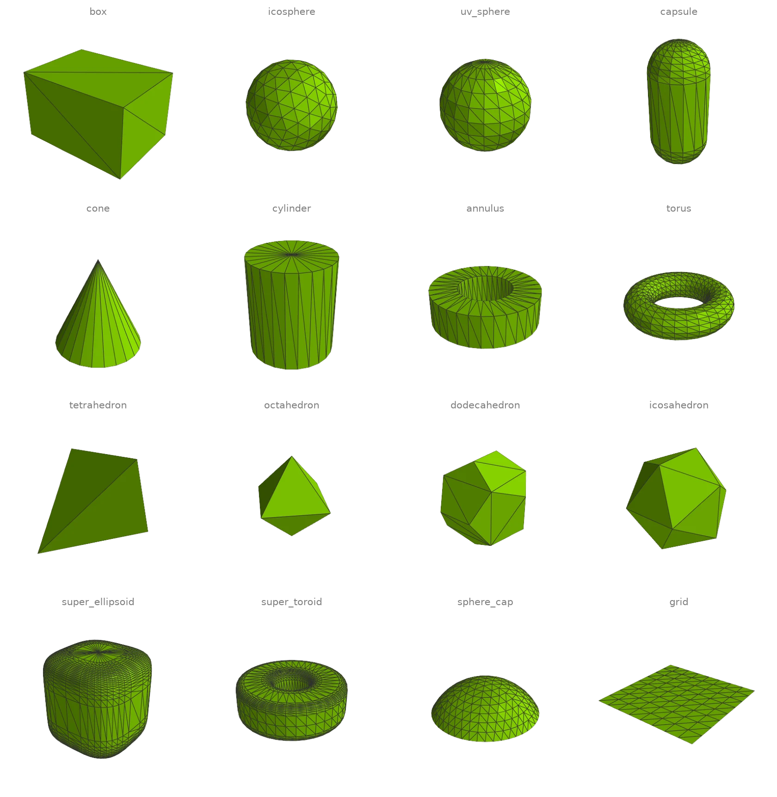
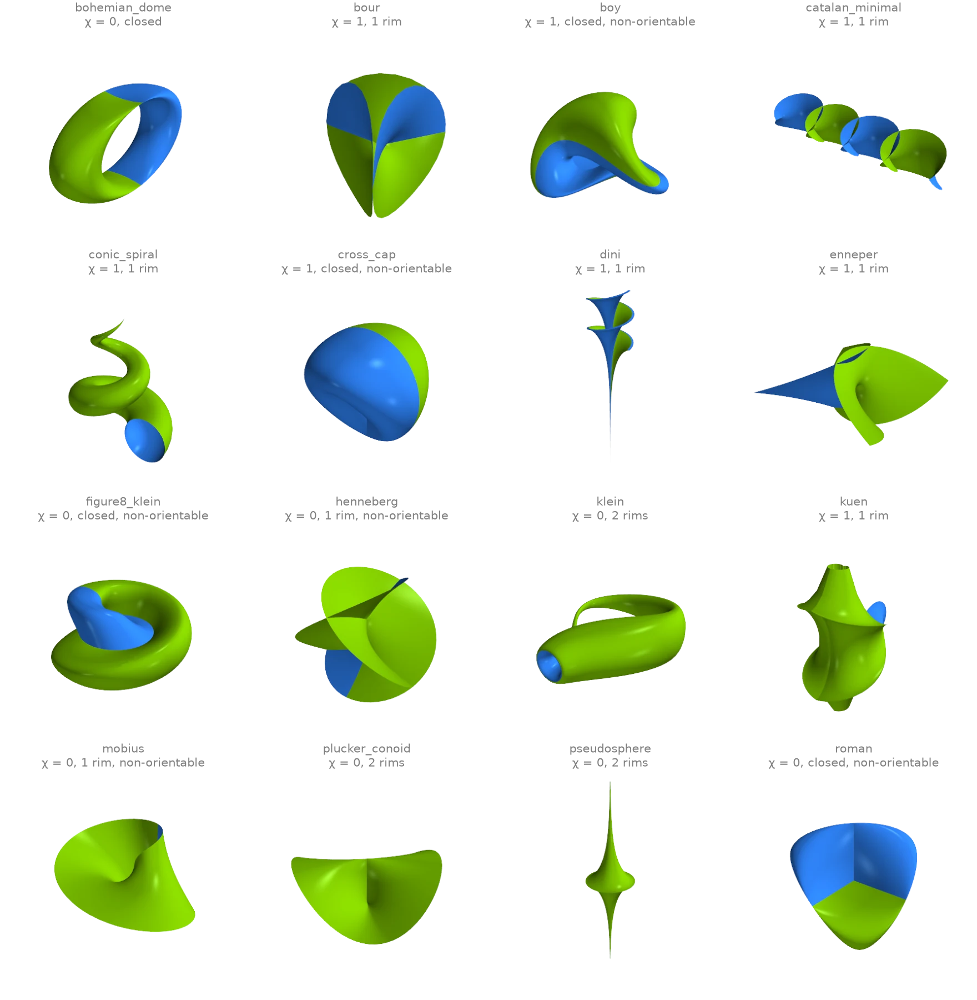
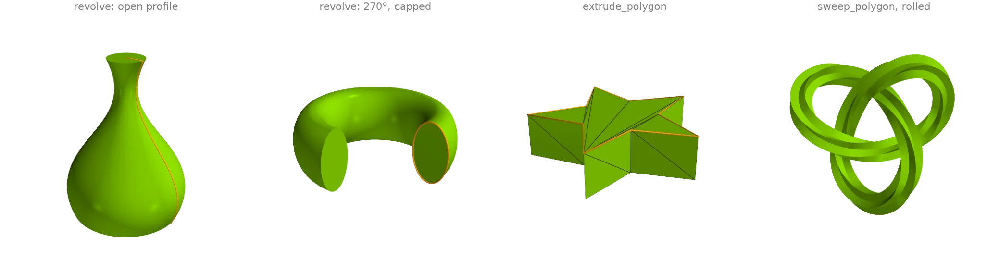
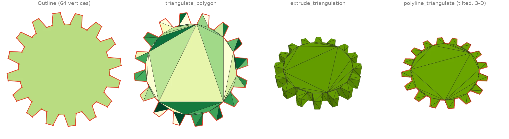
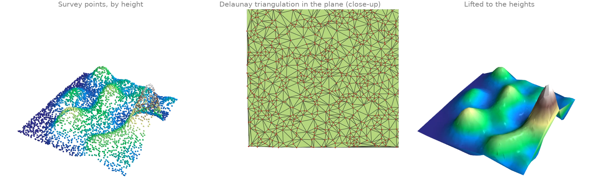

# Creating meshes

Primitives, parametric surfaces, sweeps and triangulations from
[`ordito.creation`][ordito.creation] and [`ordito.polyline`][ordito.polyline].

## Primitive gallery {#c1}

Sixteen builders from [`ordito.creation`][ordito.creation], each returning a vertex buffer and
a flat face buffer on the requested device:
[`box`][ordito.creation.box], [`icosphere`][ordito.creation.icosphere],
[`uv_sphere`][ordito.creation.uv_sphere], [`capsule`][ordito.creation.capsule],
[`cone`][ordito.creation.cone], [`cylinder`][ordito.creation.cylinder],
[`annulus`][ordito.creation.annulus], [`torus`][ordito.creation.torus], the Platonic solids
([`tetrahedron`][ordito.creation.tetrahedron], [`octahedron`][ordito.creation.octahedron],
[`dodecahedron`][ordito.creation.dodecahedron], [`icosahedron`][ordito.creation.icosahedron]),
the superquadrics [`super_ellipsoid`][ordito.creation.super_ellipsoid] and
[`super_toroid`][ordito.creation.super_toroid], and the two open patches
[`sphere_cap`][ordito.creation.sphere_cap] and [`grid`][ordito.creation.grid].
[`is_watertight`][ordito.validation.is_watertight] confirms which of them are closed.

```python
import math

import ordito as od

c = od.creation
shapes = {
    "box": c.box(extents=(1.6, 1.2, 1.0), device=device),
    "icosphere": c.icosphere(2, device=device),
    "uv_sphere": c.uv_sphere(count=(12, 20), device=device),
    "capsule": c.capsule(height=1.2, radius=0.5, count=(16, 16), device=device),
    "cone": c.cone(0.8, 1.6, sections=24, device=device),
    "cylinder": c.cylinder(0.7, 1.6, sections=24, device=device),
    "annulus": c.annulus(0.5, 1.0, height=0.6, sections=32, device=device),
    "torus": c.torus(1.0, 0.35, 32, 16, device=device),
    "tetrahedron": c.tetrahedron(device=device),
    "octahedron": c.octahedron(device=device),
    "dodecahedron": c.dodecahedron(device=device),
    "icosahedron": c.icosahedron(device=device),
    "super_ellipsoid": c.super_ellipsoid(0.3, 0.6, device=device),
    "super_toroid": c.super_toroid(0.3, 1.0, device=device),
    "sphere_cap": c.sphere_cap(math.pi / 3, subdivisions=3, device=device),
    "grid": c.grid(count=(9, 9), extents=(2.0, 2.0), device=device),
}
closed = [name for name, (v, f) in shapes.items() if od.validation.is_watertight(v, f)]
print(f"{len(closed)} of {len(shapes)} are watertight")
print("open:", ", ".join(name for name in shapes if name not in closed))
```

```text title="Output"
14 of 16 are watertight
open: sphere_cap, grid
```



Modelled on: [trimesh: creation](https://trimesh.org/trimesh.creation.html) · [Open3D: mesh primitives](https://www.open3d.org/docs/release/python_api/open3d.geometry.TriangleMesh.html) · [PyVista: geometric objects](https://docs.pyvista.org/examples/00-load/create_geometric_objects)
{: .ordito-credits }

## Parametric surfaces {#c2}

[`parametric_surface`][ordito.creation.parametric_surface] samples sixteen classical surfaces:
minimal surfaces, surfaces of revolution and immersions of non-orientable ones. Seams and poles
are glued in the index buffer, so the topology is exact at any resolution: a
[`Trimesh`][ordito.mesh.Trimesh] reports the Euler characteristic, the number of boundary loops
and whether the surface is orientable. Each face is coloured by the side that faces the
camera, green for the front of its winding and blue for the back. On a non-orientable surface
the two colours meet along a seam that no consistent winding can remove.

```python
import ordito as od

kinds: list[od.creation.ParametricSurfaceKind] = [
    "bohemian_dome", "bour", "boy", "catalan_minimal", "conic_spiral", "cross_cap",
    "dini", "enneper", "figure8_klein", "henneberg", "klein", "kuen",
    "mobius", "plucker_conoid", "pseudosphere", "roman",
]  # fmt: skip
surfaces = {}
for kind in kinds:
    surfaces[kind] = od.Trimesh(*od.creation.parametric_surface(kind, 80, 80, device=device))
closed = [k for k, m in surfaces.items() if not m.boundary_loops]
print("closed:", ", ".join(closed))
print("non-orientable:", ", ".join(k for k, m in surfaces.items() if not m.is_orientable))
```

```text title="Output"
closed: bohemian_dome, boy, cross_cap, figure8_klein, roman
non-orientable: boy, cross_cap, figure8_klein, henneberg, mobius, roman
```



Modelled on: [PyVista: parametric objects](https://docs.pyvista.org/examples/00-load/create_parametric_geometric_objects)
{: .ordito-credits }

## Revolve, extrude and sweep {#c3}

Three ways to turn a 2-D outline into a solid.
[`revolve`][ordito.creation.revolve] spins a profile about the Z axis: an open profile that
starts and ends on the axis gives a closed vase, and a closed profile, whose last point repeats
its first, revolved through part of a turn gets capped ends.
[`extrude_polygon`][ordito.creation.extrude_polygon] triangulates a star and raises it into a
prism. [`sweep_polygon`][ordito.creation.sweep_polygon] carries the
same star along a trefoil knot, rolling it twice around the path's tangent on the way.

```python
import numpy as np
import warp as wp

import ordito as od

def vec2(points: np.ndarray) -> wp.array[wp.vec2]:
    return wp.array(points, dtype=wp.vec2, device=device)

# A vase: radius against height, from the axis at the bottom to the axis at the top.
height = np.linspace(0.0, 2.0, 40)
radius = 0.55 + 0.25 * np.sin(2.6 * height + 0.6) - 0.1 * height
profile = np.concatenate([[[0.0, 0.0]], np.stack([radius, height], 1), [[0.0, 2.0]]])
vase = od.creation.revolve(vec2(profile), sections=64)

# A closed section (its last point repeats the first) revolved through three quarters
# of a turn, with capped ends.
t = np.linspace(0.0, 2.0 * np.pi, 49)
section = np.stack([1.0 + 0.3 * np.cos(t), 0.5 * np.sin(t)], 1)
ring = od.creation.revolve(vec2(section), angle=1.5 * np.pi, cap=True, sections=48)

angle = np.linspace(0.0, 2.0 * np.pi, 10, endpoint=False)
radii = np.where(np.arange(10) % 2, 0.45, 1.0)
star = np.stack([radii * np.cos(angle), radii * np.sin(angle)], 1)
prism = od.creation.extrude_polygon(vec2(star), 0.5)

s = np.linspace(0.0, 2.0 * np.pi, 301)
knot = np.stack(
    [np.sin(s) + 2 * np.sin(2 * s), np.cos(s) - 2 * np.cos(2 * s), -np.sin(3 * s)], 1
)
swept = od.creation.sweep_polygon(
    vec2(0.45 * star),
    wp.array(knot, dtype=wp.vec3, device=device),
    angles=wp.array(np.linspace(0.0, 4.0 * np.pi, 301), dtype=wp.float32, device=device),
)
for name, (v, f) in [("vase", vase), ("ring", ring), ("prism", prism), ("knot", swept)]:
    print(
        f"{name:>5}: {f.shape[0] // 3:5d} faces, watertight {od.validation.is_watertight(v, f)}"
    )
```

```text title="Output"
 vase:  5120 faces, watertight True
 ring:  4700 faces, watertight True
prism:    36 faces, watertight True
 knot:  6000 faces, watertight True
```



Modelled on: [trimesh: creation](https://trimesh.org/trimesh.creation.html) · [PyVista: extrude rotate](https://docs.pyvista.org/examples/01-filter/extrude_rotate) · [MeshLib: extrude](https://meshlib.io/documentation/ExampleMeshExtrude.html)
{: .ordito-credits }

## Polygon triangulation {#c4}

[`triangulate_polygon`][ordito.polyline.triangulate_polygon] fills a simple 2-D polygon by ear
clipping on the device, using only the polygon's own vertices: an `n`-gon becomes `n - 2`
triangles. [`extrude_triangulation`][ordito.creation.extrude_triangulation] raises the
triangulation into a watertight solid, and
[`polyline_triangulate`][ordito.polyline.polyline_triangulate] does the same filling for a
closed planar loop in 3-D, whatever plane it lies in. Interior rings (holes) are not
supported, so the gear's bore is left out.

```python
import numpy as np
import warp as wp

import ordito as od

# A 16-tooth gear outline, counter-clockwise.
teeth, steps = 16, np.array([0.0, 0.18, 0.5, 0.68])
angle = 2 * np.pi * (np.arange(teeth)[:, None] + steps).ravel() / teeth
radius = np.tile([0.8, 1.0, 1.0, 0.8], teeth)
outline = np.stack([radius * np.cos(angle), radius * np.sin(angle)], axis=1)

ring, faces = od.polyline.triangulate_polygon(wp.array(outline, dtype=wp.vec2, device=device))
print(f"{ring.shape[0]} vertices -> {faces.shape[0] // 3} triangles")
solid = od.creation.extrude_triangulation(ring, faces, height=0.3)
print(f"extruded: watertight {od.validation.is_watertight(*solid)}")

# The same outline on a tilted plane in 3-D.
tilt = od.transform.matrix_to_numpy(od.transform.rotation_matrix((1.0, 1.0, 0.0), 0.9))[:3, :3]
loop = np.c_[outline, np.zeros(len(outline))] @ tilt.T
loop_faces = od.polyline.polyline_triangulate(wp.array(loop, dtype=wp.vec3, device=device))
print(f"tilted loop: {loop_faces.shape[0]} triangles")
```

```text title="Output"
64 vertices -> 62 triangles
extruded: watertight True
tilted loop: 62 triangles
```



Modelled on: [libigl 604](https://libigl.github.io/tutorial/#triangulation-of-closed-polygons) · [MeshLib: contour triangulation](https://meshlib.io/documentation/ExampleTriangulation.html) · [trimesh: creation](https://trimesh.org/trimesh.creation.html)
{: .ordito-credits }

## Terrain triangulation {#c5}

Scattered survey points of a height field are triangulated in the plane by
[`delaunay_triangulation`][ordito.reconstruction.delaunay_triangulation], which returns the
triangulation that maximizes the smallest angle. Its faces index the input points, so lifting
them back to their heights turns the 2-D triangulation into the terrain surface (a 2.5-D
mesh).

```python
import warp as wp

import ordito as od
from examples import data

points = data.load_points("terrain_points", device)
plan = wp.array(points.numpy()[:, :2], dtype=wp.vec2, device=device)
faces = od.reconstruction.delaunay_triangulation(plan)
terrain = od.Trimesh(points, faces)
print(f"{points.shape[0]} points -> {terrain.n_faces} triangles")
print(f"boundary loops: {len(terrain.boundary_loops)}, Euler {terrain.euler_characteristic}")
```

```text title="Output"
4000 points -> 7973 triangles
boundary loops: 1, Euler 1
```



Modelled on: [PyVista: delaunay_2d](https://docs.pyvista.org/examples/00-load/create_tri_surface) · [MeshLib: terrain triangulation](https://meshlib.io/documentation/ExampleTerrainTriangulation.html)
{: .ordito-credits }
