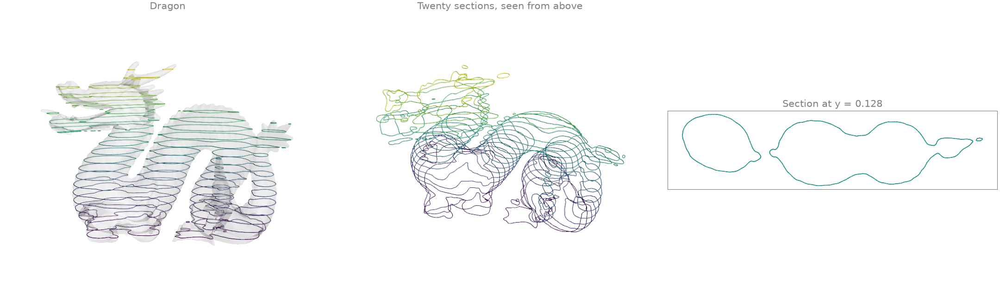
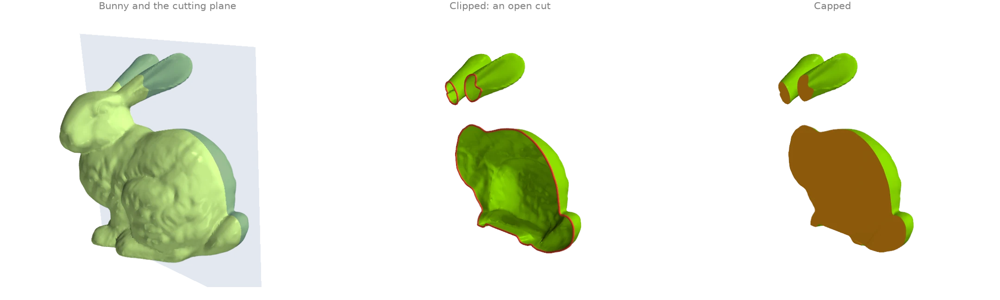
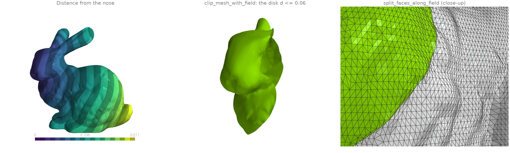
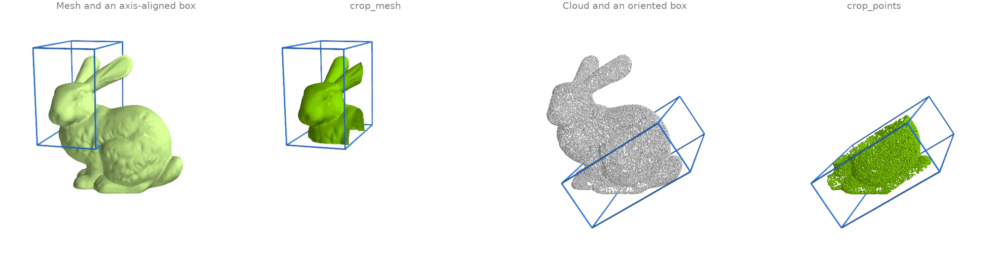
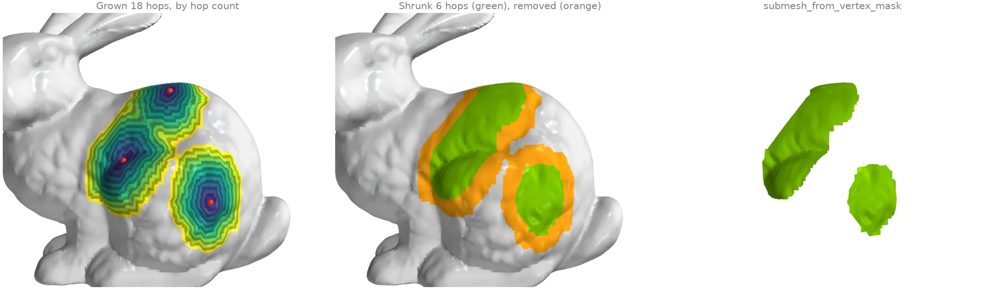
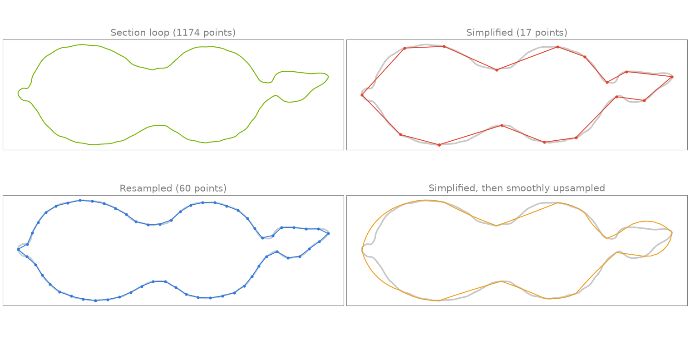

# Cutting, slicing and selection

Plane sections, clipping, cropping, growing selections and polyline processing.

## Plane sections and slice stacks {#x1}

[`mesh_with_plane`][ordito.intersection.mesh_with_plane] intersects a mesh with a plane and
returns the section as a set of line segments, one per crossed triangle. Twenty horizontal
planes through the 871 000-face dragon give a stack of contours, like a slicer preparing a
3-D print.

```python
import numpy as np
import warp as wp

import ordito as od
from examples import data

vertices, faces = data.load("dragon", device)
(_, y_min, _), (_, y_max, _) = od.bounds.aabb(vertices)
heights = np.linspace(y_min, y_max, 22)[1:-1]

sections = []
for height in heights:
    segments = od.intersection.mesh_with_plane(
        vertices, faces, wp.vec3(0.0, 1.0, 0.0), wp.vec3(0.0, float(height), 0.0)
    )
    sections.append(segments.numpy())  # (m, 2) rows of segment endpoints
print(f"{len(sections)} sections, {sum(s.shape[0] for s in sections)} segments in all")
```

```text title="Output"
20 sections, 40020 segments in all
```



Modelled on: [trimesh: section](https://github.com/mikedh/trimesh/blob/main/examples/section.ipynb) · [PyVista: slicing](https://docs.pyvista.org/examples/01-filter/slice) · [PyMeshLab: planar section](https://pymeshlab.readthedocs.io/en/latest/filter_list.html)
{: .ordito-credits }

## Clipping and capping {#x2}

[`split_mesh_with_plane`][ordito.intersection.split_mesh_with_plane] inserts the plane's
section into the mesh as real edges and labels every face by its side;
[`submesh_from_face_mask`][ordito.selection.submesh_from_face_mask] keeps one side, leaving
an open cut whose rim [`boundary_loops`][ordito.boundary.boundary_loops] finds.
[`fill_min_weight`][ordito.holes.fill_min_weight] then caps every rim with a minimum-weight
triangulation (here the body and both ears), so the clipped bunny is closed again.

```python
import warp as wp

import ordito as od
from examples import data

vertices, faces = data.load("bunny", device)
normal, origin = wp.vec3(0.3, 0.1, -1.0), wp.vec3(-0.02, 0.1, 0.0)

split_vertices, split_faces, above = od.intersection.split_mesh_with_plane(
    vertices, faces, normal, origin
)
half_vertices, half_faces = od.selection.submesh_from_face_mask(
    split_vertices, split_faces, above
)
rims = od.boundary.boundary_loops(half_vertices, half_faces)
capped_faces = od.holes.fill_min_weight(half_vertices, half_faces)
print(f"{len(rims)} rims, the cut is {max(rim.shape[0] for rim in rims)} vertices long")
print("watertight after capping:", od.validation.is_watertight(half_vertices, capped_faces))
```

```text title="Output"
3 rims, the cut is 672 vertices long
watertight after capping: True
```



Modelled on: [PyVista: clip a closed surface](https://docs.pyvista.org/examples/01-filter/clip_with_plane_box) · [trimesh: slice_plane](https://trimesh.org/trimesh.intersections.html)
{: .ordito-credits }

## Clipping with a scalar field {#x3}

Any per-vertex field can cut a mesh along one of its level sets. Here the field is the
geodesic distance from the bunny's nose ([`heat_geodesic`][ordito.heat.heat_geodesic]).
[`clip_mesh_with_field`][ordito.intersection.clip_mesh_with_field] keeps the region on one
side of the level set, re-triangulating every crossed face so the edge is clean rather than
staircased; [`split_faces_along_field`][ordito.intersection.split_faces_along_field] keeps
both sides, makes the level set a curve of real mesh edges and labels each face by its side.

```python
import warp as wp

import ordito as od
from examples import data

vertices, faces = data.load("bunny", device)
nose = wp.array([11842], dtype=wp.int32, device=device)
distance = od.heat.heat_geodesic(vertices, faces, nose)

# Keep the geodesic disk of radius 0.06 around the nose: the field 0.06 - d is >= 0 there.
radius = 0.06
inside = wp.array(radius - distance.numpy(), dtype=wp.float32, device=device)
disk_vertices, disk_faces = od.intersection.clip_mesh_with_field(vertices, faces, inside)

split_vertices, split_faces, positive = od.intersection.split_faces_along_field(
    vertices, faces, inside
)
print(f"clipped disk: {disk_faces.shape[0] // 3} faces")
inside_count = int(positive.numpy().sum())
print(f"split mesh: {inside_count} faces inside, {split_faces.shape[0] // 3} in all")
```

```text title="Output"
clipped disk: 14163 faces
split mesh: 14163 faces inside, 70625 in all
```



Modelled on: [PyVista: clip with a surface](https://docs.pyvista.org/examples/01-filter/clip_with_surface) · [PyVista: threshold](https://docs.pyvista.org/examples/01-filter/using_filters)
{: .ordito-credits }

## Cropping to a box {#x4}

[`crop_mesh`][ordito.bounds.crop_mesh] keeps the faces whose three corners lie inside a box
and renumbers them from zero; [`crop_points`][ordito.bounds.crop_points] keeps the points
inside one and returns their original indices too, so per-point attributes can follow. Both
take an optional rotation, which turns the axis-aligned box into an oriented one.

```python
import numpy as np
import warp as wp

import ordito as od
from examples import data

vertices, faces = data.load("bunny", device)
head_vertices, head_faces = od.bounds.crop_mesh(
    vertices, faces, wp.vec3(-0.1, 0.09, -0.06), wp.vec3(-0.03, 0.2, 0.06)
)

# An oriented box: rows of `rotation` are the box axes, the bounds are in box coordinates.
points = data.load_points("bunny_cloud", device)
angle = np.radians(35.0)
rotation = wp.mat33(
    np.cos(angle), np.sin(angle), 0.0, -np.sin(angle), np.cos(angle), 0.0, 0.0, 0.0, 1.0
)
box_min, box_max = wp.vec3(-0.02, 0.02, -0.08), wp.vec3(0.11, 0.08, 0.08)
kept, _ = od.bounds.crop_points(points, box_min, box_max, rotation=rotation)
print(f"cropped mesh: {head_faces.shape[0] // 3} of {faces.shape[0] // 3} faces")
print(f"cropped cloud: {kept.shape[0]} of {points.shape[0]} points")
```

```text title="Output"
cropped mesh: 21705 of 69451 faces
cropped cloud: 11169 of 30000 points
```



Modelled on: [Open3D: crop point cloud](https://www.open3d.org/docs/release/tutorial/geometry/pointcloud.html) · [PyVista: clip with a box](https://docs.pyvista.org/examples/01-filter/clip_with_plane_box)
{: .ordito-credits }

## Growing and shrinking selections {#x5}

A vertex selection grows by one ring of neighbours per hop with
[`expand_vertex_mask`][ordito.selection.expand_vertex_mask]: from three seed vertices,
eighteen hops give three patches, two of which have merged. Colouring each vertex by the hop
that first reached it shows the rings.
[`shrink_vertex_mask`][ordito.selection.shrink_vertex_mask] erodes the selection again by six
rings, peeling a band off its whole outline, and
[`submesh_from_vertex_mask`][ordito.selection.submesh_from_vertex_mask] cuts the result out
as its own mesh.

```python
import numpy as np
import warp as wp

import ordito as od
from examples import data

vertices, faces = data.load("bunny", device)
seeds = np.zeros(vertices.shape[0], dtype=bool)
seeds[[18577, 9802, 4939]] = True
mask = wp.array(seeds, dtype=wp.bool, device=device)

# Grow one hop at a time and remember when each vertex joined.
hop = np.where(seeds, 0, -1)
for k in range(1, 19):
    mask = od.selection.expand_vertex_mask(faces, mask, 1)
    hop[(hop < 0) & mask.numpy()] = k

shrunk = od.selection.shrink_vertex_mask(faces, mask, 6)
patch_vertices, patch_faces = od.selection.submesh_from_vertex_mask(vertices, faces, shrunk)
print(f"grown: {int(mask.numpy().sum())} vertices, shrunk: {int(shrunk.numpy().sum())}")
print(f"extracted patch: {patch_faces.shape[0] // 3} faces")
```

```text title="Output"
grown: 3393 vertices, shrunk: 1735
extracted patch: 3237 faces
```



Modelled on: [PyMeshLab: selection dilate / erode](https://pymeshlab.readthedocs.io/en/latest/filter_list.html)
{: .ordito-credits }

## Polyline processing {#x6}

The longest contour of the dragon's section at y = 0.128 (example X1)
([`marching_triangles`][ordito.intersection.marching_triangles] over the height field) is a
closed polyline of over a thousand points.
[`polyline_simplify`][ordito.polyline.polyline_simplify] keeps the Ramer-Douglas-Peucker
subset within a tolerance,
[`polyline_resample`][ordito.polyline.polyline_resample] redistributes a fixed number of
points evenly along the arc length, and
[`polyline_smooth_upsample`][ordito.polyline.polyline_smooth_upsample] refines the coarse
simplified loop back along circular arcs fitted to its tangents.

```python
import warp as wp

import ordito as od
from examples import data

vertices, faces = data.load("dragon", device)
height = wp.array(vertices.numpy()[:, 1] - 0.128, dtype=wp.float32, device=device)
curves, closed = od.intersection.marching_triangles(vertices, faces, height)
loop = max(
    (c for c, is_closed in zip(curves, closed, strict=True) if is_closed),
    key=lambda c: c.shape[0],
)

simplified, _ = od.polyline.polyline_simplify(loop, 0.002, closed=True)
resampled = od.polyline.polyline_resample(loop, 60, closed=True)
smooth = od.polyline.polyline_smooth_upsample(simplified, 0.002, closed=True)
print(f"section loop: {loop.shape[0]} points")
print(f"simplified: {simplified.shape[0]}, resampled: {resampled.shape[0]}")
print(f"smoothly upsampled from the simplified loop: {smooth.shape[0]}")
```

```text title="Output"
section loop: 1174 points
simplified: 17, resampled: 60
smoothly upsampled from the simplified loop: 112
```



Modelled on: [PyVista: decimate a polyline](https://docs.pyvista.org/examples/01-filter/decimate)
{: .ordito-credits }
