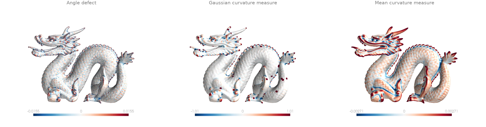
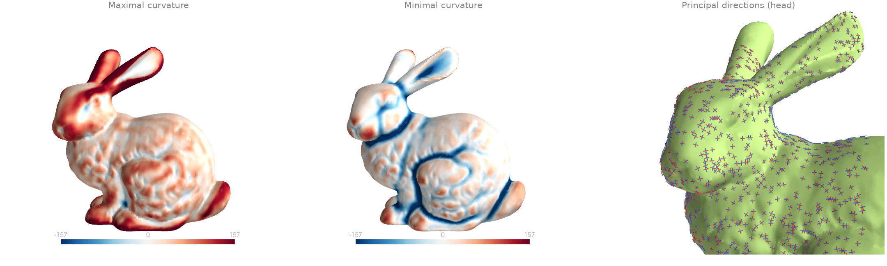
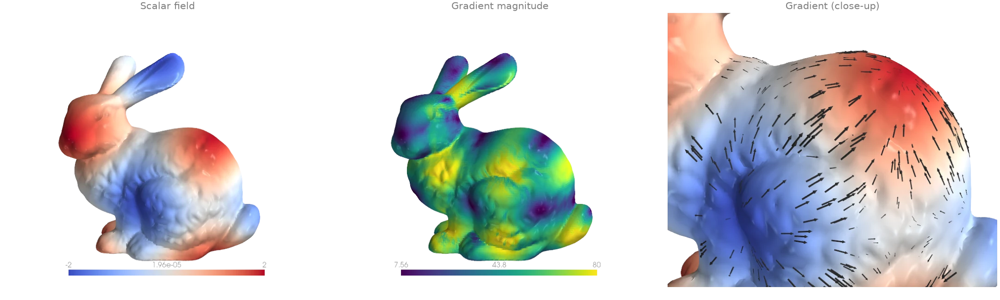
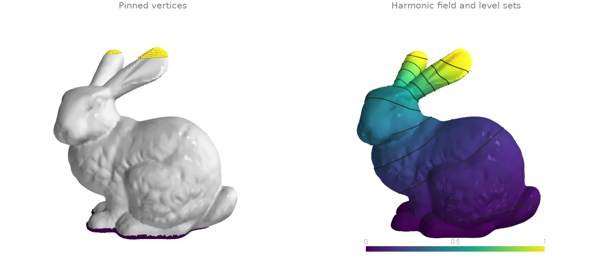
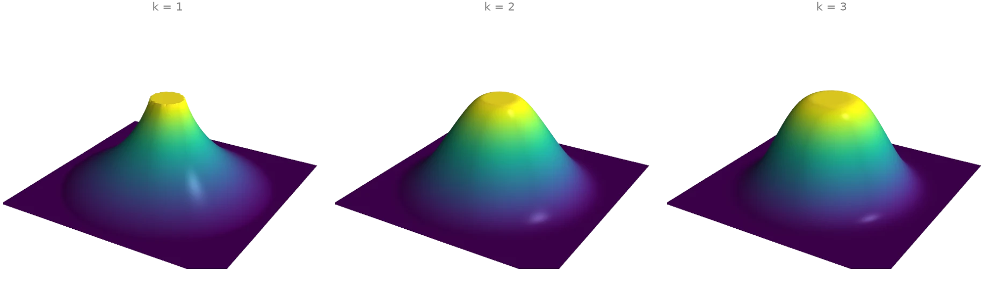
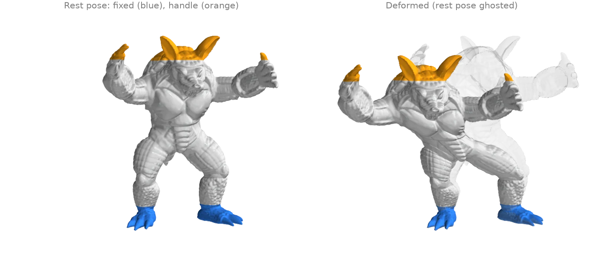
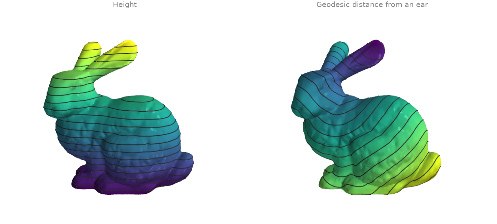
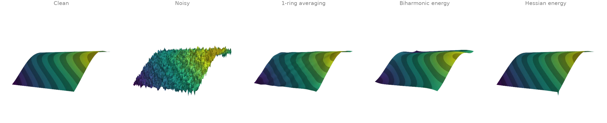
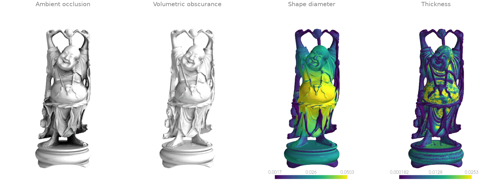
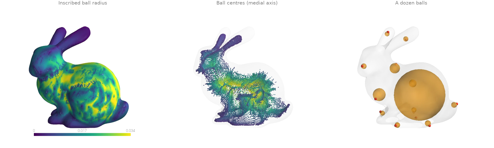

# Curvature and differential operators

Curvature, gradients, Laplace-type equations, and per-vertex shape descriptors.

## Gaussian and mean curvature {#d1}

Three curvature fields on the Stanford dragon.
[`vertex_defects`][ordito.vertices.vertex_defects] is the pointwise angle defect, `2pi` minus
the corner angles at a vertex, the discrete Gaussian curvature integrated over the vertex's
neighbourhood; it is sharp and noisy on a scan.
[`discrete_gaussian_curvature`][ordito.curvature.discrete_gaussian_curvature] and
[`discrete_mean_curvature`][ordito.curvature.discrete_mean_curvature] are the Cohen-Steiner and
Morvan curvature measures of a ball around each query point: the defects inside the ball, and
the dihedral angles of the edges inside it weighted by their length. A wider ball averages over
more surface. Colour ranges clip at the 90th percentile of the magnitude: the scan's holes and
stray patches put a few large values in the tails.

```python
import numpy as np

import ordito as od
from examples import data

vertices, faces = data.load("dragon", device)
angles = od.triangles.face_angles(vertices, faces)
defects = od.vertices.vertex_defects(vertices.shape[0], faces, angles)

radius = 4.0 * od.edges.mean_edge_length(vertices, faces)
gaussian = od.curvature.discrete_gaussian_curvature(vertices, vertices, faces, angles, radius)
mean = od.curvature.discrete_mean_curvature(vertices, vertices, faces, radius)
print(f"{vertices.shape[0]} vertices, ball radius {radius:.5f}")
print(f"median |mean curvature measure| {np.median(np.abs(mean.numpy())):.3g}")
```

```text title="Output"
437645 vertices, ball radius 0.00181
median |mean curvature measure| 0.000791
```



Modelled on: [libigl 202](https://libigl.github.io/tutorial/#gaussian-curvature) · [trimesh: curvature](https://github.com/mikedh/trimesh/blob/main/examples/curvature.ipynb) · [PyVista: curvature](https://docs.pyvista.org/api/core/_autosummary/pyvista.PolyDataFilters.curvature)
{: .ordito-credits }

## Principal curvatures and directions {#d2}

[`principal_curvature`][ordito.curvature.principal_curvature] fits a quadric to the
neighbourhood of every vertex (a ball of a few mean edge lengths) and returns the two principal
curvatures with their directions: the directions in which the surface bends most and least.
The close-up draws both direction fields as short line segments, maximal curvature in red and
minimal in blue; they follow the ridges and valleys of the bunny's face and ears.

```python
import numpy as np

import ordito as od
from examples import data

vertices, faces = data.load("bunny", device)
direction_max, direction_min, k_max, k_min = od.curvature.principal_curvature(
    vertices, faces, radius=5
)
k_max, k_min = k_max.numpy(), k_min.numpy()
print(f"k_max >= k_min at every vertex: {bool(np.all(k_max >= k_min))}")
print(f"median curvatures: k_max {np.median(k_max):.1f}, k_min {np.median(k_min):.1f}")
```

```text title="Output"
k_max >= k_min at every vertex: True
median curvatures: k_max 45.5, k_min 1.3
```



Modelled on: [libigl 203](https://libigl.github.io/tutorial/#curvature-directions) · [PyMeshLab: filters](https://pymeshlab.readthedocs.io/en/latest/filter_list.html)
{: .ordito-credits }

## Gradient of a scalar field {#d3}

A smooth pattern of hills and valleys defined on the bunny's vertices, and its gradient from
[`face_gradients`][ordito.laplacian.face_gradients]: on each triangle the linear interpolant
of the vertex values has one constant gradient, which lies in the triangle's plane. The arrows
point uphill; the magnitude vanishes on hilltops, valley floors and saddles, and the scan's
small bumps show through it because the gradient is taken along the surface.

```python
import numpy as np
import warp as wp

import ordito as od
from examples import data

vertices, faces = data.load("bunny", device)
x, y, _ = vertices.numpy().T.astype(np.float64)
field = np.sin(60.0 * x) + np.sin(60.0 * y)
values = wp.array(field, dtype=wp.float64, device=device)

gradients = od.laplacian.face_gradients(vertices, faces, values)  # (n_faces,) wp.vec3d
magnitude = np.linalg.norm(gradients.numpy(), axis=1)
print(f"{gradients.shape[0]} face gradients")
print(f"|grad f| from {magnitude.min():.2f} to {magnitude.max():.1f}")
```

```text title="Output"
69451 face gradients
|grad f| from 0.33 to 84.8
```



Modelled on: [libigl 204](https://libigl.github.io/tutorial/#gradient) · [PyVista: gradients](https://docs.pyvista.org/examples/01-filter/gradients)
{: .ordito-credits }

## Laplace equation with Dirichlet conditions {#d4}

The harmonic function on the bunny that is 0 on its base and 1 at the tips of its ears.
[`cotmatrix`][ordito.laplacian.cotmatrix] builds the cotangent Laplacian `L`, and
[`min_quad_with_fixed`][ordito.linalg.min_quad_with_fixed] minimises the Dirichlet energy `x^T
(-L) x / 2` with the pinned vertices held at their values, which solves `Lx = 0` on the free
ones. [`marching_triangles`][ordito.intersection.marching_triangles] traces level sets of the
solution; they crowd where the heat would flow fastest, around the neck and the ears.

```python
import warp as wp

import ordito as od
from examples import data

vertices, faces = data.load("bunny", device)
height = vertices.numpy()[:, 1]
base = height < height.min() + 0.005
ears = height > height.max() - 0.008

laplacian = od.laplacian.cotmatrix(vertices, faces, dtype=wp.float64)
q = od.energies.k_harmonic(laplacian, k=1)  # the Dirichlet energy -L
fixed = wp.array(base | ears, dtype=wp.bool, device=device)
fixed_values = od.typing.as_array2d(
    wp.array(ears[None].astype(np.float64), dtype=wp.float64, device=device), wp.float64
)
solution, free_map, n_free = od.linalg.min_quad_with_fixed(q, fixed, fixed_values)

field = ears.astype(np.float64)  # pinned values, then the solved free ones
free = ~(base | ears)
field[free] = solution.numpy()[0][free_map.numpy()[free]]
print(f"{n_free} free vertices, {base.sum()} pinned to 0, {ears.sum()} pinned to 1")

values = wp.array(field, dtype=wp.float64, device=device)
isolines = [
    od.intersection.marching_triangles(vertices, faces, values, level)[0]
    for level in np.linspace(0.05, 0.95, 10)
]
```

```text title="Output"
31733 free vertices, 2826 pinned to 0, 275 pinned to 1
```



Modelled on: [libigl 303](https://libigl.github.io/tutorial/#laplace-equation) · [PyMeshLab: filters](https://pymeshlab.readthedocs.io/en/latest/filter_list.html)
{: .ordito-credits }

## Polyharmonic surfaces (k = 1, 2, 3) {#d5}

A flat square grid from [`grid`][ordito.creation.grid] is pinned at height 0 outside a circle
and at height 1 on a small disk in its middle; the heights in between minimise a k-harmonic
energy. [`k_harmonic`][ordito.energies.k_harmonic] composes the operator
`(-L) (M^-1 (-L))^(k-1)` from the cotangent Laplacian of
[`cotmatrix`][ordito.laplacian.cotmatrix] and the lumped mass of
[`mass_matrix_entries`][ordito.laplacian.mass_matrix_entries], and
[`min_quad_with_fixed`][ordito.linalg.min_quad_with_fixed] solves for the free heights. Each
step up in k makes the surface smoother where it meets the pinned regions: k = 1 leaves a kink
at both rims, k = 2 meets them with a continuous slope, k = 3 also with a continuous
curvature, which widens the shoulders.

```python
import warp as wp

import ordito as od

vertices, faces = od.creation.grid(count=(101, 101), extents=(2.0, 2.0), device=device)
radius = np.linalg.norm(vertices.numpy()[:, :2], axis=1)
outside, top = radius > 0.9, radius < 0.15
pinned = outside | top

laplacian = od.laplacian.cotmatrix(vertices, faces, dtype=wp.float64)
mass = od.laplacian.mass_matrix_entries(vertices, faces, dtype=wp.float64)
fixed = wp.array(pinned, dtype=wp.bool, device=device)
heights = od.typing.as_array2d(
    wp.array(top[None].astype(np.float64), dtype=wp.float64, device=device), wp.float64
)

surfaces = {}
for k in (1, 2, 3):
    q = od.energies.k_harmonic(laplacian, mass, k=k)
    solution, free_map, _ = od.linalg.min_quad_with_fixed(q, fixed, heights)
    z = top.astype(np.float64)
    z[~pinned] = solution.numpy()[0][free_map.numpy()[~pinned]]
    surfaces[k] = z
    print(f"k = {k}: height at radius 0.5 is {z[np.abs(radius - 0.5) < 0.02].mean():.3f}")
```

```text title="Output"
k = 1: height at radius 0.5 is 0.323
k = 2: height at radius 0.5 is 0.457
k = 3: height at radius 0.5 is 0.486
```



Modelled on: [libigl 401](https://libigl.github.io/tutorial/#biharmonic-deformation) · [libigl 402](https://libigl.github.io/tutorial/#polyharmonic-deformation)
{: .ordito-credits }

## Handle-based biharmonic deformation {#d6}

The armadillo's feet are held in place and the top of the scan (its head, ears and raised
claws) is moved as one handle; every other vertex moves by the
displacement that minimises the biharmonic energy, the operator
[`k_harmonic`][ordito.energies.k_harmonic] builds at `k = 2` from
[`cotmatrix`][ordito.laplacian.cotmatrix] and
[`mass_matrix_entries`][ordito.laplacian.mass_matrix_entries].
[`min_quad_with_fixed`][ordito.linalg.min_quad_with_fixed] solves the three coordinates of the
displacement as three right-hand sides of one system. The displacement is smooth, so the body
bends as a whole and its surface detail rides along unchanged; the multigrid preconditioner
keeps the fourth-order solve over the full 173 k-vertex scan short.

```python
import numpy as np
import warp as wp

import ordito as od
from examples import data

vertices, faces = data.load("armadillo", device)
rest = vertices.numpy()
height = rest[:, 1]
span = height.max() - height.min()
feet = height < height.min() + 0.1 * span
head = height > height.max() - 0.12 * span  # head, ears and claw tips

displacement = np.zeros((3, len(rest)))  # one row per coordinate
displacement[:, head] = np.array([[50.0], [-15.0], [-20.0]])

laplacian = od.laplacian.cotmatrix(vertices, faces, dtype=wp.float64)
mass = od.laplacian.mass_matrix_entries(vertices, faces, dtype=wp.float64)
q = od.energies.k_harmonic(laplacian, mass, k=2)
pinned = feet | head
solution, free_map, n_free = od.linalg.min_quad_with_fixed(
    q,
    wp.array(pinned, dtype=wp.bool, device=device),
    wp.array(displacement, dtype=wp.float64, device=device),
    preconditioner="multigrid",
)
displacement[:, ~pinned] = solution.numpy()[:, free_map.numpy()[~pinned]]
deformed = rest + displacement.T
print(f"{n_free} free vertices, {feet.sum()} fixed, {head.sum()} moved")
```

```text title="Output"
136647 free vertices, 17157 fixed, 19170 moved
```



Modelled on: [libigl 401](https://libigl.github.io/tutorial/#biharmonic-deformation) · [MeshLib: Laplacian deformation](https://meshlib.io/documentation/ExampleLaplacian.html)
{: .ordito-credits }

## Isolines of a scalar field {#d7}

[`marching_triangles_with_offsets`][ordito.intersection.marching_triangles_with_offsets] cuts
the level set `f = c` of a per-vertex field out of every triangle and links the pieces into
curves, returned packed: all points, the offsets where each curve starts, and whether it
closes. [`split`][ordito.array.split] unpacks them into one array per curve. Two fields on the
bunny: its height, whose level sets are horizontal slices, and the geodesic distance from the
tip of an ear by [`heat_geodesic`][ordito.heat.heat_geodesic], whose level sets are geodesic
circles.

```python
import warp as wp

import ordito as od
from examples import data

vertices, faces = data.load("bunny", device)
height = wp.array(vertices.numpy()[:, 1], dtype=wp.float32, device=device)
ear = wp.array([22820], dtype=wp.int32, device=device)
distance = od.heat.heat_geodesic(vertices, faces, ear)

curves = {}
for name, field in (("height", height), ("distance", distance)):
    values = field.numpy()
    curves[name] = []
    for level in np.linspace(values.min(), values.max(), 22)[1:-1]:
        points, offsets, _closed = od.intersection.marching_triangles_with_offsets(
            vertices, faces, field, float(level)
        )
        curves[name] += od.array.split(points, offsets)
    print(f"{name}: {len(curves[name])} curves over 20 levels")
```

```text title="Output"
height: 25 curves over 20 levels
distance: 31 curves over 20 levels
```



Modelled on: [libigl 905](https://libigl.github.io/tutorial/#isolines) · [potpourri3d](https://github.com/nmwsharp/potpourri3d#mesh-utilities) · [PyVista: contouring](https://docs.pyvista.org/examples/01-filter/contouring)
{: .ordito-credits }

## Smoothing a noisy scalar field {#d8}

A smooth function on a square (a ramp plus a wave, drawn as a height field), corrupted by noise,
and three ways to recover it.
[`filter_scalar_laplacian`][ordito.smoothing.filter_scalar_laplacian] repeatedly averages each
value with its one-ring. The other two solve `(M + alpha Q) u = M f`: stay close to the noisy
field `f` in the mass-weighted norm while keeping a smoothness energy `u^T Q u` small. With the
biharmonic energy from [`k_harmonic`][ordito.energies.k_harmonic], `Q` assumes the field is flat
across the boundary and bends the ramp there; the Hessian energy from
[`hessian_energy`][ordito.energies.hessian_energy] has natural boundary conditions and no
penalty on linear functions, so the ramp keeps its slope up to the rim.
[`curved_hessian_energy`][ordito.energies.curved_hessian_energy] is its counterpart for a curved
surface.

```python
import numpy as np
import warp as wp

import ordito as od

vertices, faces = od.creation.grid(count=(81, 81), extents=(2.0, 2.0), device=device)
x, y, _ = vertices.numpy().T.astype(np.float64)
clean = 1.5 * x + np.cos(2.5 * y)
noisy = clean + np.random.default_rng(0).normal(0.0, 0.25, clean.shape)

averaged = od.smoothing.filter_scalar_laplacian(
    wp.array(noisy, dtype=wp.float32, device=device), vertices, faces, iterations=30
)

# Minimise |u - f|^2_M + alpha u^T Q u, i.e. solve (M + alpha Q) u = M f, for two energies Q.
# M is the diagonal lumped mass matrix, so M f is a per-vertex product.
lumped = od.laplacian.mass_matrix_entries(vertices, faces, dtype=wp.float64)
mass = od.typing.bsr_diag(lumped)
mass_f = wp.array(lumped.numpy() * noisy, dtype=wp.float64, device=device)
laplacian = od.laplacian.cotmatrix(vertices, faces, dtype=wp.float64)
energies = {
    "biharmonic": od.energies.k_harmonic(laplacian, lumped, k=2),
    "hessian": od.energies.hessian_energy(vertices, faces),
}
smoothed = {}
for name, q in energies.items():
    system = od.typing.bsr_axpy(od.typing.bsr_copy(q), od.typing.bsr_copy(mass), alpha=1e-3)
    u = wp.zeros_like(mass_f)
    od.linalg.solve_spd(system, mass_f, u)
    smoothed[name] = u.numpy()

rim = (np.abs(x) > 0.95) | (np.abs(y) > 0.95)
for name, u in {"1-ring average": averaged.numpy(), **smoothed}.items():
    error = u - clean
    print(
        f"{name}: RMS error {np.sqrt(np.mean(error**2)):.3f} overall, "
        f"{np.sqrt(np.mean(error[rim] ** 2)):.3f} along the boundary"
    )
```

```text title="Output"
1-ring average: RMS error 0.038 overall, 0.093 along the boundary
biharmonic: RMS error 0.090 overall, 0.205 along the boundary
hessian: RMS error 0.028 overall, 0.043 along the boundary
```



The spike at one corner of the Hessian-smoothed square is the noise of that corner vertex
surviving: it belongs to a single triangle, so the energy constrains it weakly.

Modelled on: [libigl 712](https://libigl.github.io/tutorial/#data-smoothing) · [PyMeshLab: filters](https://pymeshlab.readthedocs.io/en/latest/filter_list.html)
{: .ordito-credits }

## Ambient occlusion, obscurance, shape diameter and thickness {#d9}

Four ray-traced per-vertex descriptors of the happy Buddha, all cast against one `wp.Mesh`
BVH.

- [`ambient_occlusion`][ordito.visibility.ambient_occlusion]: the share of the outward
  hemisphere blocked by the model, shown as the light that gets through.
- [`volumetric_obscurance`][ordito.visibility.volumetric_obscurance]: the same, with each
  occluder counted `exp(-tau * t)` by its distance `t`, so only nearby geometry darkens a point;
  it brings out the folds of the robe that a far wall hides in plain occlusion.
- [`shape_diameter`][ordito.visibility.shape_diameter]: the robust mean length of a cone of
  rays fired inwards, the local diameter of the volume.
- [`thickness`][ordito.visibility.thickness]: twice the radius of the largest ball inside
  the volume touching the point. One ball per point is cheap but follows every small bump of
  the scan, hence the speckle where the shape diameter is smooth.

```python
import numpy as np
import warp as wp

import ordito as od
from examples import data

vertices, faces = data.load("buddha", device)
mesh = wp.Mesh(points=vertices, indices=faces)
normals = od.vertices.vertex_normals(vertices, faces)
diagonal = od.bounds.enclosing_diagonal(vertices)

occlusion = od.visibility.ambient_occlusion(mesh, vertices, normals=normals)
obscurance = od.visibility.volumetric_obscurance(
    mesh, vertices, normals=normals, tau=40.0 / diagonal
)
diameter = od.visibility.shape_diameter(mesh, vertices, normals=normals)
thickness = od.visibility.thickness(mesh, vertices, normals=normals)
print(f"{vertices.shape[0]} vertices, mean occlusion {occlusion.numpy().mean():.3f}")
finite = np.isfinite(diameter.numpy())
print(
    f"shape diameter: {finite.sum()} finite, median {np.median(diameter.numpy()[finite]):.4f}"
)
```

```text title="Output"
543652 vertices, mean occlusion 0.301
shape diameter: 543621 finite, median 0.0212
```



Modelled on: [libigl 606](https://libigl.github.io/tutorial/#ambient-occlusion) · [PyMeshLab: filters](https://pymeshlab.readthedocs.io/en/latest/filter_list.html) · [MeshLib: thickness](https://meshlib.io/documentation/index.html)
{: .ordito-credits }

## Maximal inscribed spheres and the medial axis {#d10}

After [`filter_laplacian`][ordito.smoothing.filter_laplacian] removes the scan's small bumps,
[`max_tangent_sphere`][ordito.visibility.max_tangent_sphere] shrinks a ball touching the surface
at each face centroid, from the inside, until it touches the surface nowhere else. Its radius is
a local thickness, and its centre lies on the medial axis: the centres of the larger balls trace
the bunny's skeleton, a sheet down its body and curves along its ears. Balls touching a small
crease stay tiny, so the skeleton view keeps balls above a tenth of the largest radius.

```python
import numpy as np
import warp as wp

import ordito as od
from examples import data

vertices, faces = data.load("bunny", device)
# The scan's millimetre bumps cap every ball touching them; smooth them away first.
vertices = od.smoothing.filter_laplacian(vertices, faces, iterations=20)
mesh = wp.Mesh(points=vertices, indices=faces)
# Touch every face at its centroid, where the surface is flat: at a vertex the ball must
# also clear the faces around it, which pins it small wherever the scan is bumpy.
face_normals, _ = od.triangles.face_normals_and_areas(vertices, faces)
corners = vertices.numpy()[faces.numpy().reshape(-1, 3)]
centroids = wp.array(corners.mean(axis=1), dtype=wp.vec3, device=device)
centers, radii = od.visibility.max_tangent_sphere(mesh, centroids, normals=face_normals)

radii = radii.numpy()
medial = radii > 0.1 * radii.max()
print(f"largest inscribed ball: radius {radii.max():.4f}, median {np.median(radii):.4f}")
print(f"{medial.sum()} of {radii.size} balls above a tenth of the largest")
```

```text title="Output"
largest inscribed ball: radius 0.0412, median 0.0148
62492 of 69451 balls above a tenth of the largest
```



Modelled on: [trimesh: examples](https://trimesh.org/examples.html) · [MeshLib: thickness](https://meshlib.io/documentation/index.html)
{: .ordito-credits }
