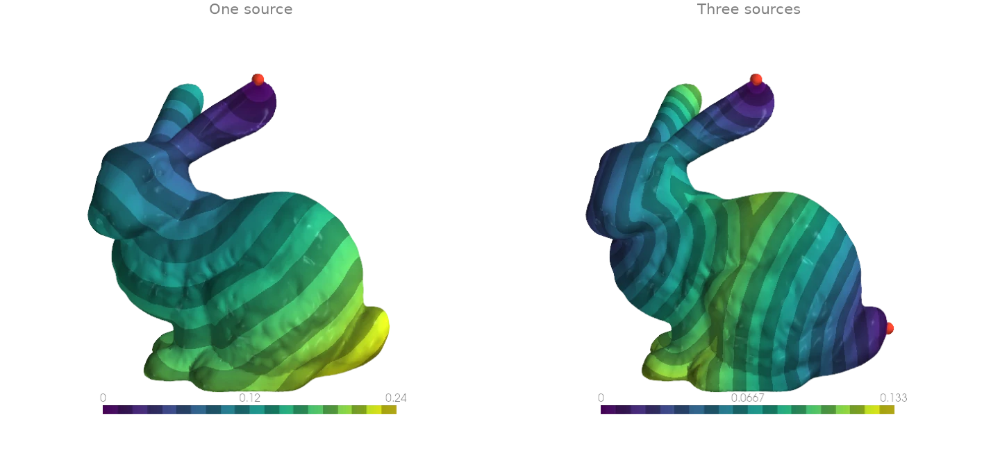
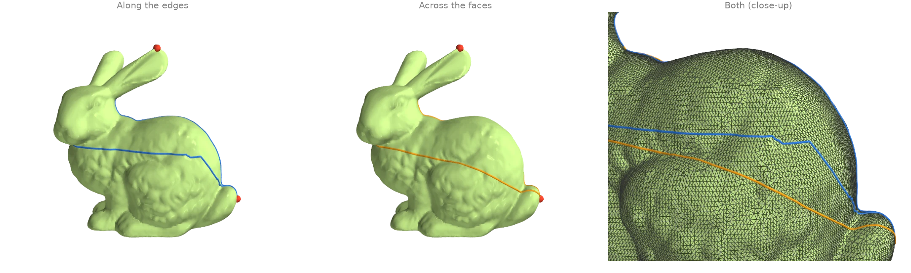
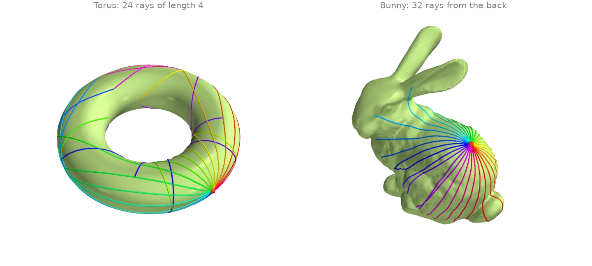
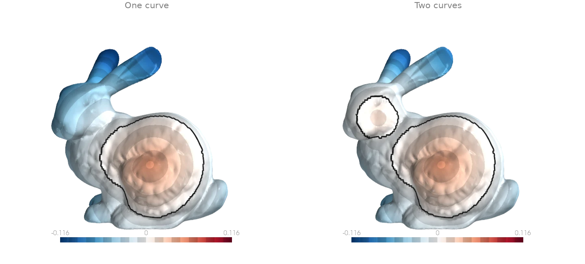
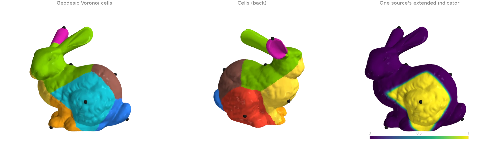
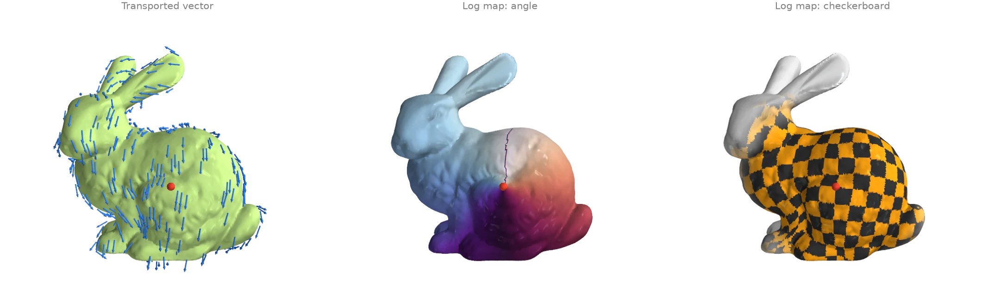
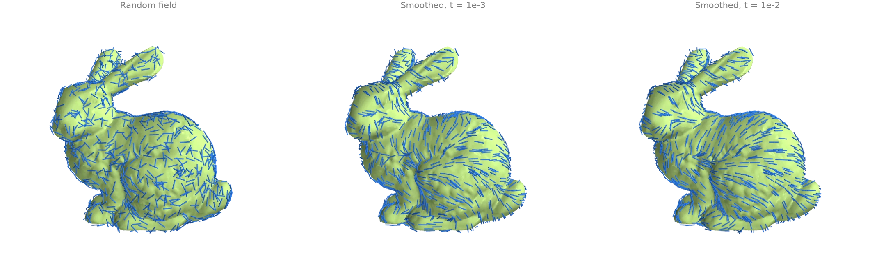
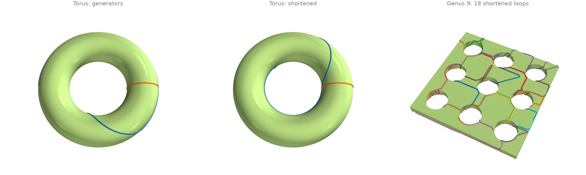

# Geodesics and tangent fields

Heat-method distances, geodesic paths and tracing, vector transport and the log map.

## Geodesic distance with the heat method {#g1}

[`heat_geodesic`][ordito.heat.heat_geodesic] approximates the distance along the surface to
the nearest source vertex. It diffuses heat from the sources for a short time, normalizes the
gradient of the result into a unit field, and integrates that field back into a distance. The
two sparse operators this needs are built once by
[`heat_operators`][ordito.heat.heat_operators] and reused here for a second set of sources.

```python
import warp as wp

import ordito as od
from examples import data

vertices, faces = data.load("bunny", device)
operators = od.heat.heat_operators(vertices, faces)

ear = wp.array([22820], dtype=wp.int32, device=device)
landmarks = wp.array([22820, 11842, 12217], dtype=wp.int32, device=device)  # ear, nose, tail
from_ear = od.heat.heat_geodesic(vertices, faces, ear, operators=operators)
from_landmarks = od.heat.heat_geodesic(vertices, faces, landmarks, operators=operators)
print(f"farthest point from the ear: {from_ear.numpy().max():.4f}")
```

```text title="Output"
farthest point from the ear: 0.2396
```



Modelled on: [libigl 716](https://libigl.github.io/tutorial/#heat-method) · [potpourri3d](https://github.com/nmwsharp/potpourri3d#mesh-distance) · [PyMeshLab](https://pymeshlab.readthedocs.io/en/latest/filter_list.html)
{: .ordito-credits }

## Shortest paths: along the edges and across the faces {#g2}

Two answers to "how do I get from the ear to the tail". The edge graph's shortest path comes
from [`shortest_path_envelope`][ordito.graph.shortest_path_envelope] (Dijkstra's distances,
computed by parallel relaxation over the [`edges_to_csr`][ordito.graph.edges_to_csr]
adjacency) followed by a short backtrack; it zigzags because it may only follow edges.
[`geodesic_path`][ordito.geodesic_walk.geodesic_path] instead descends one heat-method
distance field from every target, so its paths cut straight across faces and are shorter.

```python
import numpy as np
import warp as wp

import ordito as od
from examples import data

vertices, faces = data.load("bunny", device)
tail, targets = 12217, [22820, 11842]  # from the ear tip and the chin to the tail

# Across the faces: descend the heat distance to the tail from every target.
source = wp.array([tail], dtype=wp.int32, device=device)
points, offsets = od.geodesic_walk.geodesic_path(
    vertices, faces, source, wp.array(targets, dtype=wp.int32, device=device)
)
geodesics = od.array.split(points, offsets)

# Along the edges: Dijkstra distances to the tail, then step to the closest neighbour.
n = vertices.shape[0]
edges = od.edges.edges_unique(faces, n_vertices=n, validate=False)[0]
graph = od.graph.edges_to_csr(n, edges, od.edges.edges_unique_length(vertices, faces, edges))
seed = np.full(n, 1e6, dtype=np.float32)
seed[tail] = 0.0
dist = od.graph.shortest_path_envelope(graph, wp.array(seed, device=device)).numpy()
rows, cols, weights = graph.offsets.numpy(), graph.columns.numpy(), graph.values.numpy()
edge_paths = []
for v in targets:
    path = [v]
    while v != tail:
        ring = slice(rows[v], rows[v + 1])
        v = cols[ring][np.argmin(dist[cols[ring]] + weights[ring])]
        path.append(v)
    edge_paths.append(np.array(path))

for name, geodesic, path in zip(["ear", "chin"], geodesics, edge_paths, strict=True):
    along_edges = np.linalg.norm(np.diff(vertices.numpy()[path], axis=0), axis=1).sum()
    print(
        f"{name} -> tail: {along_edges:.4f} along edges, "
        f"{od.polyline.polyline_length(geodesic):.4f} across faces"
    )
```

```text title="Output"
ear -> tail: 0.2362 along edges, 0.2251 across faces
chin -> tail: 0.2137 along edges, 0.2018 across faces
```



Modelled on: [potpourri3d: geodesic paths](https://github.com/nmwsharp/potpourri3d) · [libigl 206](https://libigl.github.io/tutorial/#exact-discrete-geodesics) · [PyVista: geodesic](https://docs.pyvista.org/examples/01-filter/geodesic) · [trimesh: shortest path](https://github.com/mikedh/trimesh/blob/main/examples/shortest.ipynb)
{: .ordito-credits }

## Tracing straightest geodesics (the exponential map) {#g3}

[`trace_from_vertex`][ordito.geodesic_walk.trace_from_vertex] walks a batch of rays across the
surface, each starting at a vertex in a tangent direction and going straight ahead through
every face it enters, for an arc length equal to the direction's length. A fan of equal-length
rays in every direction is the image of a disk under the exponential map: on the torus the
rays along the outer equator stay together while those climbing over the tube spread and wind
around it. The tangent directions are built in each vertex's frame from
[`vertex_tangent_frames`][ordito.tangent_space.vertex_tangent_frames].

```python
import numpy as np
import warp as wp

import ordito as od
from examples import data

def fan(name: str, start: int, length: float, n_rays: int = 32):
    vertices, faces = data.load(name, device)
    basis_x, basis_y, _ = od.tangent_space.vertex_tangent_frames(vertices, faces)
    angle = (np.arange(n_rays)[:, None] + 0.5) * (2.0 * np.pi / n_rays)
    directions = length * (
        np.cos(angle) * basis_x.numpy()[start] + np.sin(angle) * basis_y.numpy()[start]
    )
    points, offsets = od.geodesic_walk.trace_from_vertex(
        vertices,
        faces,
        wp.full(n_rays, start, dtype=wp.int32, device=device),
        wp.array(directions, dtype=wp.vec3, device=device),
    )
    return od.array.split(points, offsets)

torus_rays = fan("torus", start=0, length=4.0, n_rays=24)  # a vertex on the outer equator
bunny_rays = fan("bunny", start=16151, length=0.1)  # a vertex on the back
lengths = [od.polyline.polyline_length(ray) for ray in torus_rays]
print(f"torus ray lengths: {min(lengths):.3f} to {max(lengths):.3f}")
print(f"edge crossings per torus ray: up to {max(len(ray) for ray in torus_rays) - 2}")
```

```text title="Output"
torus ray lengths: 4.000 to 4.000
edge crossings per torus ray: up to 246
```



A ray that runs exactly into a vertex stops there (the walk has no rule for which face to
continue into). On the torus's regular grid that happens to rays leaving along an edge, so
the fan starts half a step off the frame's axes.

Modelled on: [potpourri3d: geodesic tracer](https://github.com/nmwsharp/potpourri3d)
{: .ordito-credits }

## Signed distance to curves on the surface {#g4}

[`heat_signed_distance`][ordito.heat.heat_signed_distance] measures the distance along the
surface to a set of closed, oriented curves, positive on one side and negative on the other.
It diffuses the curves' normals with the vector heat method and integrates the normalized
result, so it needs no inside/outside test and handles several curves at once. The curves
here are the rims of geodesic disks: [`heat_geodesic`][ordito.heat.heat_geodesic] gives the
distance to a centre and [`boundary_loops`][ordito.boundary.boundary_loops] of the faces
within a radius orders the rim.

```python
import numpy as np
import warp as wp

import ordito as od
from examples import data

vertices, faces = data.load("bunny", device)
triangles = faces.numpy().reshape(-1, 3)

def rim(center: int, radius: float) -> np.ndarray:
    """Return the boundary loop of the geodesic disk of ``radius`` around ``center``."""
    source = wp.array([center], dtype=wp.int32, device=device)
    distance = od.heat.heat_geodesic(vertices, faces, source).numpy()
    disk = triangles[(distance[triangles] < radius).all(axis=1)].ravel()
    loops = od.boundary.boundary_loops(vertices, wp.array(disk, device=device))
    return max(loops, key=lambda loop: loop.shape[0]).numpy()

body, cheek = rim(5088, 0.05), rim(6710, 0.02)
one = od.heat.heat_signed_distance(vertices, faces, wp.array(body, device=device))
both = od.heat.heat_signed_distance(
    vertices,
    faces,
    wp.array(np.concatenate([body, cheek]), device=device),
    curve_offsets=wp.array(
        [0, body.size, body.size + cheek.size], dtype=wp.int32, device=device
    ),
)
print(f"one curve: {one.numpy().min():.4f} to {one.numpy().max():.4f}")
print(f"value on the curve: |d| <= {np.abs(one.numpy()[body]).max():.1e}")
```

```text title="Output"
one curve: -0.1247 to 0.0492
value on the curve: |d| <= 0.0e+00
```



Modelled on: [potpourri3d: signed heat method](https://github.com/nmwsharp/potpourri3d)
{: .ordito-credits }

## Extending values from a few points (geodesic Voronoi cells) {#g5}

[`extend_scalar`][ordito.heat.extend_scalar] spreads values given at a few source vertices
over the whole surface: every vertex takes the value of its geodesically nearest source, with
a short smooth blend where two sources meet. It diffuses the values and an indicator of the
sources for the same short time and divides one by the other. Extending each source's
indicator in turn and keeping the largest partitions the surface into geodesic Voronoi cells;
the [`heat_operators`][ordito.heat.heat_operators] are built once for all eight. The
sources are spread with [`farthest_point_sample`][ordito.points.farthest_point_sample].

```python
import numpy as np
import warp as wp

import ordito as od
from examples import data

vertices, faces = data.load("bunny", device)
operators = od.heat.heat_operators(vertices, faces)
sources = od.points.farthest_point_sample(vertices, 8)

# Extend each source's indicator (1 there, 0 at the others); the largest one wins.
weights = np.stack(
    [
        od.heat.extend_scalar(
            vertices, faces, sources, wp.array(np.eye(8)[k], device=device), operators=operators
        ).numpy()
        for k in range(8)
    ]
)
cells = weights.argmax(axis=0)
print(f"sources: {sources.numpy().tolist()}")
print(f"vertices per cell: {np.bincount(cells, minlength=8).tolist()}")
print(f"weights sum to 1 within {np.abs(weights.sum(axis=0) - 1).max():.1e}")
```

```text title="Output"
sources: [0, 11471, 12277, 24751, 26517, 4047, 13357, 21519]
vertices per cell: [8898, 3126, 3366, 1835, 4533, 4181, 3913, 4982]
weights sum to 1 within 3.2e-14
```



Modelled on: [potpourri3d: extend scalar](https://github.com/nmwsharp/potpourri3d)
{: .ordito-credits }

## Parallel transport and the logarithmic map {#g6}

The vector heat method carries a tangent vector from a source vertex to every other vertex
along the shortest path. [`transport_tangent_vectors`][ordito.heat.transport_tangent_vectors]
returns the result in each vertex's own tangent frame, and
[`tangent_to_world`][ordito.heat.tangent_to_world] turns it into 3-D arrows.
[`log_map`][ordito.heat.log_map] combines the same transport with the geodesic distance into
2-D coordinates around the source, a local "unwrapping" of the surface: a checkerboard drawn in
those coordinates stays square near the source and bends where the surface curves. Both share
one [`vector_heat_operators`][ordito.heat.vector_heat_operators] bundle.

```python
import numpy as np
import warp as wp

import ordito as od
from examples import data

vertices, faces = data.load("bunny", device)
operators = od.heat.vector_heat_operators(vertices, faces)
basis_x, basis_y, _ = operators[2]

source = 5088  # a vertex on the flank
transported, resolved = od.heat.transport_tangent_vectors(
    vertices,
    faces,
    wp.array([source], dtype=wp.int32, device=device),
    wp.array([wp.vec2(1.0, 0.0)], dtype=wp.vec2, device=device),
    operators=operators,
)
arrows = od.heat.tangent_to_world(transported, basis_x, basis_y)
coordinates = od.heat.log_map(vertices, faces, source, operators=operators)
print(f"resolved vertices: {resolved.numpy().mean():.1%}")
radius = np.linalg.norm(coordinates.numpy(), axis=1)
print(f"largest log-map radius (geodesic distance): {radius.max():.4f}")
```

```text title="Output"
resolved vertices: 100.0%
largest log-map radius (geodesic distance): 0.1718
```



Modelled on: [potpourri3d: vector heat](https://github.com/nmwsharp/potpourri3d) · [libigl 902](https://libigl.github.io/tutorial/)
{: .ordito-credits }

## Smoothing a tangent vector field {#g7}

A random unit vector at every vertex is a tangent field with no structure.
[`diffuse_tangent_field`][ordito.heat.diffuse_tangent_field] runs one implicit step of the
connection Laplacian on it, which averages neighbouring vectors *after* transporting them into
a common frame, so the field straightens out across the surface instead of cancelling against
the change of tangent plane. The diffusion time of
[`vector_heat_operators`][ordito.heat.vector_heat_operators] sets how far the averaging
reaches. The smoothed fields are normalized to unit length and turned into 3-D vectors by
[`tangent_to_world`][ordito.heat.tangent_to_world]; the printed alignment compares the two
ends of every [`edges_unique`][ordito.edges.edges_unique] edge.

```python
import numpy as np
import warp as wp

import ordito as od
from examples import data

vertices, faces = data.load("bunny", device)
angle = np.random.default_rng(0).uniform(0.0, 2.0 * np.pi, vertices.shape[0])
noisy = wp.array(np.stack([np.cos(angle), np.sin(angle)], 1), dtype=wp.vec2d, device=device)
edges = od.edges.edges_unique(faces)[0].numpy()

world = {}
for name, t in (("random", None), ("t = 1e-3", 1e-3), ("t = 1e-2", 1e-2)):
    system, _, (basis_x, basis_y, _), preconditioner = od.heat.vector_heat_operators(
        vertices, faces, t
    )
    field = noisy.numpy()
    if t is not None:
        field = od.heat.diffuse_tangent_field(system, noisy, preconditioner=preconditioner)
        field = field.numpy() / np.linalg.norm(field.numpy(), axis=1, keepdims=True)
    tangent = wp.array(field, dtype=wp.vec2, device=device)
    world[name] = od.heat.tangent_to_world(tangent, basis_x, basis_y).numpy()
    cosine = np.einsum("ij,ij->i", world[name][edges[:, 0]], world[name][edges[:, 1]])
    print(f"{name:>9}: mean cosine between neighbours {cosine.mean():.3f}")
```

```text title="Output"
   random: mean cosine between neighbours -0.001
 t = 1e-3: mean cosine between neighbours 0.975
 t = 1e-2: mean cosine between neighbours 0.982
```



Modelled on: [libigl 901](https://libigl.github.io/tutorial/)
{: .ordito-credits }

## Shortening non-contractible loops {#g8}

[`homology_generators`][ordito.homology.homology_generators] returns a basis of the loops
that cannot be shrunk to a point: two per handle. They come out of a spanning-tree
construction, so they are long and jagged.
[`shorten_loop`][ordito.geodesic_walk.shorten_loop] then shortens each one without changing
which way it wraps around the surface, rerouting it one vertex at a time through the shorter
side of the vertex's ring, until it settles on a short loop along the mesh edges.

```python
import warp as wp

import ordito as od
from examples import data

result = {}

def total_length(vertices: wp.array[wp.vec3], loops: list[wp.array[wp.int32]]) -> float:
    points = [od.array.gather(vertices, loop) for loop in loops]
    return sum(od.polyline.polyline_length(p, closed=True) for p in points)

for name in ("torus", "handles"):
    vertices, faces = data.load(name, device)
    loops = od.homology.homology_generators(vertices, faces)
    short, sweeps = od.geodesic_walk.shorten_loop(vertices, faces, loops, max_iter=1000)
    before, after = total_length(vertices, loops), total_length(vertices, short)
    print(f"{name}: {len(loops)} loops, length {before:.2f} -> {after:.2f} ({sweeps} sweeps)")
    result[name] = ([loop.numpy() for loop in loops], [loop.numpy() for loop in short])
```

```text title="Output"
torus: 2 loops, length 10.79 -> 8.04 (65 sweeps)
handles: 18 loops, length 485.80 -> 451.22 (11 sweeps)
```



The shortened loops stay on mesh edges, so they are locally shortest *edge* paths rather than
true geodesics. On the torus's regular grid the loop around the hole cannot step off a row of
edges without first getting longer, which is why it does not settle exactly on the inner
equator.

Modelled on: [potpourri3d: geodesic loops](https://github.com/nmwsharp/potpourri3d)
{: .ordito-credits }
