# Examples

Each example below is a complete, runnable snippet together with the image it produced. The
inputs are shared across examples so that related operations can be compared on the same shape:
most use the Stanford bunny, and the rest use the dragon, the happy Buddha, or meshes built with
[`ordito.creation`][ordito.creation].

`data` in the snippets is the gallery's input module
([`examples/data.py`](https://github.com/lucagrementieri/ordito/blob/main/examples/data.py)). It
loads a mesh into ordito's layout: `wp.vec3` vertices and a flat `wp.int32` face buffer. The code
runs on whichever Warp `device` you pass, CPU or CUDA. The images come from
`python -m examples.run`, which renders them with PyVista.

Each example also links the reference-library examples it was modelled on. The images are ordito's
own output.

## [The Trimesh object](trimesh-object.md)

-   [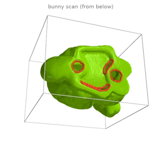](trimesh-object.md#t1)

    [Quick start: build a mesh and read its properties](trimesh-object.md#t1)

-   [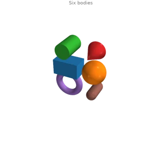](trimesh-object.md#t2)

    [Bodies: split, explode and recombine](trimesh-object.md#t2)

-   [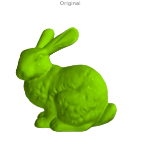](trimesh-object.md#t3)

    [Rigid and mirror transforms](trimesh-object.md#t3)

-   [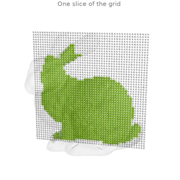](trimesh-object.md#t4)

    [Inside tests and surface samples](trimesh-object.md#t4)

-   [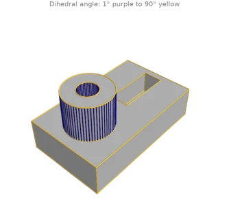](trimesh-object.md#t5)

    [Edge structure: dihedral angles, convexity and boundaries](trimesh-object.md#t5)

-   [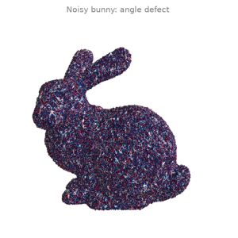](trimesh-object.md#t6)

    [Caching and functional updates](trimesh-object.md#t6)

-   [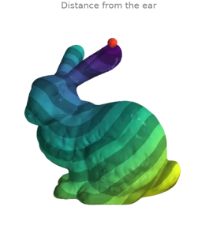](trimesh-object.md#t7)

    [Reusing cached operators](trimesh-object.md#t7)

## [Creating meshes](creation.md)

-   [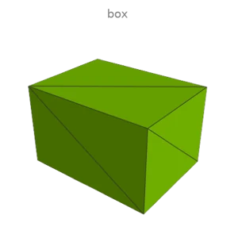](creation.md#c1)

    [Primitive gallery](creation.md#c1)

-   [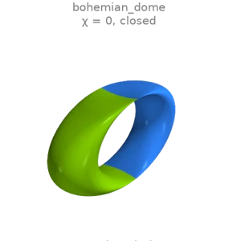](creation.md#c2)

    [Parametric surfaces](creation.md#c2)

-   [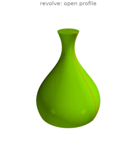](creation.md#c3)

    [Revolve, extrude and sweep](creation.md#c3)

-   [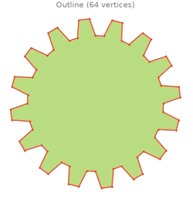](creation.md#c4)

    [Polygon triangulation](creation.md#c4)

-   [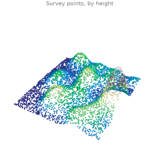](creation.md#c5)

    [Terrain triangulation](creation.md#c5)

## [Inspecting meshes](inspect.md)

-   [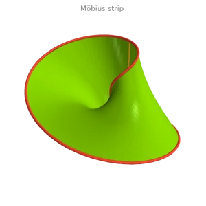](inspect.md#i1)

    [Validation masks: boundaries, non-manifold elements, orientation](inspect.md#i1)

-   [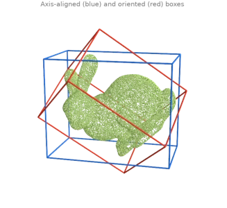](inspect.md#i2)

    [Bounding boxes, principal axes and a fitted plane](inspect.md#i2)

-   [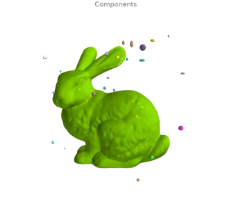](inspect.md#i3)

    [Connected components: label, split, remove debris](inspect.md#i3)

-   [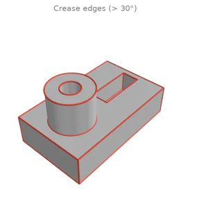](inspect.md#i4)

    [Feature edges: creases, convexity and boundaries](inspect.md#i4)

-   [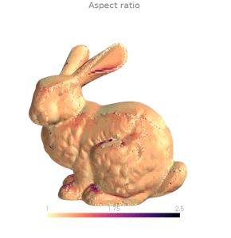](inspect.md#i5)

    [Triangle quality](inspect.md#i5)

-   [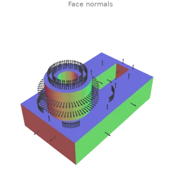](inspect.md#i6)

    [Normals: per face, per vertex, per corner](inspect.md#i6)

-   [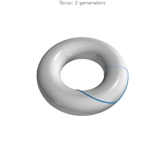](inspect.md#i7)

    [Homology generators: handles and tunnels](inspect.md#i7)

-   [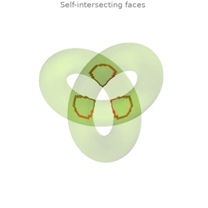](inspect.md#i8)

    [Self-intersections and mesh-mesh collisions](inspect.md#i8)

## [Curvature and differential operators](differential.md)

-   [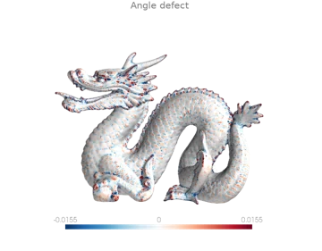](differential.md#d1)

    [Gaussian and mean curvature](differential.md#d1)

-   [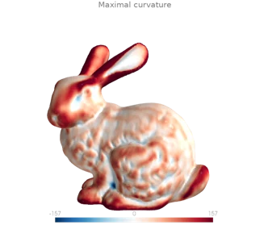](differential.md#d2)

    [Principal curvatures and directions](differential.md#d2)

-   [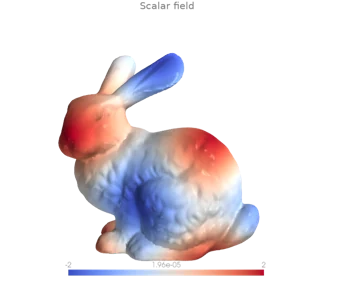](differential.md#d3)

    [Gradient of a scalar field](differential.md#d3)

-   [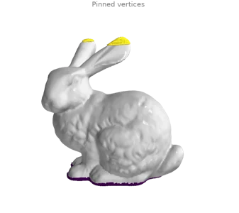](differential.md#d4)

    [Laplace equation with Dirichlet conditions](differential.md#d4)

-   [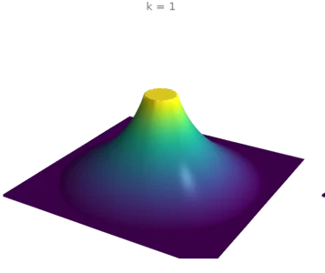](differential.md#d5)

    [Polyharmonic surfaces (k = 1, 2, 3)](differential.md#d5)

-   [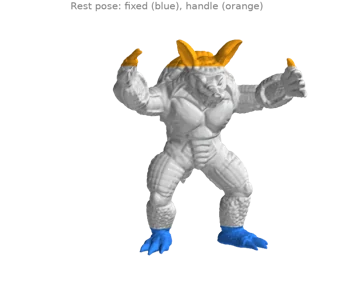](differential.md#d6)

    [Handle-based biharmonic deformation](differential.md#d6)

-   [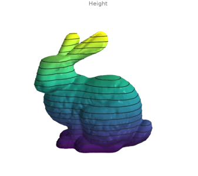](differential.md#d7)

    [Isolines of a scalar field](differential.md#d7)

-   [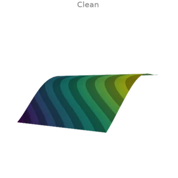](differential.md#d8)

    [Smoothing a noisy scalar field](differential.md#d8)

-   [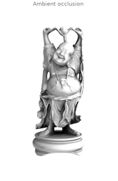](differential.md#d9)

    [Ambient occlusion, obscurance, shape diameter and thickness](differential.md#d9)

-   [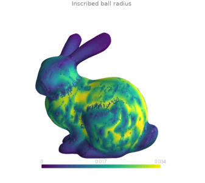](differential.md#d10)

    [Maximal inscribed spheres and the medial axis](differential.md#d10)

## [Geodesics and tangent fields](geodesics.md)

-   [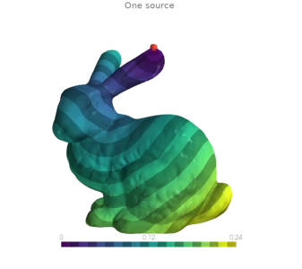](geodesics.md#g1)

    [Geodesic distance with the heat method](geodesics.md#g1)

-   [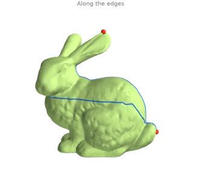](geodesics.md#g2)

    [Shortest paths: along the edges and across the faces](geodesics.md#g2)

-   [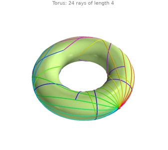](geodesics.md#g3)

    [Tracing straightest geodesics (the exponential map)](geodesics.md#g3)

-   [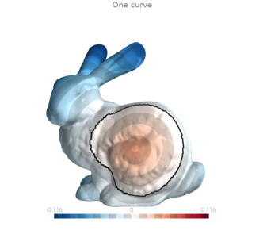](geodesics.md#g4)

    [Signed distance to curves on the surface](geodesics.md#g4)

-   [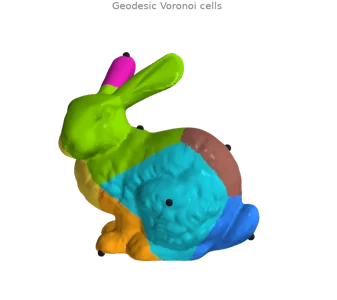](geodesics.md#g5)

    [Extending values from a few points (geodesic Voronoi cells)](geodesics.md#g5)

-   [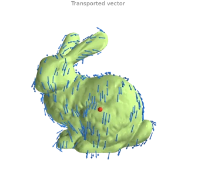](geodesics.md#g6)

    [Parallel transport and the logarithmic map](geodesics.md#g6)

-   

    [Smoothing a tangent vector field](geodesics.md#g7)

-   [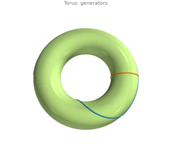](geodesics.md#g8)

    [Shortening non-contractible loops](geodesics.md#g8)

## [Parametrization and textures](parametrization.md)

-   [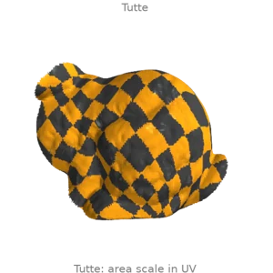](parametrization.md#p1)

    [Flattening a disk: Tutte, harmonic, LSCM and ARAP](parametrization.md#p1)

-   [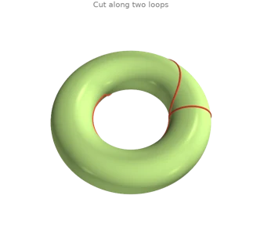](parametrization.md#p2)

    [Cutting a closed surface open along seams](parametrization.md#p2)

-   [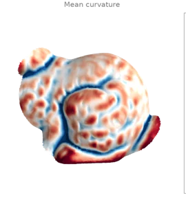](parametrization.md#p3)

    [Baking a field into a texture and reading it back](parametrization.md#p3)

## [Smoothing and fairing](smoothing.md)

-   [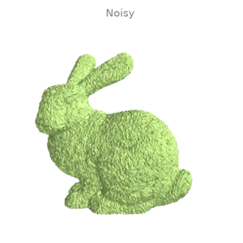](smoothing.md#s1)

    [Denoising a scan: four smoothing filters](smoothing.md#s1)

-   [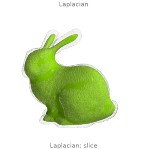](smoothing.md#s2)

    [Smoothing without shrinking](smoothing.md#s2)

-   [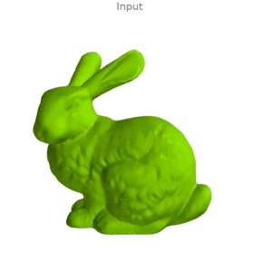](smoothing.md#s3)

    [Mean-curvature flow](smoothing.md#s3)

-   [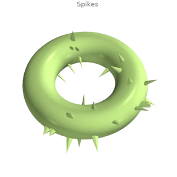](smoothing.md#s4)

    [Removing spikes and sharpening detail](smoothing.md#s4)

-   [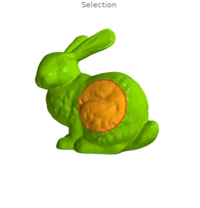](smoothing.md#s5)

    [Fairing a region and smoothing its rim](smoothing.md#s5)

-   [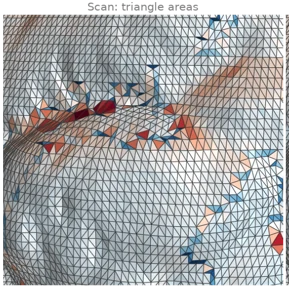](smoothing.md#s6)

    [Relaxation: even triangle areas and a local surface fit](smoothing.md#s6)

## [Remeshing and simplification](remesh.md)

-   

    [Quadric decimation](remesh.md#r1)

-   [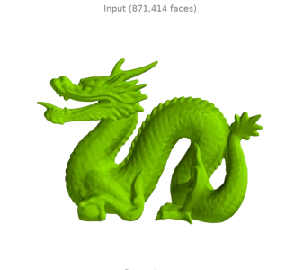](remesh.md#r2)

    [Vertex clustering](remesh.md#r2)

-   [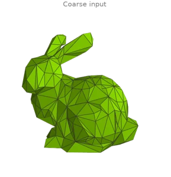](remesh.md#r3)

    [Subdivision: midpoint and Loop](remesh.md#r3)

-   [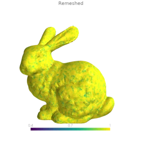](remesh.md#r4)

    [Isotropic remeshing](remesh.md#r4)

-   [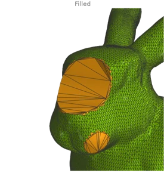](remesh.md#r5)

    [Refining to a size or to the surrounding density](remesh.md#r5)

-   

    [Delaunay flips and the intrinsic Delaunay triangulation](remesh.md#r6)

## [Repairing meshes](repair.md)

-   

    [Filling holes: fan, minimum weight and smooth](repair.md#h1)

-   

    [Filling only the small holes](repair.md#h2)

-   

    [Stitching two boundaries](repair.md#h3)

-   

    [Joining nearby open components](repair.md#h4)

-   

    [Degenerate triangles, duplicate vertices and T-vertices](repair.md#h5)

-   

    [Consistent and outward orientation](repair.md#h6)

-   

    [Non-manifold repair](repair.md#h7)

-   

    [Fixing self-intersections](repair.md#h8)

-   

    [Removing tunnels](repair.md#h9)

-   

    [One-call watertight solid](repair.md#h10)

## [Offsets, voxels and implicit surfaces](volumes.md)

-   

    [Offset, thicken and shell](volumes.md#v1)

-   

    [Signed distance field and its level sets](volumes.md#v2)

-   

    [Meshing an implicit surface: the gyroid](volumes.md#v3)

-   

    [Voxelizing meshes and point clouds](volumes.md#v4)

-   

    [Voxel morphology](volumes.md#v5)

-   

    [Voxel CSG (approximate booleans)](volumes.md#v6)

-   

    [Generalized winding number](volumes.md#v7)

## [Spatial queries](queries.md)

-   

    [Ray casting a depth and a normal image](queries.md#q1)

-   

    [Rays against a mesh: hits and misses](queries.md#q2)

-   

    [Closest points on a surface](queries.md#q3)

-   

    [Distance between two surfaces](queries.md#q4)

-   

    [Inside / outside classification](queries.md#q5)

-   

    [Nearest neighbours and ball queries](queries.md#q6)

-   

    [Chamfer and Hausdorff distances](queries.md#q7)

## [Cutting, slicing and selection](cutting.md)

-   

    [Plane sections and slice stacks](cutting.md#x1)

-   

    [Clipping and capping](cutting.md#x2)

-   

    [Clipping with a scalar field](cutting.md#x3)

-   

    [Cropping to a box](cutting.md#x4)

-   

    [Growing and shrinking selections](cutting.md#x5)

-   

    [Polyline processing](cutting.md#x6)

## [Point clouds](points.md)

-   

    [Down-sampling: voxel grid, farthest point and blue noise](points.md#pc1)

-   

    [Surface sampling: uniform, Poisson disk and blue noise](points.md#pc2)

-   

    [Normal estimation](points.md#pc3)

-   

    [Outlier removal: statistical, radius and probabilistic](points.md#pc4)

-   

    [Cloud-to-cloud distance](points.md#pc5)

-   

    [Interpolating sparse samples onto a surface](points.md#pc6)

-   

    [Convex-hull points and half-space tests](points.md#pc7)

## [Reconstruction and registration](reconstruction.md)

-   

    [Screened Poisson reconstruction](reconstruction.md#rr1)

-   

    [Ball pivoting](reconstruction.md#rr2)

-   

    [Local triangulation and uniform resampling](reconstruction.md#rr3)

-   

    [Rigid ICP: point-to-point vs point-to-plane](reconstruction.md#rr4)

-   

    [Robust ICP with outliers](reconstruction.md#rr5)

-   

    [Known correspondences: Procrustes alignment](reconstruction.md#rr6)

