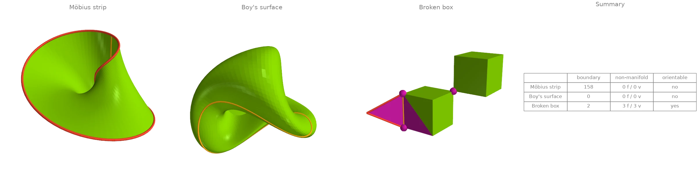
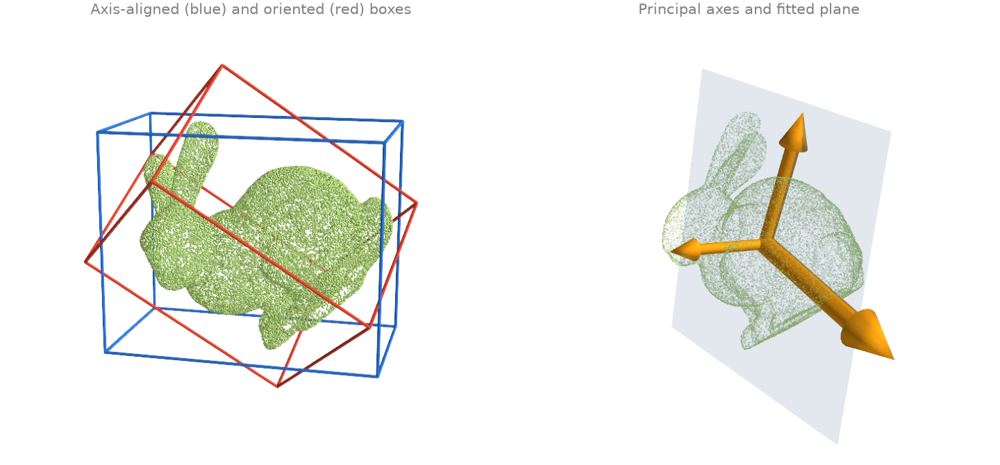
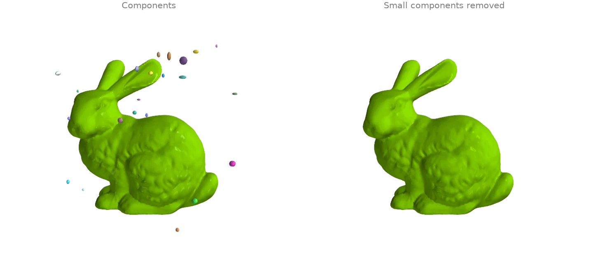
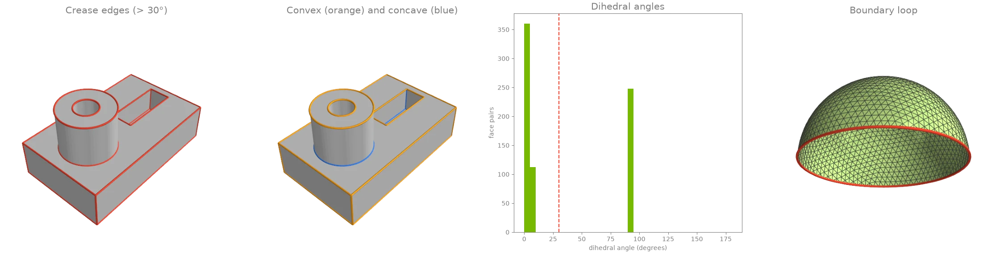
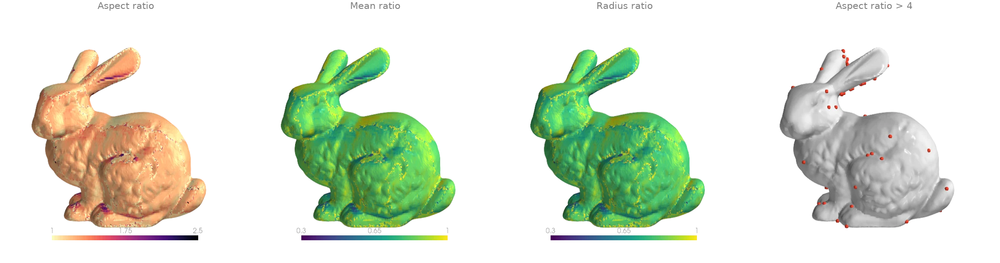
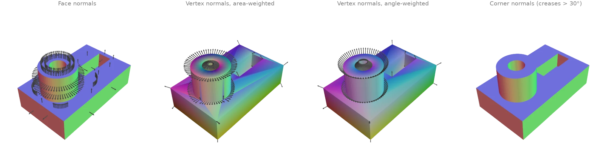
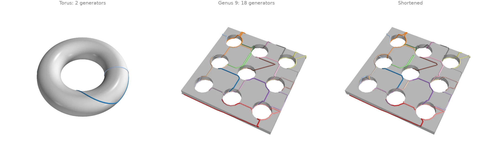
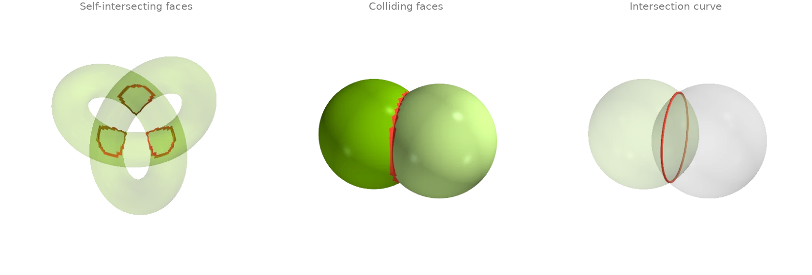

# Inspecting meshes

Topology, validity, components, normals, quality and bounding volumes.

## Validation masks: boundaries, non-manifold elements, orientation {#i1}

Three small meshes, each broken in a different way. The Möbius strip has one boundary loop and
no consistent orientation, Boy's surface is closed but non-orientable, and the broken box has
a fin on one edge (an edge with three faces) and two cubes meeting at one corner (a vertex
whose faces form two fans). The per-element masks locate each defect:
[`face_watertight_mask`][ordito.validation.face_watertight_mask],
[`edge_manifold_mask`][ordito.validation.edge_manifold_mask],
[`vertex_manifold_mask`][ordito.validation.vertex_manifold_mask] and
[`edge_winding_consistent_mask`][ordito.validation.edge_winding_consistent_mask];
[`boundary_edges`][ordito.boundary.boundary_edges] lists the rims and
[`is_orientable`][ordito.validation.is_orientable] gives the global verdict.

```python
import ordito as od
from examples import data

results = {}
for name in ("mobius", "boy", "broken_box"):
    vertices, faces = data.load(name, device)
    results[name] = {
        "open_faces": ~od.validation.face_watertight_mask(faces).numpy(),
        "non_manifold_faces": ~od.validation.edge_manifold_mask(faces).numpy(),
        "non_manifold_vertices": ~od.validation.vertex_manifold_mask(vertices, faces).numpy(),
        "boundary_edges": od.boundary.boundary_edges(vertices, faces).numpy(),
        "orientable": od.validation.is_orientable(faces),
        "inconsistent_edges": int(
            (~od.validation.edge_winding_consistent_mask(faces).numpy()).sum()
        ),
    }
    m = results[name]
    print(
        f"{name}: {len(m['boundary_edges'])} boundary edges, "
        f"{m['non_manifold_faces'].sum()} faces on non-manifold edges, "
        f"{m['non_manifold_vertices'].sum()} non-manifold vertices, "
        f"{m['inconsistent_edges']} edges wound the same way by both faces, "
        f"orientable: {m['orientable']}"
    )
```

```text title="Output"
mobius: 158 boundary edges, 0 faces on non-manifold edges, 0 non-manifold vertices, 79 edges wound the same way by both faces, orientable: False
boy: 0 boundary edges, 0 faces on non-manifold edges, 0 non-manifold vertices, 79 edges wound the same way by both faces, orientable: False
broken_box: 2 boundary edges, 3 faces on non-manifold edges, 3 non-manifold vertices, 0 edges wound the same way by both faces, orientable: True
```



Magenta faces touch an edge used by three faces, magenta dots are non-manifold vertices, red
edges are boundary edges and orange edges are traversed in the same direction by both of their
faces (where the orientation flips). Both ends of the fin's edge are reported as non-manifold
vertices along with the shared corner.

Modelled on: [Open3D: mesh properties](https://www.open3d.org/docs/release/tutorial/geometry/mesh.html) · [PyVista: mesh quality](https://docs.pyvista.org/examples/01-filter/mesh_quality)
{: .ordito-credits }

## Bounding boxes, principal axes and a fitted plane {#i2}

A bunny point cloud turned about a skew axis. The axis-aligned box from
[`aabb`][ordito.bounds.aabb] grows with the tilt; the oriented box from
[`oriented_bounding_box`][ordito.bounds.oriented_bounding_box] searches orientations for the
smallest volume and does not. [`principal_axes`][ordito.points.principal_axes] gives the
covariance frame (drawn at three times the standard deviation along each axis), and
[`fit_plane`][ordito.points.fit_plane] the least-squares plane, whose normal is the least
spread axis.

```python
import numpy as np

import ordito as od
from examples import data

points = data.load_points("tilted_bunny_cloud", device)

aabb_lower, aabb_upper = od.bounds.aabb(points)
rotation, obb_lower, obb_upper = od.bounds.oriented_bounding_box(points)
axes, scatter, centroid = od.points.principal_axes(points)  # scatter = n - 1 times variance
plane_normal, plane_origin = od.points.fit_plane(points)

aabb_volume = np.prod(np.array(aabb_upper) - np.array(aabb_lower))
obb_volume = np.prod(np.array(obb_upper) - np.array(obb_lower))
print(f"axis-aligned box volume {aabb_volume:.3e}, oriented box volume {obb_volume:.3e}")
deviations = np.sqrt(np.array(scatter) / (points.size - 1))
print(f"standard deviations along the principal axes {deviations}")
```

```text title="Output"
axis-aligned box volume 3.221e-03, oriented box volume 2.396e-03
standard deviations along the principal axes [0.04859596 0.03405995 0.02667325]
```



Modelled on: [Open3D: bounding volumes](https://www.open3d.org/docs/release/tutorial/geometry/pointcloud.html) · [trimesh: examples](https://trimesh.org/examples.html) · [libigl 910](https://libigl.github.io/tutorial/#bounding-boxes)
{: .ordito-credits }

## Connected components: label, split, remove debris {#i3}

The bunny scan is surrounded by small floating blobs, the debris a scanner leaves behind.
[`face_connected_component_labels`][ordito.adjacency.face_connected_component_labels] gives
every face the label of its edge-connected component, [`split`][ordito.combine.split] cuts the
mesh into one mesh per component, and
[`remove_small_components`][ordito.repair.remove_small_components] drops every component
below a face count (or area, or diameter) in one call.

```python
import numpy as np

import ordito as od
from examples import data

vertices, faces = data.load("bunny_debris", device)
labels = od.adjacency.face_connected_component_labels(faces)
parts = od.combine.split(vertices, faces)
sizes = sorted((part_faces.shape[0] // 3 for _, part_faces in parts), reverse=True)
print(f"{len(parts)} components; the largest has {sizes[0]} faces, the next {sizes[1]}")

clean_vertices, clean_faces = od.repair.remove_small_components(vertices, faces, min_faces=1000)
print(f"kept {clean_faces.shape[0] // 3} of {faces.shape[0] // 3} faces")
```

```text title="Output"
41 components; the largest has 69451 faces, the next 80
kept 69451 of 72651 faces
```



Modelled on: [Open3D: connected components](https://www.open3d.org/docs/release/tutorial/geometry/mesh.html) · [PyVista: connectivity](https://docs.pyvista.org/examples/01-filter/connectivity) · [PyMeshLab: filters](https://pymeshlab.readthedocs.io/en/latest/filter_list.html)
{: .ordito-credits }

## Feature edges: creases, convexity and boundaries {#i4}

[`face_adjacency`][ordito.adjacency.face_adjacency] pairs the faces that share an edge;
[`face_adjacency_angles`][ordito.adjacency.face_adjacency_angles] measures the dihedral angle
across each pair and
[`face_adjacency_convex`][ordito.adjacency.face_adjacency_convex] says which way it folds.
[`crease_edges`][ordito.seams.crease_edges] keeps the edges that bend by more than a threshold
angle in one call, and [`boundary_loops`][ordito.boundary.boundary_loops] orders the edges used
by a single face into closed rims.

```python
import numpy as np

import ordito as od
from examples import data

vertices, faces = data.load("cad_part", device)
adjacency, shared_edges = od.adjacency.face_adjacency(faces, return_edges=True)
angles = od.adjacency.face_adjacency_angles(vertices, faces, adjacency)
convex = od.adjacency.face_adjacency_convex(vertices, faces, adjacency, shared_edges)
creases = od.seams.crease_edges(vertices, faces, angle=30.0)
sharp = angles.numpy() > np.radians(30.0)
print(
    f"{creases.shape[0]} crease edges: {(sharp & convex.numpy()).sum()} convex, "
    f"{(sharp & ~convex.numpy()).sum()} concave"
)

rim_vertices, rim_faces = data.load("hemisphere", device)
loops = od.boundary.boundary_loops(rim_vertices, rim_faces)
print(f"hemisphere: {len(loops)} boundary loop of {loops[0].shape[0]} vertices")
```

```text title="Output"
248 crease edges: 176 convex, 72 concave
hemisphere: 1 boundary loop of 96 vertices
```



Modelled on: [PyVista: extract edges](https://docs.pyvista.org/examples/01-filter/extract_edges) · [trimesh: examples](https://trimesh.org/examples.html) · [PyMeshLab: filters](https://pymeshlab.readthedocs.io/en/latest/filter_list.html)
{: .ordito-credits }

## Triangle quality {#i5}

[`face_quality`][ordito.triangles.face_quality] scores the shape of every triangle of the bunny
scan. The aspect ratio (circumradius over twice the inradius) is 1 for an equilateral triangle
and grows without bound for a sliver; the mean ratio and the radius ratio run the other way,
from 0 for a degenerate triangle to 1. The scan is mostly well shaped, with a scatter of
slivers where the scanner's patches were stitched.

```python
import numpy as np

import ordito as od
from examples import data

vertices, faces = data.load("bunny", device)
aspect = od.triangles.face_quality(vertices, faces, "aspect_ratio").numpy()
mean_ratio = od.triangles.face_quality(vertices, faces, "mean_ratio").numpy()
radius_ratio = od.triangles.face_quality(vertices, faces, "radius_ratio").numpy()
print(f"aspect ratio: median {np.median(aspect):.3f}, worst {aspect.max():.1f}")
print(f"{(aspect > 4).sum()} of {aspect.size} faces have an aspect ratio above 4")
```

```text title="Output"
aspect ratio: median 1.231, worst 1666.9
85 of 69451 faces have an aspect ratio above 4
```



Modelled on: [PyVista: mesh quality](https://docs.pyvista.org/examples/01-filter/mesh_quality) · [PyMeshLab: filters](https://pymeshlab.readthedocs.io/en/latest/filter_list.html) · [libigl 701](https://libigl.github.io/tutorial/#statistics)
{: .ordito-credits }

## Normals: per face, per vertex, per corner {#i6}

Four ways to put normals on a machined part, coloured by direction (red, green, blue for
the x, y, z components). [`face_normals_and_areas`][ordito.triangles.face_normals_and_areas]
gives one flat normal per face. [`vertex_normals`][ordito.vertices.vertex_normals] averages
them per vertex, weighted by face area or by the corner angle: area weighting leans towards
the long triangles of a flat side, angle weighting does not depend on how a flat side was
triangulated. Both smear a crease. [`corner_normals`][ordito.triangles.corner_normals] keeps
one normal per face corner and averages only over faces not separated by a
[`crease_edges`][ordito.seams.crease_edges] edge, which is what a renderer with hard edges
needs.

```python
import numpy as np

import ordito as od
from examples import data

vertices, faces = data.load("cad_part", device)
face_normals, _ = od.triangles.face_normals_and_areas(vertices, faces)
area_weighted = od.vertices.vertex_normals(vertices, faces, weighting="area")
angle_weighted = od.vertices.vertex_normals(vertices, faces, weighting="angle")
creases = od.seams.crease_edges(vertices, faces, angle=30.0)
corner = od.triangles.corner_normals(vertices, faces, creases)  # (n_faces, 3) normals

gap = np.degrees(
    np.arccos(np.clip((area_weighted.numpy() * angle_weighted.numpy()).sum(1), -1, 1))
)
print(f"area- and angle-weighted vertex normals differ by up to {gap.max():.1f} degrees")
```

```text title="Output"
area- and angle-weighted vertex normals differ by up to 41.9 degrees
```



Modelled on: [libigl 201](https://libigl.github.io/tutorial/#normals) · [Open3D: vertex normals](https://www.open3d.org/docs/release/tutorial/geometry/mesh.html) · [PyVista: compute normals](https://docs.pyvista.org/examples/01-filter/compute_normals)
{: .ordito-credits }

## Homology generators: handles and tunnels {#i7}

[`homology_generators`][ordito.homology.homology_generators] returns a basis of the loops
that cannot be shrunk to a point on a closed surface: two per handle, so a torus has 2 and the
slab with nine tunnels has 18. The basis comes from a tree-cotree construction, so its loops
follow the spanning trees and wander; [`shorten_loop`][ordito.geodesic_walk.shorten_loop]
pulls each one tighter along the mesh edges without changing its homotopy class. A basis
loop that winds around several tunnels at once stays long: shortening cannot turn it into a
loop around one tunnel, because that is a different class.

```python
import numpy as np
import warp as wp

import ordito as od
from examples import data

torus_vertices, torus_faces = data.load("torus", device)
torus_loops = od.homology.homology_generators(torus_vertices, torus_faces)
print(f"torus: {len(torus_loops)} generators (genus {len(torus_loops) // 2})")

vertices, faces = data.load("handles", device)
loops = od.homology.homology_generators(vertices, faces)
short_loops, sweeps = od.geodesic_walk.shorten_loop(vertices, faces, loops, max_iter=500)
print(f"slab: {len(loops)} generators (genus {len(loops) // 2})")

def length(loop: wp.array[wp.int32]) -> float:  # closed polyline length
    points = vertices.numpy()[loop.numpy()]
    return np.linalg.norm(points - np.roll(points, 1, axis=0), axis=1).sum()

before, after = sum(map(length, loops)), sum(map(length, short_loops))
print(f"total loop length {before:.1f} before shortening, {after:.1f} after ({sweeps} sweeps)")
```

```text title="Output"
torus: 2 generators (genus 1)
slab: 18 generators (genus 9)
total loop length 485.8 before shortening, 451.2 after (11 sweeps)
```



Modelled on: [MeshLib: tunnel detection](https://meshlib.io/documentation/index.html)
{: .ordito-credits }

## Self-intersections and mesh-mesh collisions {#i8}

A trefoil tube too thick for its path passes through itself where the strands cross;
[`face_self_intersecting_mask`][ordito.validation.face_self_intersecting_mask] flags every face
that crosses another face of the same mesh. For two separate meshes,
[`collision_masks`][ordito.intersection.collision_masks] flags the faces of each that touch the
other, and [`mesh_with_mesh`][ordito.intersection.mesh_with_mesh] returns the intersection
curve as segments. The two overlapping spheres come out of one input buffer through
[`split`][ordito.combine.split].

```python
import ordito as od
from examples import data

vertices, faces = data.load("fat_knot", device)
crossing = od.validation.face_self_intersecting_mask(vertices, faces)
print(f"knot: {crossing.numpy().sum()} of {faces.shape[0] // 3} faces cross another face")

(vertices_a, faces_a), (vertices_b, faces_b) = od.combine.split(
    *data.load("two_spheres", device)
)
hit_a, hit_b = od.intersection.collision_masks(vertices_a, faces_a, vertices_b, faces_b)
curve = od.intersection.mesh_with_mesh(vertices_a, faces_a, vertices_b, faces_b)
print(f"spheres: {hit_a.numpy().sum()} + {hit_b.numpy().sum()} colliding faces")
print(f"intersection curve: {curve.shape[0]} segments")
```

```text title="Output"
knot: 580 of 25600 faces cross another face
spheres: 148 + 148 colliding faces
intersection curve: 148 segments
```



Modelled on: [MeshLib: mesh collision](https://meshlib.io/documentation/index.html) · [libigl 903](https://libigl.github.io/tutorial/#self-intersections) · [PyVista: collision](https://docs.pyvista.org/examples/01-filter/collision)
{: .ordito-credits }
