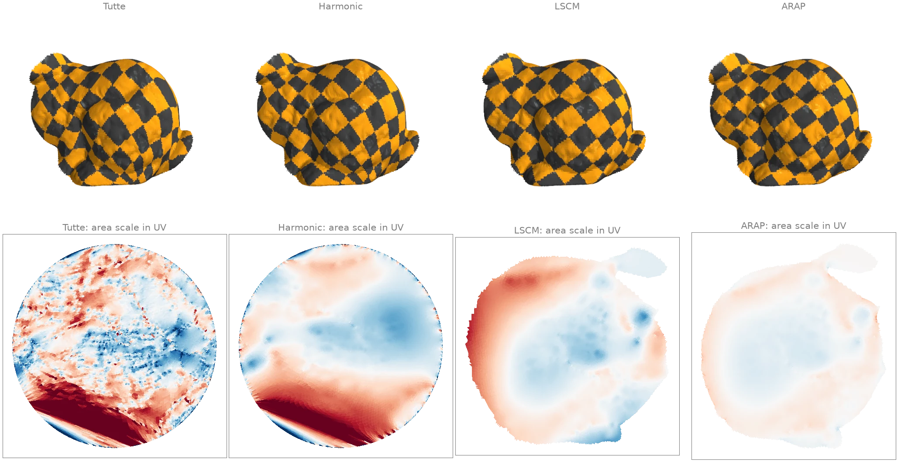
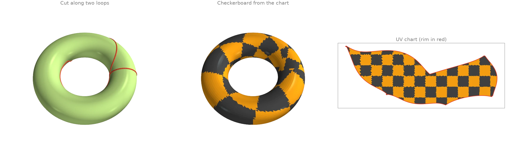
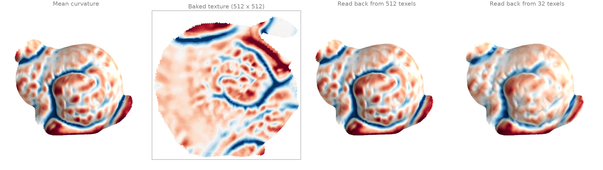

# Parametrization and textures

Flattening surfaces into the plane, cutting seams, and baking fields into textures.

## Flattening a disk: Tutte, harmonic, LSCM and ARAP {#p1}

Four ways to map a disk-shaped patch of the bunny into the plane, each drawn as a checkerboard
texture and as its UV layout:

- [`tutte`][ordito.parametrization.tutte] and [`harmonic`][ordito.parametrization.harmonic]
  pin the boundary ([`longest_boundary_loop`][ordito.boundary.longest_boundary_loop]) to a
  circle with [`map_vertices_to_circle`][ordito.parametrization.map_vertices_to_circle] and
  solve for the interior, with uniform and cotangent weights;
- [`lscm`][ordito.parametrization.lscm] pins only two vertices and finds the most conformal
  (angle-preserving) map, with a free boundary;
- [`arap`][ordito.parametrization.arap] starts from the LSCM map and makes every triangle as
  close to a rigid copy of itself as it can, so lengths are preserved too.

[`face_flipped_mask`][ordito.parametrization.face_flipped_mask] checks that no triangle is
turned over. The UV layouts are coloured by how much each triangle's area is scaled (red:
enlarged, blue: shrunk, on a log scale from 1/4 to 4): forcing the boundary onto a circle
stretches part of the patch, LSCM keeps angles but not areas, and ARAP keeps both close to the
surface's.

```python
import numpy as np
import warp as wp

import ordito as od
from examples import data

vertices, faces = data.load("face_patch", device)
boundary = od.boundary.longest_boundary_loop(vertices, faces)
circle = od.parametrization.map_vertices_to_circle(vertices, boundary)

uv = {
    "Tutte": od.parametrization.tutte(vertices, faces, boundary, circle),
    "Harmonic": od.parametrization.harmonic(vertices, faces, boundary, circle),
}
# LSCM: pin two opposite boundary vertices at their true distance apart.
b = boundary.numpy()
pins = wp.array([b[0], b[b.size // 2]], dtype=wp.int32, device=device)
span = np.linalg.norm(vertices.numpy()[b[0]] - vertices.numpy()[b[b.size // 2]])
pinned_uv = wp.array([(0.0, 0.0), (span, 0.0)], dtype=wp.vec2, device=device)
uv["LSCM"] = od.parametrization.lscm(vertices, faces, pins, pinned_uv)
uv["ARAP"] = od.parametrization.arap(
    vertices,
    faces,
    od.typing.as_dense(pins[:1]),
    od.typing.as_dense(pinned_uv[:1]),
    uv["LSCM"],
    max_iterations=50,
)

for name, coordinates in uv.items():
    flipped = od.parametrization.face_flipped_mask(coordinates, faces).numpy().sum()
    print(f"{name:>8}: {flipped} flipped triangles")
```

```text title="Output"
   Tutte: 0 flipped triangles
Harmonic: 0 flipped triangles
    LSCM: 0 flipped triangles
    ARAP: 0 flipped triangles
```



Modelled on: [libigl 501: harmonic](https://libigl.github.io/tutorial/#harmonic-parametrization) · [libigl 502: LSCM](https://libigl.github.io/tutorial/#least-squares-conformal-maps) · [libigl 503: ARAP](https://libigl.github.io/tutorial/#as-rigid-as-possible) · [PyMeshLab: parametrization](https://pymeshlab.readthedocs.io/en/latest/filter_list.html)
{: .ordito-credits }

## Cutting a closed surface open along seams {#p2}

A torus cannot be flattened as it is: it has no boundary and two independent loops around it.
Cutting along one loop of each kind opens it into a disk. The loops come from
[`homology_generators`][ordito.homology.homology_generators], straightened by
[`shorten_loop`][ordito.geodesic_walk.shorten_loop];
[`cut_along_edges`][ordito.seams.cut_along_edges] duplicates the vertices along them so the
two sides come apart, and [`lscm`][ordito.parametrization.lscm] flattens the result into a
rectangle-like chart. Reading the chart back,
[`uv_seam_edges`][ordito.seams.uv_seam_edges] finds exactly the edges where the two sides of
the cut land in different places in UV, and
[`seam_edge_vertices`][ordito.seams.seam_edge_vertices] turns them back into vertex pairs.

```python
import numpy as np
import warp as wp

import ordito as od
from examples import data

vertices, faces = data.load("torus", device)
loops = od.homology.homology_generators(vertices, faces)
loops, _ = od.geodesic_walk.shorten_loop(vertices, faces, loops, max_iter=1000)
ring = [loop.numpy() for loop in loops]
cut = np.concatenate([np.stack([loop, np.roll(loop, -1)], axis=1) for loop in ring])

cut_vertices, cut_faces = od.seams.cut_along_edges(
    vertices, faces, wp.array(cut, dtype=wp.int32, device=device)
)
rim = od.boundary.boundary_loops(cut_vertices, cut_faces)
print(
    f"{len(loops)} loops, {cut.shape[0]} cut edges; the cut mesh has {len(rim)} boundary loop"
)

b = rim[0].numpy()
pins = wp.array([b[0], b[b.size // 2]], dtype=wp.int32, device=device)
pinned_uv = wp.array([(0.0, 0.0), (1.0, 0.0)], dtype=wp.vec2, device=device)
uv = od.parametrization.lscm(cut_vertices, cut_faces, pins, pinned_uv)

seams, _, _ = od.seams.uv_seam_edges(faces, uv, face_texcoords=cut_faces)
seam_pairs = od.seams.seam_edge_vertices(faces, seams)
print(f"seams found from the UV chart: {seam_pairs.shape[0]} edges")
```

```text title="Output"
2 loops, 177 cut edges; the cut mesh has 1 boundary loop
seams found from the UV chart: 177 edges
```



Modelled on: [libigl: seam edges](https://libigl.github.io/tutorial/) · [PyMeshLab: cut along crease edges](https://pymeshlab.readthedocs.io/en/latest/filter_list.html)
{: .ordito-credits }

## Baking a field into a texture and reading it back {#p3}

With a UV chart, any per-vertex quantity can be stored as an image. Here the mean curvature
of the bunny patch from [`principal_curvature`][ordito.curvature.principal_curvature] is
baked by [`rasterize_attribute`][ordito.texture.rasterize_attribute], which fills every
texel a triangle covers by interpolating across it in the [`lscm`][ordito.parametrization.lscm]
chart. [`remap_attribute_from_uv`][ordito.texture.remap_attribute_from_uv] samples the image
back onto the vertices: at 512 texels the round trip is close to exact, while a 32-texel
texture keeps only the broad shape of the field.

```python
import numpy as np
import warp as wp

import ordito as od
from examples import data

vertices, faces = data.load("face_patch", device)
boundary = od.boundary.longest_boundary_loop(vertices, faces).numpy()
pins = wp.array([boundary[0], boundary[boundary.size // 2]], dtype=wp.int32, device=device)
pinned_uv = wp.array([(0.0, 0.0), (1.0, 0.0)], dtype=wp.vec2, device=device)
uv = od.parametrization.lscm(vertices, faces, pins, pinned_uv).numpy()
uv = (uv - uv.min(axis=0)) / np.ptp(uv, axis=0).max() * 0.98 + 0.01  # fit into [0, 1]
uv = wp.array(uv, dtype=wp.vec2, device=device)

_, _, k1, k2 = od.curvature.principal_curvature(vertices, faces)
mean = 0.5 * (k1.numpy() + k2.numpy())
field = od.typing.as_array2d(
    wp.array(mean[:, None], dtype=wp.float32, device=device), wp.float32
)

images, restored = {}, {}
for resolution in (512, 32):
    images[resolution] = od.texture.rasterize_attribute(uv, faces, field, resolution)
    restored[resolution] = od.texture.remap_attribute_from_uv(uv, images[resolution])
    error = np.abs(restored[resolution].numpy()[:, 0] - mean)
    relative = np.median(error) / np.ptp(mean)
    print(f"{resolution:>3} texels: median error {relative:.2%} of the field's range")
```

```text title="Output"
512 texels: median error 0.07% of the field's range
 32 texels: median error 1.43% of the field's range
```



Modelled on: [trimesh: texture](https://trimesh.org/examples.html)
{: .ordito-credits }
