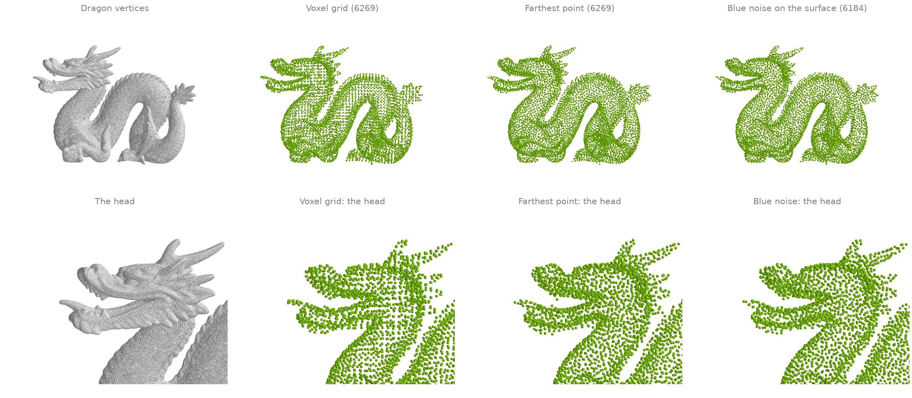
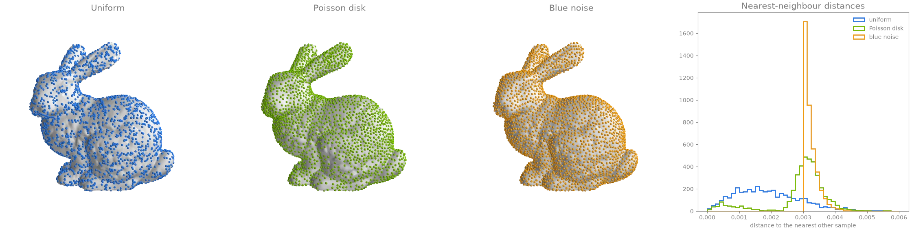
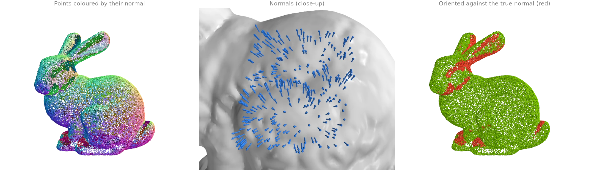
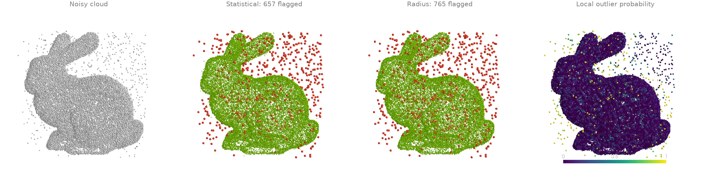
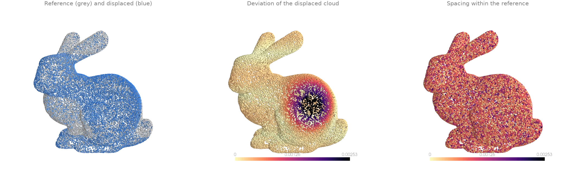
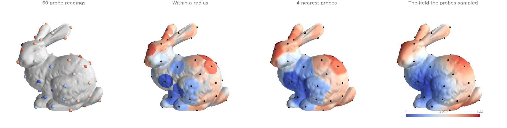
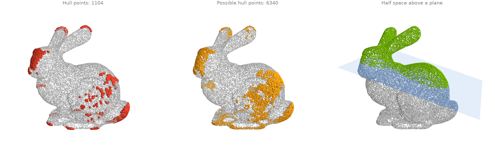

# Point clouds

Down-sampling, surface sampling, normal estimation, outlier removal and interpolation.

## Down-sampling: voxel grid, farthest point and blue noise {#pc1}

Three ways to thin the dragon's 437 000 vertices to a few thousand points.
[`voxel_down_sample`][ordito.voxels.voxel_down_sample] averages the points in each occupied
cell of a grid; [`farthest_point_sample`][ordito.points.farthest_point_sample] greedily picks
the point farthest from all picked so far, for an exact count with even coverage; and
[`sample_surface_blue_noise`][ordito.sample.sample_surface_blue_noise] draws new points on
the mesh surface, no two closer than a radius.

```python
import ordito as od
from examples import data

vertices, faces = data.load("dragon", device)

voxel = od.voxels.voxel_down_sample(vertices, 0.004)
farthest = vertices.numpy()[od.points.farthest_point_sample(vertices, voxel.shape[0]).numpy()]
blue, _ = od.sample.sample_surface_blue_noise(vertices, faces, radius=0.0027, seed=1)
print(f"{vertices.shape[0]} input points")
print(f"voxel grid: {voxel.shape[0]}, farthest point: {farthest.shape[0]}")
print(f"blue noise: {blue.shape[0]}")
```

```text title="Output"
437645 input points
voxel grid: 6269, farthest point: 6269
blue noise: 6184
```



Modelled on: [Open3D: voxel down-sampling](https://www.open3d.org/docs/release/tutorial/geometry/pointcloud.html) · [PyVista: farthest point sampling](https://docs.pyvista.org/examples/01-filter/farthest_point_sampling) · [pytorch3d: sample_farthest_points](https://pytorch3d.readthedocs.io/en/latest/modules/ops.html)
{: .ordito-credits }

## Surface sampling: uniform, Poisson disk and blue noise {#pc2}

[`sample_surface`][ordito.sample.sample_surface] draws points uniformly by area, which leaves
clumps and gaps; [`sample_surface_poisson_disk`][ordito.sample.sample_surface_poisson_disk]
draws five times as many and eliminates the most crowded ones until the requested count
remains, so the same number of points covers the surface more evenly;
[`sample_surface_blue_noise`][ordito.sample.sample_surface_blue_noise] instead takes a
radius and guarantees that no two samples are closer than it. The histogram of each sample's
distance to its nearest neighbour
([`nearest_neighbor_distance`][ordito.neighbors.nearest_neighbor_distance]) shows the
difference: the uniform draw spreads down to zero, the elimination pulls most gaps towards
the typical spacing, and blue noise has a hard floor at its radius.

```python
import numpy as np

import ordito as od
from examples import data

vertices, faces = data.load("bunny", device)
uniform, _ = od.sample.sample_surface(vertices, faces, 4000, seed=1)
poisson, _ = od.sample.sample_surface_poisson_disk(vertices, faces, 4000, seed=1)
blue, _ = od.sample.sample_surface_blue_noise(vertices, faces, radius=0.003, seed=1)

gap_uniform = od.neighbors.nearest_neighbor_distance(uniform).numpy()
gap_poisson = od.neighbors.nearest_neighbor_distance(poisson).numpy()
gap_blue = od.neighbors.nearest_neighbor_distance(blue).numpy()
for name, gap in (("uniform", gap_uniform), ("Poisson", gap_poisson), ("blue", gap_blue)):
    median, smallest = np.median(gap), gap.min()
    print(f"{name:>8}: {len(gap)} samples, gap median {median:.5f}, min {smallest:.5f}")
```

```text title="Output"
 uniform: 4000 samples, gap median 0.00177, min 0.00003
 Poisson: 4000 samples, gap median 0.00311, min 0.00003
    blue: 4016 samples, gap median 0.00316, min 0.00300
```



The Poisson-disk histogram keeps a small tail of near-coincident pairs, about 2 % of the
samples closer than a tenth of the typical spacing. Weighted sample elimination should remove
the most crowded points first, so that tail is unexpected; use the blue-noise sampler when a
hard minimum spacing matters.

Modelled on: [Open3D: mesh sampling](https://www.open3d.org/docs/release/tutorial/geometry/mesh.html) · [libigl 810](https://libigl.github.io/tutorial/#blue-noise-sampling) · [PyMeshLab: Poisson-disk sampling](https://pymeshlab.readthedocs.io/en/latest/filter_list.html)
{: .ordito-credits }

## Normal estimation {#pc3}

A bare point cloud has no normals; [`estimate_normals`][ordito.points.estimate_normals] fits
a plane to each point's neighbourhood (here its 16 nearest neighbours from
[`query_nearest`][ordito.neighbors.query_nearest]) and takes the plane's normal. The sign is
a convention, not a measurement: by default each normal is turned away from the cloud's
centroid, which is right on most of the bunny and wrong where the surface folds back towards
the centre (red, compared with the exact normals of the surface the cloud was sampled from).

```python
import numpy as np

import ordito as od
from examples import data

points = data.load_points("bunny_cloud", device)
neighbours, _ = od.neighbors.query_nearest(points, points, k=16)
normals = od.points.estimate_normals(points, neighbours)

# Compare with the exact normals of the surface the cloud was sampled from.
cosine = np.sum(normals.numpy() * data.cloud_normals("bunny_cloud"), axis=1)
angle = np.degrees(np.arccos(np.clip(np.abs(cosine), 0.0, 1.0)))
print(f"median angle to the true normal (ignoring sign): {np.median(angle):.2f} degrees")
print(f"flipped relative to the true normal: {(cosine < 0).mean():.1%} of points")
```

```text title="Output"
median angle to the true normal (ignoring sign): 4.15 degrees
flipped relative to the true normal: 9.9% of points
```



Modelled on: [Open3D: vertex normal estimation](https://www.open3d.org/docs/release/tutorial/geometry/pointcloud.html) · [pytorch3d: estimate_pointcloud_normals](https://pytorch3d.readthedocs.io/en/latest/modules/ops.html)
{: .ordito-credits }

## Outlier removal: statistical, radius and probabilistic {#pc4}

A jittered scan of the bunny with 900 stray points scattered through its bounding box. Three
detectors, all from neighbourhood statistics:

- [`statistical_outlier_mask`][ordito.points.statistical_outlier_mask] flags points whose
  mean distance to their `k` nearest neighbours is far above the cloud's average;
- [`radius_outlier_mask`][ordito.points.radius_outlier_mask] flags points with too few
  neighbours within a fixed radius;
- [`outlier_probability`][ordito.points.outlier_probability] scores each point by how
  stretched its neighbourhood is relative to its neighbours' (Local Outlier Probability).

```python
import numpy as np

import ordito as od
from examples import data

points = data.load_points("noisy_cloud", device)
neighbours, distances = od.neighbors.query_nearest(points, points, k=20)

statistical = od.points.statistical_outlier_mask(distances, std_ratio=2.0).numpy()
radius = od.points.radius_outlier_mask(points, radius=0.004, min_neighbors=4).numpy()
probability = od.points.outlier_probability(neighbours, distances).numpy()

stray = np.arange(points.shape[0]) >= 30_000  # the input's last 900 points are the strays
for name, flagged in (
    ("statistical", statistical),
    ("radius", radius),
    ("LoOP > 0.8", probability > 0.8),
):
    print(f"{name:>11}: flags {flagged.sum()}, of which {(flagged & stray).sum()} strays")
```

```text title="Output"
statistical: flags 657, of which 657 strays
     radius: flags 765, of which 765 strays
 LoOP > 0.8: flags 402, of which 402 strays
```



Modelled on: [Open3D: point cloud outlier removal](https://www.open3d.org/docs/release/tutorial/geometry/pointcloud_outlier_removal.html) · [PyMeshLab: select outliers](https://pymeshlab.readthedocs.io/en/latest/filter_list.html)
{: .ordito-credits }

## Cloud-to-cloud distance {#pc5}

Two scans of the same bunny, the second pushed outwards by a bump on its flank and a gentle
ripple. [`query_nearest`][ordito.neighbors.query_nearest] with `k=1` finds, for every point
of the second cloud, its nearest point in the first and the distance to it: a per-point
deviation map with no mesh in sight. For one cloud against itself,
[`nearest_neighbor_distance`][ordito.neighbors.nearest_neighbor_distance] gives each point's
spacing to its closest other point, the noise floor such a comparison sits on.

```python
import numpy as np

import ordito as od
from examples import data

reference = data.load_points("bunny_cloud", device)
displaced = data.load_points("bunny_cloud_displaced", device)

_, distance = od.neighbors.query_nearest(reference, displaced, k=1)
spacing = od.neighbors.nearest_neighbor_distance(reference)
print(f"deviation: median {np.median(distance.numpy()):.5f}, max {distance.numpy().max():.5f}")
print(f"spacing of the reference cloud: median {np.median(spacing.numpy()):.5f}")
```

```text title="Output"
deviation: median 0.00022, max 0.00287
spacing of the reference cloud: median 0.00065
```



Modelled on: [Open3D: point cloud distance](https://www.open3d.org/docs/release/tutorial/geometry/pointcloud.html) · [PyVista: distance between point clouds](https://docs.pyvista.org/examples/01-filter/distance_between_surfaces)
{: .ordito-credits }

## Interpolating sparse samples onto a surface {#pc6}

A field measured at only 60 probe points, spread over the bunny by
[`farthest_point_sample`][ordito.points.farthest_point_sample], is carried onto every vertex
by [`interpolate_from_points`][ordito.interpolation.interpolate_from_points]: a
Gaussian-weighted mean of the nearby probes. With a radius footprint, vertices farther than
the radius from every probe get the `null_value` (grey); with `k` nearest probes every vertex
gets a value, however far its probes are.

```python
import numpy as np
import warp as wp

import ordito as od
from examples import data

vertices, _ = data.load("bunny", device)
probes = vertices.numpy()[od.points.farthest_point_sample(vertices, 60).numpy()]
readings = np.sin(40.0 * probes[:, 0]) + np.cos(40.0 * probes[:, 1])  # the "measurement"

source = wp.array(probes, dtype=wp.vec3, device=device)
values = wp.array(readings, dtype=wp.float32, device=device)
by_radius = od.interpolation.interpolate_from_points(
    source, values, vertices, radius=0.015, null_value=float("nan")
)
by_neighbours = od.interpolation.interpolate_from_points(
    source, values, vertices, radius=0.015, k=4
)
print(f"vertices with no probe within the radius: {np.isnan(by_radius.numpy()).sum()}")
```

```text title="Output"
vertices with no probe within the radius: 9266
```



Modelled on: [PyVista: interpolate](https://docs.pyvista.org/examples/01-filter/interpolate)
{: .ordito-credits }

## Convex-hull points and half-space tests {#pc7}

Which points of the cloud lie on its convex hull?
[`convex_subset_mask`][ordito.points.convex_subset_mask] marks the points that are extreme
along some sampled direction: every one is on the hull, and more directions find more of
them. [`convex_superset_mask`][ordito.points.convex_superset_mask] answers the other way
round, discarding only points provably inside, so every hull vertex survives.
[`half_space_mask`][ordito.points.half_space_mask] is the building block: the points strictly
on one side of a plane. ordito selects hull *points* only; it does not build the hull's
triangle mesh.

```python
import warp as wp

import ordito as od
from examples import data

points = data.load_points("bunny_cloud", device)
on_hull = od.points.convex_subset_mask(points, n_directions=4096).numpy()
candidates = od.points.convex_superset_mask(points).numpy()
upper = od.points.half_space_mask(
    points, wp.vec3(0.3, 1.0, 0.0), plane_origin=wp.vec3(0.0, 0.11, 0.0)
).numpy()
print(f"{on_hull.sum()} points certified on the hull (subset)")
print(f"{candidates.sum()} points that may be on it (superset), of {points.shape[0]}")
print(f"{upper.sum()} points above the plane")
```

```text title="Output"
1104 points certified on the hull (subset)
6340 points that may be on it (superset), of 30000
9513 points above the plane
```



Checked against an exact hull (`scipy.spatial.ConvexHull`, 1564 vertices on this cloud): all
1104 points of the subset are hull vertices, and every hull vertex is among the superset's
candidates. Convex-hull meshing is not part of ordito.

Modelled on: [Open3D: convex hull](https://www.open3d.org/docs/release/tutorial/geometry/pointcloud.html) · [trimesh: convex](https://trimesh.org/trimesh.convex.html)
{: .ordito-credits }
