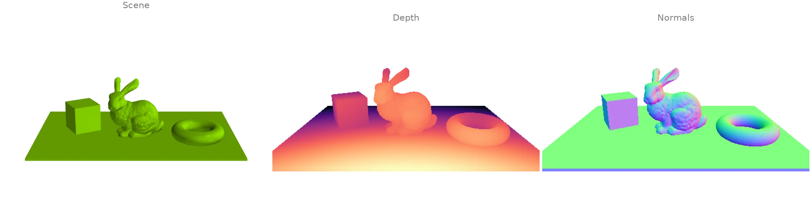
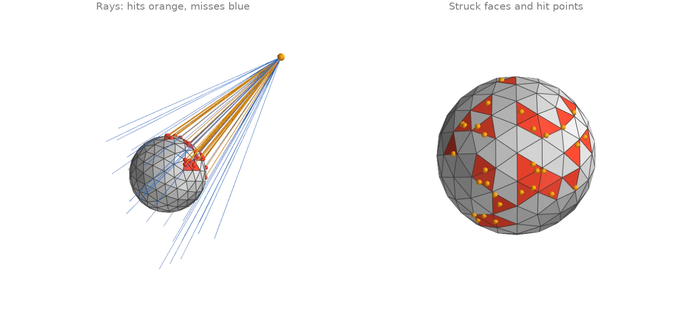
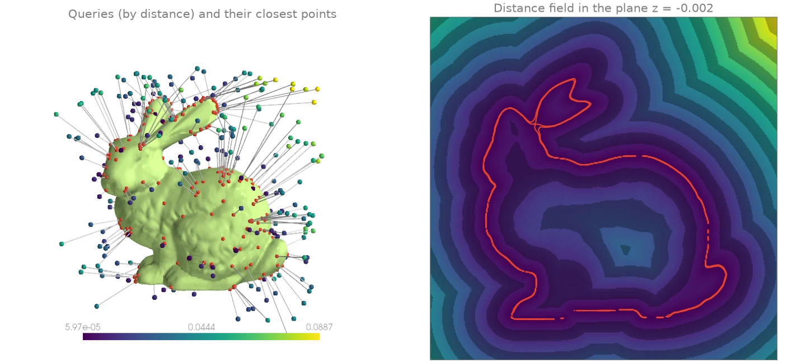
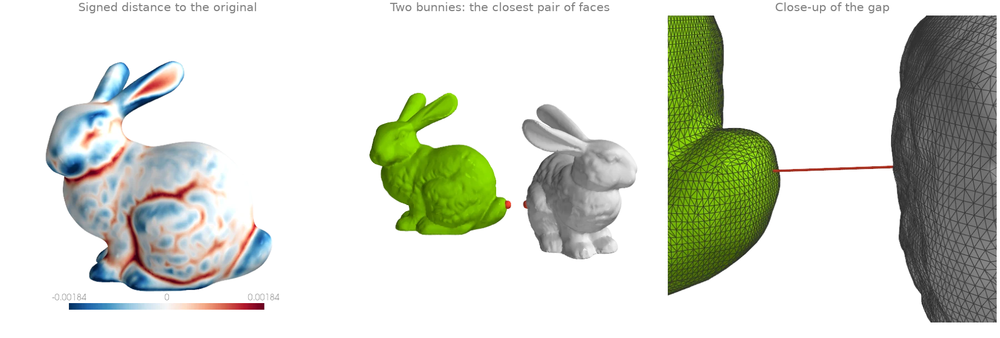
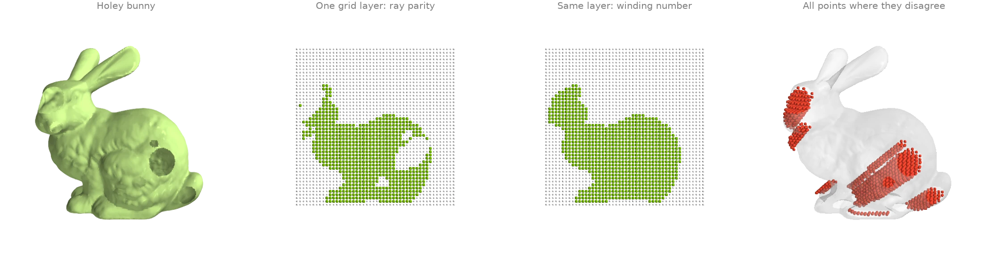
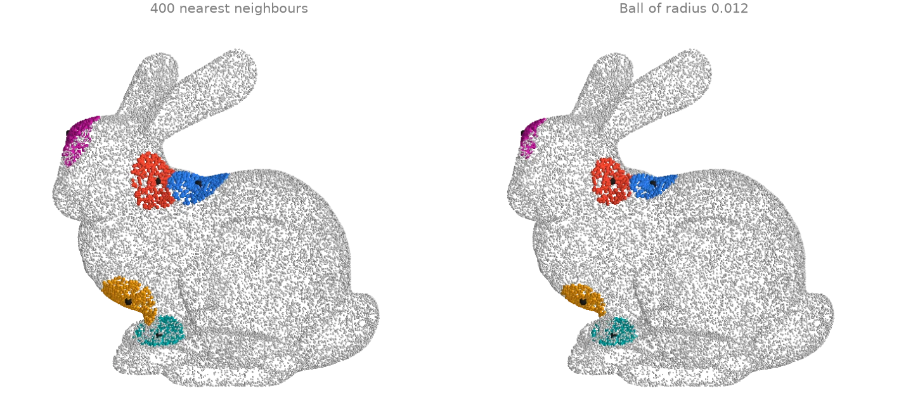
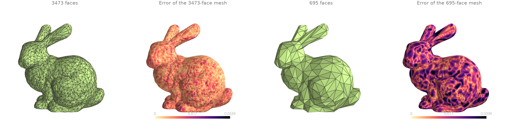

# Spatial queries

Ray casting, closest points, distances between shapes, inside/outside tests and neighbour
search.

## Ray casting a depth and a normal image {#q1}

One ray per pixel of a pinhole camera is cast against the scene's BVH with
[`intersects_location`][ordito.ray.intersects_location]. Each hit gives the depth of its pixel,
and the normal of the face it struck from
[`face_normals_and_areas`][ordito.triangles.face_normals_and_areas] gives the pixel's normal:
a ray tracer's first bounce in a few lines.

```python
import numpy as np
import warp as wp

import ordito as od
from examples import data

vertices, faces = data.load("scene", device)
mesh = wp.Mesh(points=vertices, indices=faces)

# A pinhole camera at `eye` looking at `target`, one ray per pixel.
height, width, fov = 300, 480, np.radians(45.0)
eye, target, up = (
    np.array([0.0, 1.4, 3.2]),
    np.array([0.0, 0.35, 0.0]),
    np.array([0.0, 1.0, 0.0]),
)
forward = (target - eye) / np.linalg.norm(target - eye)
right = np.cross(forward, up) / np.linalg.norm(np.cross(forward, up))
v, u = np.mgrid[0:height, 0:width]
scale = np.tan(fov / 2) / height * 2
directions = (
    forward
    + (u - width / 2)[..., None] * scale * right
    - (v - height / 2)[..., None] * scale * np.cross(right, forward)
).reshape(-1, 3)
origins = wp.array(np.broadcast_to(eye, directions.shape), dtype=wp.vec3, device=device)
directions = wp.array(directions, dtype=wp.vec3, device=device)

locations, ray_index, face_index = od.ray.intersects_location(mesh, origins, directions)
face_normals, _ = od.triangles.face_normals_and_areas(vertices, faces)

depth = np.full(height * width, np.nan)
depth[ray_index.numpy()] = np.linalg.norm(locations.numpy() - eye, axis=1)
normal = np.zeros((height * width, 3))
normal[ray_index.numpy()] = face_normals.numpy()[face_index.numpy()]
depth, normal = depth.reshape(height, width), normal.reshape(height, width, 3)
print(f"{ray_index.shape[0]} of {height * width} rays hit the scene")
```

```text title="Output"
53747 of 144000 rays hit the scene
```



Modelled on: [Open3D: ray casting](https://www.open3d.org/docs/release/tutorial/geometry/ray_casting.html) · [trimesh: raytrace](https://github.com/mikedh/trimesh/blob/main/examples/raytrace.py) · [libigl 608](https://libigl.github.io/tutorial/#off-screen-ray-tracing-with-embree)
{: .ordito-credits }

## Rays against a mesh: hits and misses {#q2}

A fan of rays from one point is shot at an icosphere.
[`intersects_any`][ordito.ray.intersects_any] answers hit or miss for each ray, and
[`intersects_location`][ordito.ray.intersects_location] returns the first hit of every ray
that strikes: its position, the ray it belongs to and the face it struck.

```python
import numpy as np
import warp as wp

import ordito as od

vertices, faces = od.creation.icosphere(subdivisions=2, device=device)
mesh = wp.Mesh(points=vertices, indices=faces)

# 60 rays from one eye point, aimed at random targets around the sphere.
rng = np.random.default_rng(0)
eye = np.array([3.0, 1.8, 2.4])
targets = rng.uniform(-1.2, 1.2, (60, 3))
origins = wp.array(np.broadcast_to(eye, targets.shape), dtype=wp.vec3, device=device)
directions = wp.array(targets - eye, dtype=wp.vec3, device=device)

hit = od.ray.intersects_any(mesh, origins, directions)
locations, ray_index, face_index = od.ray.intersects_location(mesh, origins, directions)
print(f"{int(hit.numpy().sum())} of {targets.shape[0]} rays hit the sphere")
print(f"{np.unique(face_index.numpy()).size} distinct faces struck")
```

```text title="Output"
30 of 60 rays hit the sphere
24 distinct faces struck
```



Modelled on: [trimesh: ray](https://github.com/mikedh/trimesh/blob/main/examples/ray.ipynb) · [PyVista: ray_trace](https://docs.pyvista.org/examples/01-filter/ray_trace)
{: .ordito-credits }

## Closest points on a surface {#q3}

[`closest_point_on_mesh`][ordito.proximity.closest_point_on_mesh] projects every query point
onto the nearest point of the surface and returns that point, its distance and the face it
lies on. Here it runs on random points around the bunny (the box comes from
[`aabb`][ordito.bounds.aabb]) and on a dense grid in a plane through it, whose distances
form the unsigned distance field of the surface.

```python
import numpy as np
import warp as wp

import ordito as od
from examples import data

vertices, faces = data.load("bunny", device)
lower, upper = od.bounds.aabb(vertices)
lower, upper = np.array(lower), np.array(upper)
margin = 0.15 * (upper - lower)

rng = np.random.default_rng(4)
queries = rng.uniform(lower - margin, upper + margin, (300, 3))
queries = wp.array(queries, dtype=wp.vec3, device=device)
closest, distance, _ = od.proximity.closest_point_on_mesh(vertices, faces, queries)

# The same query on a 400 x 400 grid in the plane z = mid-depth: an unsigned distance field.
x, y = np.meshgrid(
    np.linspace(lower[0] - margin[0], upper[0] + margin[0], 400),
    np.linspace(lower[1] - margin[1], upper[1] + margin[1], 400),
)
grid = np.stack([x, y, np.full_like(x, 0.5 * (lower[2] + upper[2]))], axis=-1)
_, field, _ = od.proximity.closest_point_on_mesh(
    vertices, faces, wp.array(grid.reshape(-1, 3), dtype=wp.vec3, device=device)
)
print(f"query distances: {distance.numpy().min():.4f} to {distance.numpy().max():.4f}")
```

```text title="Output"
query distances: 0.0001 to 0.0887
```



Modelled on: [trimesh: nearest](https://github.com/mikedh/trimesh/blob/main/examples/nearest.ipynb) · [Open3D: distance queries](https://www.open3d.org/docs/release/tutorial/geometry/distance_queries.html)
{: .ordito-credits }

## Distance between two surfaces {#q4}

How far one surface lies from another, two ways. Per vertex:
[`signed_distance_on_mesh`][ordito.proximity.signed_distance_on_mesh] measures every vertex of
a smoothed bunny ([`filter_laplacian`][ordito.smoothing.filter_laplacian]) against the
original, with a sign (negative inside) that shows where smoothing ate into the shape and
where it pushed out. As one number:
[`mesh_to_mesh_distance`][ordito.proximity.mesh_to_mesh_distance] returns the exact clearance
between two disjoint meshes and the pair of faces that realises it.

```python
import warp as wp

import ordito as od
from examples import data

vertices, faces = data.load("bunny", device)
smoothed = od.smoothing.filter_laplacian(vertices, faces, lamb=0.5, iterations=40)
signed = od.proximity.signed_distance_on_mesh(vertices, faces, smoothed, sign_mode="winding")
print(f"smoothed vs original: {signed.numpy().min():.5f} to {signed.numpy().max():.5f}")

# A second bunny, turned and set beside the first: how close do they come?
turned = vertices.numpy() @ data.rotation((0.0, 1.0, 0.0), 120.0).T + [0.12, 0.0, 0.02]
turned = wp.array(turned, dtype=wp.vec3, device=device)
clearance, face_a, face_b = od.proximity.mesh_to_mesh_distance(vertices, faces, turned, faces)
print(f"clearance {clearance:.5f} between faces {face_a} and {face_b}")
```

```text title="Output"
smoothed vs original: -0.00278 to 0.00263
clearance 0.02464 between faces 16023 and 54012
```



Modelled on: [PyVista: distance between surfaces](https://docs.pyvista.org/examples/01-filter/distance_between_surfaces) · [MeshLib: signed distance](https://meshlib.io/documentation/ExampleSignedDistances.html) · [PyMeshLab: distance](https://pymeshlab.readthedocs.io/en/latest/filter_list.html)
{: .ordito-credits }

## Inside / outside classification {#q5}

Which points of a grid lie inside the bunny? The bunny here has holes punched in its side, so
"inside" is ill-posed for a ray test:
[`contains_points`][ordito.ray.contains_points] votes over the parity of a few rays, and a ray
that escapes through a hole flips its vote. The generalized winding number,
[`signed_distance_on_mesh`][ordito.proximity.signed_distance_on_mesh] with
`sign_mode="winding"`, degrades gracefully instead: it counts how many times the surface wraps
around a point, and a small hole only changes that count slightly.

```python
import numpy as np
import warp as wp

import ordito as od
from examples import data

vertices, faces = data.load("holey_bunny", device)
lower, upper = (np.array(corner) for corner in od.bounds.aabb(vertices))
axes = [np.linspace(lower[i], upper[i], 48) for i in range(3)]
grid = np.stack(np.meshgrid(*axes, indexing="ij"), axis=-1).reshape(-1, 3)
points = wp.array(grid, dtype=wp.vec3, device=device)

mesh = wp.Mesh(points=vertices, indices=faces)
by_parity = od.ray.contains_points(mesh, points).numpy()
signed = od.proximity.signed_distance_on_mesh(vertices, faces, points, sign_mode="winding")
by_winding = signed.numpy() < 0.0
print(f"inside by ray parity:     {by_parity.sum()} of {grid.shape[0]} grid points")
print(f"inside by winding number: {by_winding.sum()}")
print(f"the two disagree on {(by_parity != by_winding).sum()}")
```

```text title="Output"
inside by ray parity:     24856 of 110592 grid points
inside by winding number: 26899
the two disagree on 2559
```



Modelled on: [PyVista: extract cells inside a surface](https://docs.pyvista.org/examples/01-filter/extract_cells_inside_surface) · [trimesh: contains](https://trimesh.org/trimesh.base.html#trimesh.base.Trimesh.contains) · [libigl 702](https://libigl.github.io/tutorial/#generalized-winding-number)
{: .ordito-credits }

## Nearest neighbours and ball queries {#q6}

Two neighbourhood queries on a 30 000-point cloud, from five query points.
[`query_nearest`][ordito.neighbors.query_nearest] returns the `k` nearest points of each
query (a fixed count, whose patch size varies with the local density), and
[`query_ball`][ordito.neighbors.query_ball] returns every point within a radius (a fixed size,
whose count varies). Both are exact; the spatial index is built internally, or passed in to
reuse it across calls.

```python
import warp as wp

import ordito as od
from examples import data

points = data.load_points("bunny_cloud", device)
picked = points.numpy()[[1200, 5000, 9100, 17000, 26000]]
queries = wp.array(picked, dtype=wp.vec3, device=device)

knn_index, knn_distance = od.neighbors.query_nearest(points, queries, k=400)
ball_index, ball_distance = od.neighbors.query_ball(points, queries, r=0.012)
print("k nearest: farthest neighbour at", knn_distance.numpy()[:, -1].round(4))
print("ball of radius 0.012: counts", [index.shape[0] for index in ball_index])
```

```text title="Output"
k nearest: farthest neighbour at [0.0147 0.0151 0.0151 0.0162 0.0134]
ball of radius 0.012: counts [255, 243, 231, 245, 327]
```



Modelled on: [Open3D: KD-tree](https://www.open3d.org/docs/release/tutorial/geometry/kdtree.html)
{: .ordito-credits }

## Chamfer and Hausdorff distances {#q7}

How far is a simplified mesh from the original? The bunny is decimated twice with
[`quadric_decimate`][ordito.remesh.quadric_decimate], and
[`chamfer_points_to_mesh`][ordito.metrics.chamfer_points_to_mesh] with
`point_reduction=None` gives the squared distance from every original vertex to the
simplified surface: an error map. The two summary numbers are the symmetric
[`chamfer_mesh_to_mesh`][ordito.metrics.chamfer_mesh_to_mesh] (a mean of squared distances,
the pytorch3d convention) and [`hausdorff_mesh_to_mesh`][ordito.metrics.hausdorff_mesh_to_mesh]
(the worst case).

```python
import numpy as np

import ordito as od
from examples import data

vertices, faces = data.load("bunny", device)
results = {}
for ratio in (0.05, 0.01):
    # A scan is creased everywhere at a coarse scale: raise feature_angle to reach the target.
    coarse_vertices, coarse_faces = od.remesh.quadric_decimate(
        vertices, faces, target_ratio=ratio, feature_angle=90.0
    )
    error = od.metrics.chamfer_points_to_mesh(
        vertices, coarse_vertices, coarse_faces, point_reduction=None, single_directional=True
    )
    chamfer = od.metrics.chamfer_mesh_to_mesh(vertices, faces, coarse_vertices, coarse_faces)
    hausdorff = od.metrics.hausdorff_mesh_to_mesh(
        vertices, faces, coarse_vertices, coarse_faces
    )
    print(
        f"{coarse_faces.shape[0] // 3} faces: chamfer {chamfer:.2e}, hausdorff {hausdorff:.4f}"
    )
    results[ratio] = (coarse_vertices, coarse_faces, np.sqrt(error.numpy()))
```

```text title="Output"
3473 faces: chamfer 1.28e-07, hausdorff 0.0087
695 faces: chamfer 4.31e-06, hausdorff 0.0099
```



Modelled on: [PyMeshLab: Hausdorff distance](https://pymeshlab.readthedocs.io/en/latest/filter_list.html) · [pytorch3d: chamfer loss](https://pytorch3d.org/tutorials/deform_source_mesh_to_target_mesh)
{: .ordito-credits }
