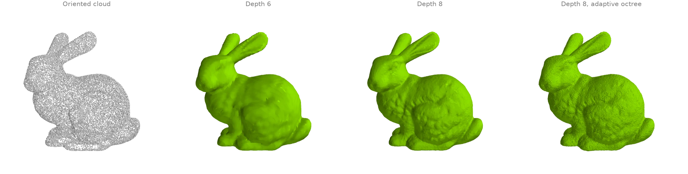
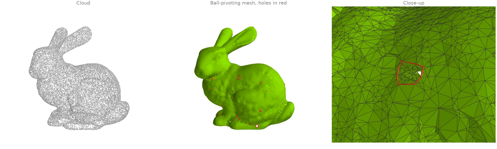
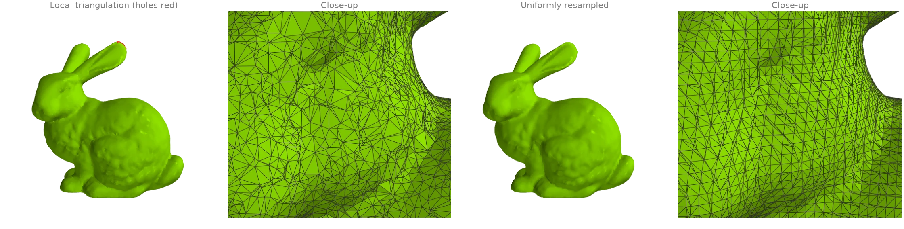
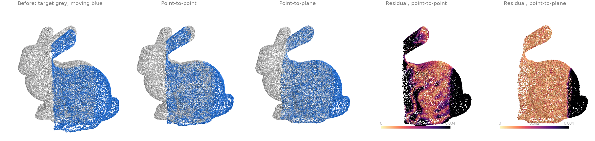
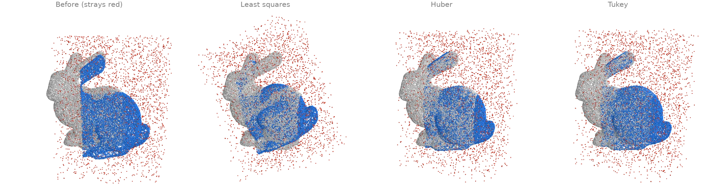
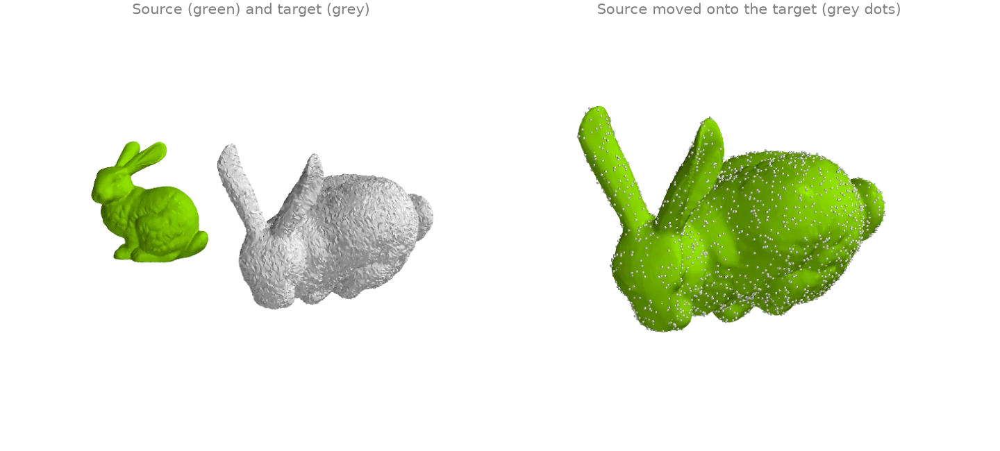

# Reconstruction and registration

Surfaces from point clouds, and rigid alignment of two scans.

## Screened Poisson reconstruction {#rr1}

[`screened_poisson`][ordito.reconstruction.screened_poisson] turns an oriented point cloud
into a closed surface: it solves for an indicator function whose gradient matches the
normals, screened towards zero at the points, and extracts its level set. `depth` sets the
grid resolution (`2 ** depth` cells across): depth 6 gives a smooth blob, depth 8 the
bunny's fur. `method="adaptive"` solves on an octree refined only near the points instead
of a dense grid.

```python
from typing import Literal

import warp as wp

import ordito as od
from examples import data

points = data.load_points("bunny_cloud", device)
normals = wp.array(data.cloud_normals("bunny_cloud"), dtype=wp.vec3, device=device)

surfaces = {}
runs: list[tuple[str, int, Literal["dense", "adaptive"]]] = [
    ("dense6", 6, "dense"),
    ("dense8", 8, "dense"),
    ("adaptive8", 8, "adaptive"),
]
for name, depth, method in runs:
    vertices, faces = od.reconstruction.screened_poisson(
        points, normals, depth=depth, method=method
    )
    print(f"{method} depth {depth}: {faces.shape[0] // 3} faces")
    surfaces[name] = (vertices.numpy(), faces.numpy().reshape(-1, 3))
```

```text title="Output"
dense depth 6: 23720 faces
dense depth 8: 377948 faces
adaptive depth 8: 416261 faces
```



Modelled on: [Open3D: Poisson surface reconstruction](https://www.open3d.org/docs/release/tutorial/geometry/surface_reconstruction.html) · [PyMeshLab: screened Poisson](https://pymeshlab.readthedocs.io/en/latest/filter_list.html)
{: .ordito-credits }

## Ball pivoting {#rr2}

[`ball_pivoting`][ordito.reconstruction.ball_pivoting] rolls a ball of fixed radius over the
cloud: every three points the ball can rest on without containing another become a triangle,
and the ball pivots across each new edge to find the next. Unlike Poisson reconstruction it
*interpolates* the points (every vertex is an input point) and leaves holes where the
sampling is sparser than the ball, which
[`boundary_loops`][ordito.boundary.boundary_loops] finds (red).

```python
import warp as wp

import ordito as od
from examples import data

points = data.load_points("bunny_cloud", device)
normals = wp.array(data.cloud_normals("bunny_cloud"), dtype=wp.vec3, device=device)
# clustering=0 keeps candidates near an edge's ends: a random sample has many close pairs.
vertices, faces = od.reconstruction.ball_pivoting(points, normals, radius=0.003, clustering=0.0)

holes = od.boundary.boundary_loops(vertices, faces)
print(f"{faces.shape[0] // 3} triangles over {points.shape[0]} points")
print(f"{len(holes)} boundary loops left open")
```

```text title="Output"
58599 triangles over 30000 points
53 boundary loops left open
```



Modelled on: [Open3D: ball pivoting](https://www.open3d.org/docs/release/tutorial/geometry/surface_reconstruction.html) · [PyMeshLab: ball pivoting](https://pymeshlab.readthedocs.io/en/latest/filter_list.html)
{: .ordito-credits }

## Local triangulation and uniform resampling {#rr3}

[`triangulate_point_cloud`][ordito.reconstruction.triangulate_point_cloud] lets every point
build a small fan over its nearest neighbours in its tangent plane and keeps the triangles
that neighbouring fans agree on: a mesh whose vertices are exactly the input points, with
uneven triangles where the sampling is uneven.
[`resample_uniform`][ordito.reconstruction.resample_uniform] then rebuilds any mesh from its
signed distance field on a uniform grid, so the result has evenly sized triangles and no
holes, at the cost of detail thinner than a voxel.

```python
import warp as wp

import ordito as od
from examples import data

points = data.load_points("bunny_cloud", device)
normals = wp.array(data.cloud_normals("bunny_cloud"), dtype=wp.vec3, device=device)
local_vertices, local_faces = od.reconstruction.triangulate_point_cloud(points, normals)
holes = od.boundary.boundary_loops(local_vertices, local_faces)
print(f"local triangulation: {local_faces.shape[0] // 3} faces, {len(holes)} holes")

vertices, faces = od.reconstruction.resample_uniform(
    local_vertices, local_faces, voxel_size=0.0015
)
watertight = od.validation.is_watertight(vertices, faces)
print(f"resampled: {faces.shape[0] // 3} faces, watertight {watertight}")
```

```text title="Output"
local triangulation: 59903 faces, 8 holes
resampled: 74560 faces, watertight True
```



Modelled on: [MeshLib: points to mesh](https://meshlib.io/documentation/ExamplePointsToMesh.html) · [PyVista: reconstruct surface](https://docs.pyvista.org/examples/01-filter/surface_reconstruction) · [PyMeshLab: uniform mesh resampling](https://pymeshlab.readthedocs.io/en/latest/filter_list.html)
{: .ordito-credits }

## Rigid ICP: point-to-point vs point-to-plane {#rr4}

Two overlapping partial scans of the bunny, the second turned by 15 degrees and shifted.
Iterative closest point alternates between matching each point of the moving scan to its
nearest neighbour in the target and solving for the rigid motion that best fits the matches.
[`icp`][ordito.registration.icp] minimizes point-to-point distances; here it stalls in a
local minimum a third of the way there, because the scans only partly overlap and the
unmatched rims pull back.
[`icp_point_to_plane`][ordito.registration.icp_point_to_plane] minimizes the distance to the
target's tangent planes (normals from [`estimate_normals`][ordito.points.estimate_normals]),
which lets the scans slide along each other, and lands on the true pose.

```python
import numpy as np

import ordito as od
from examples import data

target = data.load_points("scan_a", device)
moving = data.load_points("scan_b", device)
neighbours, _ = od.neighbors.query_nearest(target, target, k=16)
target_normals = od.points.estimate_normals(target, neighbours)

_, point_to_point, _ = od.registration.icp(moving, target, max_iterations=50, max_distance=0.02)
matrix, point_to_plane, _ = od.registration.icp_point_to_plane(
    moving, target, target_normals=target_normals, max_iterations=50, max_distance=0.02
)
for name, aligned in (("point-to-point", point_to_point), ("point-to-plane", point_to_plane)):
    _, residual = od.neighbors.query_nearest(target, aligned, k=1)
    print(f"{name}: median distance to the target {np.median(residual.numpy()):.5f}")
angle = np.degrees(np.arccos((np.trace(matrix.numpy()[0][:3, :3]) - 1.0) / 2.0))
print(f"point-to-plane recovered a rotation of {angle:.1f} degrees")
```

```text title="Output"
point-to-point: median distance to the target 0.00259
point-to-plane: median distance to the target 0.00084
point-to-plane recovered a rotation of 15.1 degrees
```



Modelled on: [Open3D: ICP registration](https://www.open3d.org/docs/release/tutorial/pipelines/icp_registration.html) · [MeshLib: ICP](https://meshlib.io/documentation/ExampleMeshICP.html) · [libigl 808](https://libigl.github.io/tutorial/#iterative-closest-point) · [trimesh: scan registration](https://github.com/mikedh/trimesh/blob/main/examples/scan_register.py)
{: .ordito-credits }

## Robust ICP with outliers {#rr5}

The moving scan of RR4 again, now cluttered with 15 % stray points around it, and no
distance cut-off on the matches. Plain least squares lets every stray pull on the fit, and
[`icp_point_to_plane`][ordito.registration.icp_point_to_plane] converges to a wrong pose. A
robust kernel down-weights large residuals: `robust_kernel="huber"` caps their influence,
`"tukey"` ignores them beyond a scale estimated from the residuals' median absolute
deviation, and both recover the pose.

```python
import numpy as np

import ordito as od

target = data.load_points("scan_a", device)
moving = data.load_points("scan_b_outliers", device)
neighbours, _ = od.neighbors.query_nearest(target, target, k=16)
target_normals = od.points.estimate_normals(target, neighbours)

aligned = {}
for kernel in ("none", "huber", "tukey"):
    matrix, aligned[kernel], _ = od.registration.icp_point_to_plane(
        moving, target, target_normals=target_normals, robust_kernel=kernel, max_iterations=50
    )
    rotation = matrix.numpy()[0][:3, :3]
    angle = np.degrees(np.arccos(np.clip((np.trace(rotation) - 1.0) / 2.0, -1.0, 1.0)))
    print(f"{kernel:>5}: recovered a rotation of {angle:.1f} degrees (true: 15.0)")
```

```text title="Output"
 none: recovered a rotation of 28.4 degrees (true: 15.0)
huber: recovered a rotation of 15.4 degrees (true: 15.0)
tukey: recovered a rotation of 15.6 degrees (true: 15.0)
```



Modelled on: [Open3D: robust kernels](https://www.open3d.org/docs/release/tutorial/pipelines/robust_kernels.html)
{: .ordito-credits }

## Known correspondences: Procrustes alignment {#rr6}

When point `i` of one set is known to match point `i` of the other (landmarks, a tracked
mesh, a deformed copy), no iteration is needed: [`procrustes`][ordito.registration.procrustes]
solves for the best rotation, translation and, optionally, uniform scale in closed form (the
Kabsch-Umeyama solution). Here a copy of the bunny is scaled by 1.6, turned 70 degrees, moved
and jittered, and the transform is recovered from the vertex correspondence alone.

```python
import numpy as np
import warp as wp

import ordito as od
from examples import data

vertices, _ = data.load("bunny", device)
rng = np.random.default_rng(0)
turn = data.rotation((1.0, 0.4, 0.2), 70.0)
copy = 1.6 * vertices.numpy() @ turn.T + [0.25, 0.05, -0.1]
copy += rng.normal(0.0, 0.0005, copy.shape)
target = wp.array(copy, dtype=wp.vec3, device=device)

matrix, aligned, cost = od.registration.procrustes(vertices, target, reflection=False)
linear = matrix.numpy()[0][:3, :3]
print(f"recovered scale {np.cbrt(np.linalg.det(linear)):.4f} (true 1.6)")
# `cost` is the mean squared distance, so its root is the RMS residual: the jitter alone.
print(f"rms residual {np.sqrt(cost):.5f}, jitter {0.0005 * np.sqrt(3):.5f}")
```

```text title="Output"
recovered scale 1.6001 (true 1.6)
rms residual 0.00087, jitter 0.00087
```



Modelled on: [pytorch3d: corresponding_points_alignment](https://pytorch3d.readthedocs.io/en/latest/modules/ops.html) · [trimesh: procrustes](https://trimesh.org/trimesh.registration.html)
{: .ordito-credits }
