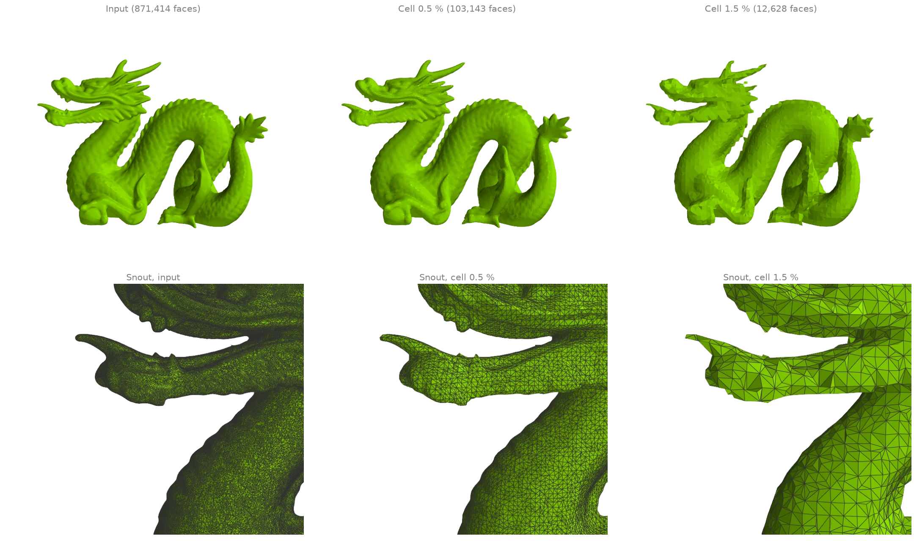
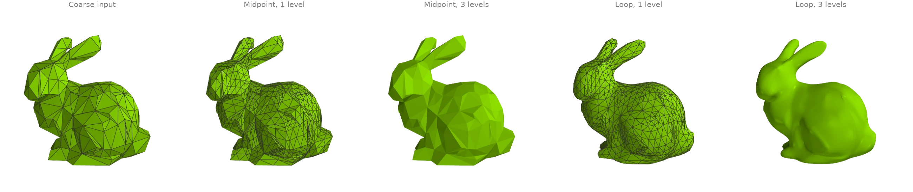
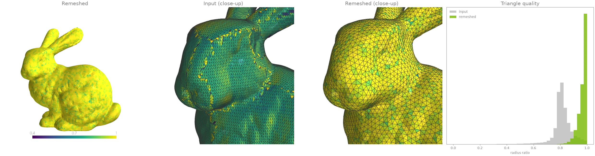
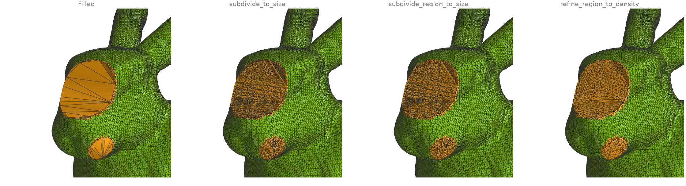
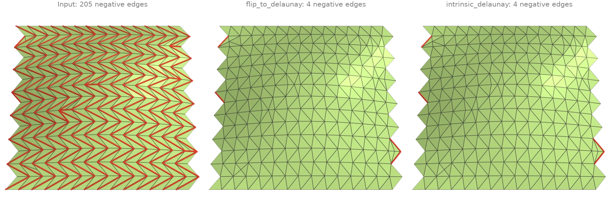

# Remeshing and simplification

Decimation, subdivision, isotropic remeshing, local refinement and Delaunay flips.

## Quadric decimation {#r1}

[`quadric_decimate`][ordito.remesh.quadric_decimate] simplifies the dragon to a face budget by
Garland-Heckbert edge collapses: each collapse is priced by how far it moves the surface, so
flat regions are thinned first and the scales, teeth and creases survive longest. The
wireframe close-ups of the snout show the same three levels. The feature angle is raised from
its default: on a scan almost every edge is "sharp" at 30 degrees, and frozen features put a
floor under the reachable face count.

```python
import ordito as od
from examples import data

vertices, faces = data.load("dragon", device)
results = {}
for ratio in (0.1, 0.01):
    # The default 30-degree feature angle freezes the scan's many sharp edges and stops
    # well short of 1 %; 90 degrees keeps only the strong creases.
    results[ratio] = od.remesh.quadric_decimate(
        vertices, faces, target_ratio=ratio, feature_angle=90.0
    )
    print(f"{ratio:.0%}: {faces.shape[0] // 3} -> {results[ratio][1].shape[0] // 3} faces")
```

```text title="Output"
10%: 871414 -> 87141 faces
1%: 871414 -> 8714 faces
```


Modelled on: [MeshLib: decimate](https://meshlib.io/documentation/ExampleMeshDecimate.html) · [Open3D: mesh simplification](https://www.open3d.org/docs/release/tutorial/geometry/mesh.html) · [PyVista: decimation](https://docs.pyvista.org/examples/01-filter/decimate) · [PyMeshLab](https://pymeshlab.readthedocs.io/en/latest/filter_list.html) · [libigl 703](https://libigl.github.io/tutorial/#mesh-decimation)
{: .ordito-credits }

## Vertex clustering {#r2}

[`cluster_decimate`][ordito.remesh.cluster_decimate] snaps every vertex to a uniform voxel
grid, welds each occupied cell to one vertex and drops the faces that collapsed. It has no
priority queue, so it is fully parallel, but it is a resampling rather than a simplification:
the triangles come out uniform in size whatever the detail underneath, and thin features
narrower than a cell can weld together.

```python
import numpy as np

import ordito as od
from examples import data

vertices, faces = data.load("dragon", device)
points = vertices.numpy()
diagonal = float(np.linalg.norm(points.max(axis=0) - points.min(axis=0)))
results = {}
for fraction in (0.005, 0.015):
    results[fraction] = od.remesh.cluster_decimate(
        vertices, faces, voxel_size=fraction * diagonal
    )
    print(
        f"cells of {fraction:.1%} of the diagonal: {results[fraction][1].shape[0] // 3} faces"
    )
```

```text title="Output"
cells of 0.5% of the diagonal: 103143 faces
cells of 1.5% of the diagonal: 12628 faces
```



Modelled on: [Open3D: vertex clustering](https://www.open3d.org/docs/release/tutorial/geometry/mesh.html) · [PyMeshLab](https://pymeshlab.readthedocs.io/en/latest/filter_list.html)
{: .ordito-credits }

## Subdivision: midpoint and Loop {#r3}

Both schemes split every triangle into four. [`subdivide`][ordito.remesh.subdivide] puts the
new vertices at the edge midpoints, so the surface keeps its facets however often it is
applied; [`subdivide_loop`][ordito.remesh.subdivide_loop] moves old and new vertices by
Loop's stencils, and repeated passes converge to a smooth limit surface. The input is the
bunny decimated to a few hundred faces by
[`quadric_decimate`][ordito.remesh.quadric_decimate].

```python
import ordito as od
from examples import data

vertices, faces = data.load("bunny", device)
coarse = od.remesh.quadric_decimate(vertices, faces, target_faces=500, feature_angle=180.0)

midpoint, loop = [coarse], [coarse]
for _ in range(3):
    midpoint.append(od.remesh.subdivide(*midpoint[-1]))
    loop.append(od.remesh.subdivide_loop(*loop[-1]))
print("faces per level:", [f.shape[0] // 3 for _, f in loop])
```

```text title="Output"
faces per level: [500, 2000, 8000, 32000]
```



Modelled on: [libigl 711](https://libigl.github.io/tutorial/#subdivision-surfaces) · [Open3D: mesh subdivision](https://www.open3d.org/docs/release/tutorial/geometry/mesh.html) · [PyVista: subdivide](https://docs.pyvista.org/examples/01-filter/subdivide) · [PyMeshLab](https://pymeshlab.readthedocs.io/en/latest/filter_list.html)
{: .ordito-credits }

## Isotropic remeshing {#r4}

A scan's triangles come in every shape. [`isotropic_remesh`][ordito.remesh.isotropic_remesh]
drives every edge toward one target length by repeated splits, collapses, valence-improving
flips and tangential smoothing, reprojecting onto the input after each pass, so the result is
the same surface sampled by near-equilateral triangles. The colours are
[`face_quality`][ordito.triangles.face_quality]'s radius ratio (1 for an equilateral
triangle, 0 for a degenerate one). Edges sharper than `feature_angle` are kept as creases;
on a noisy scan the default treats too many of them as features, so it is raised here.

```python
import ordito as od
from examples import data

vertices, faces = data.load("bunny", device)
# A scan has no real creases; the default 30-degree feature angle would freeze its noise.
new_vertices, new_faces = od.remesh.isotropic_remesh(vertices, faces, feature_angle=90.0)

before = od.triangles.face_quality(vertices, faces, metric="radius_ratio").numpy()
after = od.triangles.face_quality(new_vertices, new_faces, metric="radius_ratio").numpy()
print(f"faces: {before.size} -> {after.size}")
print(f"mean radius ratio: {before.mean():.3f} -> {after.mean():.3f}")
print(f"faces below 0.5: {(before < 0.5).sum()} -> {(after < 0.5).sum()}")
```

```text title="Output"
faces: 69451 -> 20678
mean radius ratio: 0.814 -> 0.967
faces below 0.5: 618 -> 16
```



Modelled on: [PyMeshLab](https://pymeshlab.readthedocs.io/en/latest/filter_list.html)
{: .ordito-credits }

## Refining to a size or to the surrounding density {#r5}

Filling the bunny's holes with [`fill_min_weight`][ordito.holes.fill_min_weight] leaves
patches of long triangles. Three refinements bring them to the scan's sampling:

- [`subdivide_to_size`][ordito.remesh.subdivide_to_size] bisects every edge of the mesh
  longer than a bound, crack-free;
- [`subdivide_region_to_size`][ordito.remesh.subdivide_region_to_size] does the same inside
  a face region only, with Delaunay flips between passes;
- [`refine_region_to_density`][ordito.remesh.refine_region_to_density] needs no length at
  all: it splits a patch triangle until its size matches its corners' surroundings (Liepa's
  criterion).

```python
import numpy as np
import warp as wp

import ordito as od
from examples import data

vertices, faces = data.load("holey_bunny", device)
filled = od.holes.fill_min_weight(vertices, faces)
is_patch = np.arange(filled.shape[0] // 3) >= faces.shape[0] // 3  # fill faces come last
patch = wp.array(is_patch, dtype=wp.bool, device=device)
max_edge = 1.5 * od.edges.mean_edge_length(vertices, faces)

everywhere = od.remesh.subdivide_to_size(vertices, filled, max_edge, return_index=True)
in_region = od.remesh.subdivide_region_to_size(vertices, filled, patch, max_edge)
to_density = od.remesh.refine_region_to_density(vertices, filled, patch)
for name, (_, new_faces, *_) in {
    "everywhere": everywhere,
    "in the patches": in_region,
    "to density": to_density,
}.items():
    print(f"{name}: {filled.shape[0] // 3} -> {new_faces.shape[0] // 3} faces")
```

```text title="Output"
everywhere: 67736 -> 77152 faces
in the patches: 67736 -> 72408 faces
to density: 67736 -> 69776 faces
```



Modelled on: [MeshLib: mesh modification](https://meshlib.io/documentation/ExampleMeshModification.html) · [PyMeshLab](https://pymeshlab.readthedocs.io/en/latest/filter_list.html) · [trimesh: subdivide_to_size](https://trimesh.org/trimesh.remesh.html)
{: .ordito-credits }

## Delaunay flips and the intrinsic Delaunay triangulation {#r6}

The patch is cut along the long diagonal of every sheared cell and carries a few needles and
caps, so most of its edges have a negative cotangent weight (red): the cotangent Laplacian
then violates the maximum principle.
[`flip_to_delaunay`][ordito.remesh.flip_to_delaunay] flips edges in space toward the empty
circumcircle property, with a dihedral gate so the surface barely moves;
[`intrinsic_delaunay`][ordito.remesh.intrinsic_delaunay] flips *intrinsically*, along
geodesics across the two triangles, so no vertex or surface point moves at all; what is
left is on the boundary, where no flip can help.
[`robust_laplacian`][ordito.laplacian.robust_laplacian] builds the cotangent Laplacian on
that intrinsic triangulation (after mollifying the degenerate faces).

```python
import math

import numpy as np

import ordito as od
from examples import data

vertices, faces = data.load("sliver_patch", device)
flipped = od.remesh.flip_to_delaunay(vertices, faces, max_angle_change=math.radians(30.0))
intrinsic_faces, lengths, n_flips = od.remesh.intrinsic_delaunay(vertices, faces)

weights = {
    "input": od.laplacian.cotmatrix_entries(vertices, faces),
    "flip_to_delaunay": od.laplacian.cotmatrix_entries(vertices, flipped),
    "intrinsic_delaunay": od.laplacian.cotmatrix_entries_intrinsic(lengths),
}
for name, w in weights.items():
    print(f"{name}: {(w.numpy() < 0).sum()} negative half-cotangents")
print(f"{n_flips} intrinsic flips")

for build in (od.laplacian.cotmatrix, od.laplacian.robust_laplacian):
    matrix = build(vertices, faces)
    n = matrix.nnz_sync()  # the value buffer may be longer than the matrix
    rows = np.repeat(np.arange(matrix.nrow), np.diff(matrix.offsets.numpy()[: matrix.nrow + 1]))
    off_diagonal = matrix.values.numpy()[:n][rows != matrix.columns.numpy()[:n]]
    print(f"{build.__name__}: {(off_diagonal < 0).sum()} negative off-diagonal entries")
```

```text title="Output"
input: 412 negative half-cotangents
flip_to_delaunay: 24 negative half-cotangents
intrinsic_delaunay: 23 negative half-cotangents
230 intrinsic flips
cotmatrix: 410 negative off-diagonal entries
robust_laplacian: 8 negative off-diagonal entries
```



Modelled on: [libigl 716](https://libigl.github.io/tutorial/#intrinsic-delaunay-triangulation) · [PyMeshLab](https://pymeshlab.readthedocs.io/en/latest/filter_list.html)
{: .ordito-credits }
