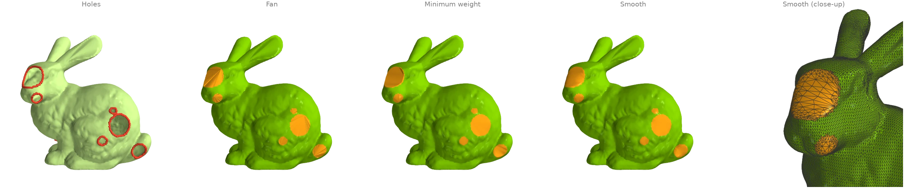
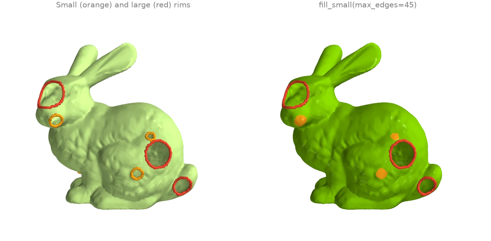
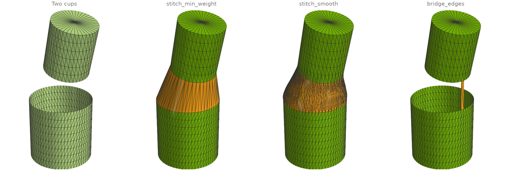
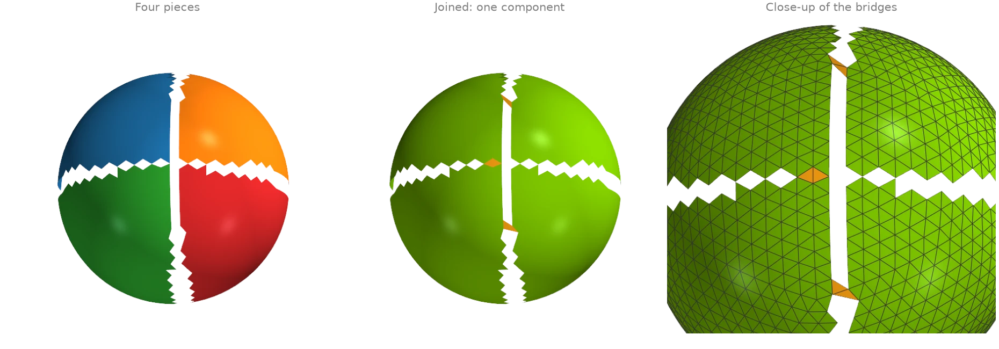
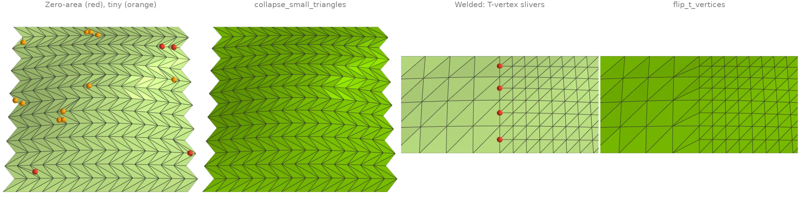
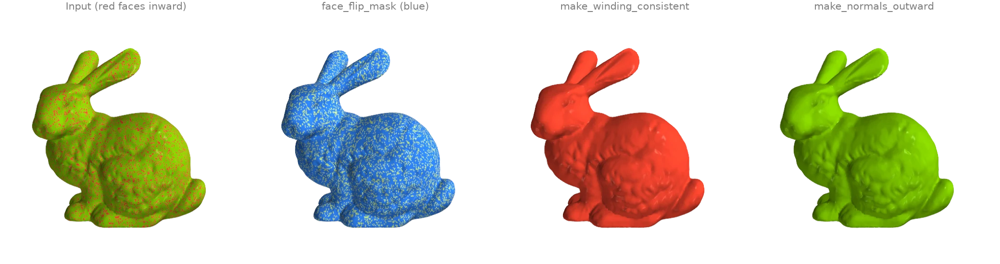
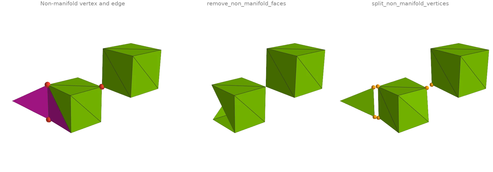
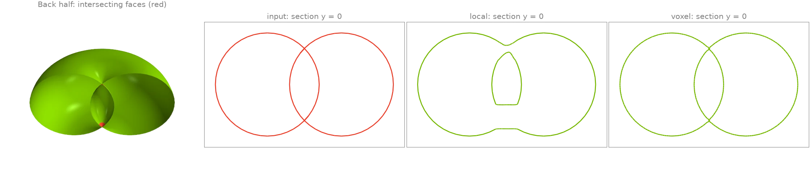
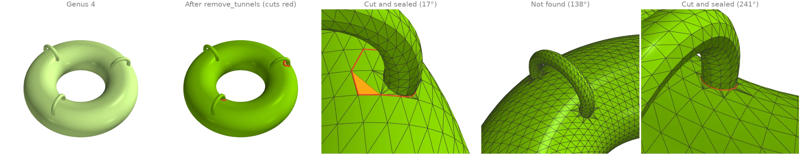
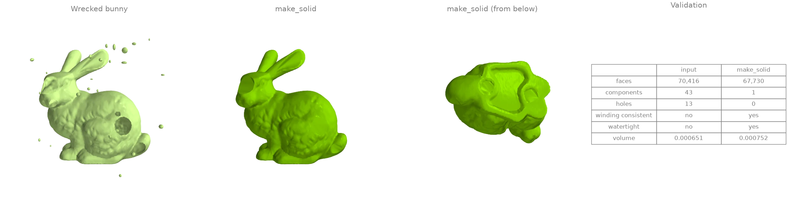

# Repairing meshes

Holes, stitching, orientation, degeneracies, non-manifold elements, self-intersections and
tunnels.

## Filling holes: fan, minimum weight and smooth {#h1}

The bunny has holes punched through its side and the scan's own openings in its base.
[`boundary_loops`][ordito.boundary.boundary_loops] finds every rim, and three fills close them:

- [`fill_fan`][ordito.holes.fill_fan] fans each hole from one rim vertex;
- [`fill_min_weight`][ordito.holes.fill_min_weight] picks the minimum-weight triangulation of
  each rim;
- [`fill_smooth`][ordito.holes.fill_smooth] refines that patch and fairs it into the
  surrounding surface.

```python
import ordito as od
from examples import data

vertices, faces = data.load("holey_bunny", device)
loops = od.boundary.boundary_loops(vertices, faces)
print(f"{len(loops)} holes, rims of {sorted(loop.shape[0] for loop in loops)} vertices")

fan_faces = od.holes.fill_fan(vertices, faces)
min_weight_faces = od.holes.fill_min_weight(vertices, faces)
smooth_vertices, smooth_faces, patch = od.holes.fill_smooth(vertices, faces, return_patch=True)
print(
    "watertight after the smooth fill:",
    od.validation.is_watertight(smooth_vertices, smooth_faces),
)
```

```text title="Output"
11 holes, rims of [22, 23, 36, 37, 39, 40, 42, 52, 75, 80, 96] vertices
watertight after the smooth fill: True
```



Modelled on: [MeshLib: fill holes](https://meshlib.io/documentation/ExampleMeshFillHole.html) · [PyVista: fill_holes](https://docs.pyvista.org/examples/01-filter/fill_holes) · [pymeshfix: bunny](https://pymeshfix.pyvista.org/examples/bunny.html) · [PyMeshLab: close holes](https://pymeshlab.readthedocs.io/en/latest/filter_list.html)
{: .ordito-credits }

## Filling only the small holes {#h2}

A scan's large openings are often intended while its small holes are dropouts.
[`fill_small`][ordito.holes.fill_small] closes only the rims up to a size (here 45 boundary
edges) with minimum-weight patches and leaves the rest open.
[`fillable_loop_mask`][ordito.holes.fillable_loop_mask] answers a different question: which
rims a fill over the rim's own vertices can close without creating an invalid mesh. The holes
punched into the bunny have ragged rims with *chords* (an existing edge between two rim
vertices), which a fill could duplicate, so they are flagged; the scan's own holes in the
base are not.

```python
import ordito as od
from examples import data

vertices, faces = data.load("holey_bunny", device)
loops = od.boundary.boundary_loops(vertices, faces)
fillable = od.holes.fillable_loop_mask(vertices, faces, loops).numpy()
print("rim sizes:", [loop.shape[0] for loop in loops])
print("chord-free and simple:", fillable.tolist())

filled = od.holes.fill_small(vertices, faces, max_edges=45)
left = od.boundary.boundary_loops(vertices, filled)
print(f"after fill_small: {len(left)} holes left, of {[loop.shape[0] for loop in left]} edges")
```

```text title="Output"
rim sizes: [96, 75, 37, 52, 22, 36, 23, 42, 39, 40, 80]
chord-free and simple: [False, False, False, False, False, False, False, True, True, True, True]
after fill_small: 4 holes left, of [96, 75, 52, 80] edges
```



Modelled on: [pymeshfix](https://pymeshfix.pyvista.org/examples/index.html) · [PyMeshLab: close holes](https://pymeshlab.readthedocs.io/en/latest/filter_list.html)
{: .ordito-credits }

## Stitching two boundaries {#h3}

Two open cups face each other across a gap, with rims of different radius, resolution and
tilt. [`stitch_min_weight`][ordito.holes.stitch_min_weight] joins the rims with the band of
triangles that minimizes a stitching metric;
[`stitch_smooth`][ordito.holes.stitch_smooth] then refines that band and fairs it into both
surfaces. [`bridge_edges`][ordito.holes.bridge_edges] is the local operation underneath: it
tacks one boundary edge of each rim together with two triangles, turning the two rims into
one.

```python
import numpy as np

import ordito as od
from examples import data

vertices_a, faces_a = data.load("cup_bottom", device)
vertices_b, faces_b = data.load("cup_top", device)
band_vertices, band_faces = od.holes.stitch_min_weight(vertices_a, faces_a, vertices_b, faces_b)
smooth_vertices, smooth_faces, band = od.holes.stitch_smooth(
    vertices_a, faces_a, vertices_b, faces_b, return_patch=True
)
print("stitched watertight:", od.validation.is_watertight(smooth_vertices, smooth_faces))

# Bridge the closest pair of boundary edges, one on each rim.
vertices, faces = od.combine.concatenate([(vertices_a, faces_a), (vertices_b, faces_b)])
rim = od.boundary.oriented_boundary_edges(vertices, faces).numpy()
on_a = rim[:, 0] < vertices_a.shape[0]
mid = vertices.numpy()[rim].mean(axis=1)
gap = np.linalg.norm(mid[on_a][:, None] - mid[~on_a][None], axis=2)
i, j = np.unravel_index(gap.argmin(), gap.shape)
bridged = od.holes.bridge_edges(vertices, faces, tuple(rim[on_a][i]), tuple(rim[~on_a][j]))
print("rims after the bridge:", len(od.boundary.boundary_loops(vertices, bridged)))
```

```text title="Output"
stitched watertight: True
rims after the bridge: 1
```



Modelled on: [MeshLib: stitch holes](https://meshlib.io/documentation/ExampleMeshStitchHole.html)
{: .ordito-credits }

## Joining nearby open components {#h4}

A surface torn into four pieces by two narrow cracks is four components.
[`join_closest_components`][ordito.holes.join_closest_components] repeatedly bridges the
closest pair of boundary edges on two different open components with a two-triangle patch
(see [`bridge_edges`][ordito.holes.bridge_edges]) until one component is left. Nothing moves
and no vertex is added; `max_distance` would refuse joins across a wider gap.
[`face_connected_component_labels`][ordito.adjacency.face_connected_component_labels] counts
the components before and after.

```python
import numpy as np

import ordito as od
from examples import data

vertices, faces = data.load("torn_hemisphere", device)
joined = od.holes.join_closest_components(vertices, faces)

before = od.adjacency.face_connected_component_labels(faces).numpy()
after = od.adjacency.face_connected_component_labels(joined).numpy()
print(f"components: {np.unique(before).size} -> {np.unique(after).size}")
print(f"bridge triangles: {(joined.shape[0] - faces.shape[0]) // 3}")
```

```text title="Output"
components: 4 -> 1
bridge triangles: 6
```



Modelled on: [MeshLib examples](https://meshlib.io/documentation/Examples.html)
{: .ordito-credits }

## Degenerate triangles, duplicate vertices and T-vertices {#h5}

Two small patches carry the defects that break normals, cotangent weights and curvature.

- The first has needles, caps and exactly degenerate triangles (marked).
  [`face_nondegenerate_mask`][ordito.triangles.face_nondegenerate_mask] finds the zero-area
  ones and [`remove_degenerate_faces`][ordito.repair.remove_degenerate_faces] would drop
  them; [`collapse_small_triangles`][ordito.repair.collapse_small_triangles] instead
  collapses the shortest edge of every triangle below an area threshold, which removes the
  needles and caps as well without opening a hole.
- The second is two grids stitched at different resolutions and never welded.
  [`remove_duplicated_vertices`][ordito.repair.remove_duplicated_vertices] welds the seam;
  the fine side's extra seam vertices are then T-vertices, each with a sliver triangle
  (marked) across the coarse edge, and [`flip_t_vertices`][ordito.repair.flip_t_vertices] flips
  those slivers away.

```python
import ordito as od
from examples import data

vertices, faces = data.load("sliver_patch", device)
zero_area = ~od.triangles.face_nondegenerate_mask(vertices, faces).numpy()
_, dropped = od.repair.remove_degenerate_faces(vertices, faces)
collapsed_vertices, collapsed = od.repair.collapse_small_triangles(vertices, faces)
print(f"zero-area faces: {zero_area.sum()}; faces after dropping them: {dropped.shape[0] // 3}")
print(f"faces after collapsing small ones: {faces.shape[0] // 3} -> {collapsed.shape[0] // 3}")

patch_vertices, patch_faces = data.load("t_vertex_patch", device)
welded_vertices, _, _, welded = od.repair.remove_duplicated_vertices(
    patch_vertices, patch_faces, epsilon=1e-6
)
flipped = od.repair.flip_t_vertices(welded_vertices, welded)
for name, f in (("welded", welded), ("flipped", flipped)):
    quality = od.triangles.face_quality(welded_vertices, f).numpy()
    print(f"{name}: {(quality > 40).sum()} slivers, worst aspect ratio {quality.max():.0f}")
print(f"seam vertices welded: {patch_vertices.shape[0] - welded_vertices.shape[0]}")
```

```text title="Output"
zero-area faces: 4; faces after dropping them: 412
faces after collapsing small ones: 416 -> 392
welded: 4 slivers, worst aspect ratio 1591
flipped: 0 slivers, worst aspect ratio 2
seam vertices welded: 5
```



Modelled on: [MeshLib: fix degeneracies](https://meshlib.io/documentation/ExampleMeshFixDegeneracies.html) · [PyMeshLab: cleaning](https://pymeshlab.readthedocs.io/en/latest/filter_list.html)
{: .ordito-credits }

## Consistent and outward orientation {#h6}

A fifth of the bunny's triangles have their winding reversed (red: facing inward).
[`face_flip_mask`][ordito.validation.face_flip_mask] propagates an orientation across shared
edges and flags every face that disagrees with its component's first face;
[`make_winding_consistent`][ordito.repair.make_winding_consistent] applies those flips. That
makes the winding coherent but not necessarily outward: here the seed face happened to face
inward, so everything did. [`make_normals_outward`][ordito.repair.make_normals_outward] also
fixes the global sign from the enclosed volume. The scan is open at its base, so it is
called with `multibody=True`: the default only flips a watertight mesh (trimesh's rule).

```python
import ordito as od
from examples import data

vertices, faces = data.load("flipped_bunny", device)
print("winding consistent:", od.validation.is_winding_consistent(faces))
flips = od.validation.face_flip_mask(faces).numpy()
print(f"faces to flip: {flips.sum()} of {flips.size}")

consistent = od.repair.make_winding_consistent(faces)
# The scan has holes in its base: the whole-mesh rule only flips a watertight mesh, the
# per-body rule trusts each component's own signed volume.
outward = od.repair.make_normals_outward(vertices, faces, multibody=True)
for name, f in (("consistent", consistent), ("outward", outward)):
    print(f"{name}: signed volume {od.measures.volume(vertices, f):+.6f}")
```

```text title="Output"
winding consistent: False
faces to flip: 55574 of 69451
consistent: signed volume -0.000770
outward: signed volume +0.000770
```



Modelled on: [libigl 706](https://libigl.github.io/tutorial/#facet-orientation) · [PyMeshLab](https://pymeshlab.readthedocs.io/en/latest/filter_list.html) · [MeshLib examples](https://meshlib.io/documentation/Examples.html)
{: .ordito-credits }

## Non-manifold repair {#h7}

Two cubes meet at a single corner (a non-manifold vertex: two fans of faces touch only
there), and a fin is glued to one cube's edge (a non-manifold edge with three faces).
[`vertex_manifold_mask`][ordito.validation.vertex_manifold_mask] and
[`edge_manifold_mask`][ordito.validation.edge_manifold_mask] find them. Two repairs with
different trade-offs:
[`remove_non_manifold_faces`][ordito.repair.remove_non_manifold_faces] deletes every face
on a non-manifold edge, while
[`split_non_manifold_vertices`][ordito.repair.split_non_manifold_vertices] keeps every face
and duplicates vertices instead, so the cubes come apart at the corner and the fin is cut
loose along its edge (pulled apart slightly in the image). Deleting faces cannot fix the
shared corner, so only the split result is manifold.

```python
import ordito as od
from examples import data

vertices, faces = data.load("broken_box", device)
bad_vertices = ~od.validation.vertex_manifold_mask(vertices, faces).numpy()
bad_faces = ~od.validation.edge_manifold_mask(faces).numpy()
print(f"non-manifold vertices: {bad_vertices.sum()}")
print(f"faces on a non-manifold edge: {bad_faces.sum()}")

removed_vertices, removed_faces = od.repair.remove_non_manifold_faces(vertices, faces)
split_vertices, split_faces, source = od.repair.split_non_manifold_vertices(vertices, faces)
for name, (v, f) in {
    "removed": (removed_vertices, removed_faces),
    "split": (split_vertices, split_faces),
}.items():
    manifold = od.validation.is_vertex_manifold(f) and od.validation.is_edge_manifold(f)
    print(f"{name}: {f.shape[0] // 3} faces, {v.shape[0]} vertices, manifold: {manifold}")
```

```text title="Output"
non-manifold vertices: 3
faces on a non-manifold edge: 3
removed: 22 faces, 15 vertices, manifold: False
split: 25 faces, 19 vertices, manifold: True
```



Modelled on: [PyMeshLab](https://pymeshlab.readthedocs.io/en/latest/filter_list.html) · [Open3D: mesh properties](https://www.open3d.org/docs/release/tutorial/geometry/mesh.html)
{: .ordito-credits }

## Fixing self-intersections {#h8}

A spindle torus, whose tube radius exceeds its ring radius, passes through itself around its
axis. [`face_self_intersecting_mask`][ordito.validation.face_self_intersecting_mask] finds
the triangles that cross a non-adjacent one (red).
[`fix_self_intersections`][ordito.repair.fix_self_intersections] removes them in one of two
ways: `"local"` cuts out the intersecting faces plus a ring around them and refills the
holes, keeping the rest of the mesh as it was; `"voxel"` rebuilds the whole surface as the
zero level set of its signed distance field. The cross-sections through the axis show what
changed: the lens-shaped core where the tube overlaps itself has winding number 0, so it is
a cavity, and both repairs keep it as one, bounded by a surface that no longer crosses the
outer shell (the local repair leaves it as a separate inner shell, the voxel rebuild lets
the two touch). The 3-D view is cut in half to show the core.

```python
import ordito as od
from examples import data

vertices, faces = data.load("self_intersecting_torus", device)
crossing = od.validation.face_self_intersecting_mask(vertices, faces).numpy()
print(f"self-intersecting faces: {crossing.sum()} of {crossing.size}")

results = {}
for method in ("local", "voxel"):
    results[method] = od.repair.fix_self_intersections(vertices, faces, method=method)
    v, f = results[method]
    left = od.validation.face_self_intersecting_mask(v, f).numpy().sum()
    print(f"{method}: {f.shape[0] // 3} faces, {left} still intersecting")
```

```text title="Output"
self-intersecting faces: 325 of 9216
local: 10122 faces, 0 still intersecting
voxel: 54484 faces, 0 still intersecting
```



Modelled on: [MeshLib: self-intersections](https://meshlib.io/documentation/ExampleDetectSelfIntersections.html) · [pymeshfix](https://pymeshfix.pyvista.org/examples/index.html)
{: .ordito-credits }

## Removing tunnels {#h9}

A ring torus carries three thin handles fused onto its tube, the kind of spurious topology a
scan picks up where two sheets touch: genus 4, of which only the ring's own tunnel is meant.
[`remove_tunnels`][ordito.repair.remove_tunnels] computes a homology basis, shortens each
loop within its class, and cuts the surface along every loop no longer than `max_length`,
sealing both rims of each cut (red); nothing moves, so the cut is only visible as new
topology. The threshold sits far below the ring's own loops, so the
intended tunnel survives. One call removes at most one tunnel per family of dependent loops,
hence the loop until nothing is cut.
[`euler_characteristic`][ordito.measures.euler_characteristic] tracks the genus.

The test is on *shortened* loop length, and shortening is a local descent: here the basis
loops through one of the handles stay several times longer than its girth, so that handle is
not found at this threshold.

```python
import ordito as od
from examples import data

vertices, faces = data.load("thin_handles", device)
print("genus before:", (2 - od.measures.euler_characteristic(faces)) // 2)

n_input = faces.shape[0] // 3
removed = 1
while removed:
    vertices, faces, removed = od.repair.remove_tunnels(vertices, faces, max_length=1.0)
    print(f"cut {removed} tunnel(s)")
print("genus after:", (2 - od.measures.euler_characteristic(faces)) // 2)
```

```text title="Output"
genus before: 4
cut 2 tunnel(s)
cut 0 tunnel(s)
genus after: 2
```



Modelled on: [MeshLib examples](https://meshlib.io/documentation/Examples.html)
{: .ordito-credits }

## One-call watertight solid {#h10}

The wrecked bunny has everything at once: punched holes, 5 % of its faces flipped, an
unwelded band of duplicated vertices and forty floating blobs of debris. After welding the
duplicates with [`remove_duplicated_vertices`][ordito.repair.remove_duplicated_vertices],
[`make_solid`][ordito.repair.make_solid] runs the whole repair loop: connectivity repair and
consistent winding, debris removal, hole filling, then degeneracy and self-intersection
passes until nothing changes. [`make_volume`][ordito.repair.make_volume] finally turns the
closed result outward. The table compares the two with the
[`ordito.validation`][ordito.validation] predicates.

```python
import numpy as np
import warp as wp

import ordito as od
from examples import data

vertices, faces = data.load("wrecked_bunny", device)
welded, _, _, welded_faces = od.repair.remove_duplicated_vertices(vertices, faces, epsilon=1e-6)
solid, solid_faces = od.repair.make_solid(welded, welded_faces)
solid_faces = od.repair.make_volume(solid, solid_faces)

def report(v: wp.array[wp.vec3], f: wp.array[wp.int32]) -> dict[str, object]:
    labels = od.adjacency.face_connected_component_labels(f).numpy()
    return {
        "faces": f.shape[0] // 3,
        "components": np.unique(labels).size,
        "holes": len(od.boundary.boundary_loops(v, f)),
        "winding consistent": od.validation.is_winding_consistent(f),
        "watertight": od.validation.is_watertight(v, f),
        "volume": round(od.measures.volume(v, f), 6),
    }

before, after = report(vertices, faces), report(solid, solid_faces)
for key in before:
    print(f"{key}: {before[key]} -> {after[key]}")
```

```text title="Output"
faces: 70416 -> 67730
components: 43 -> 1
holes: 13 -> 0
winding consistent: False -> True
watertight: False -> True
volume: 0.000651 -> 0.000752
```



Modelled on: [pymeshfix](https://pymeshfix.pyvista.org/examples/index.html) · [MeshLib examples](https://meshlib.io/documentation/Examples.html)
{: .ordito-credits }
