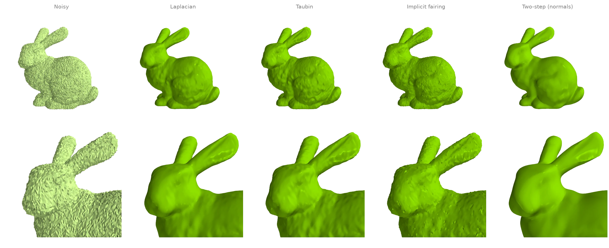
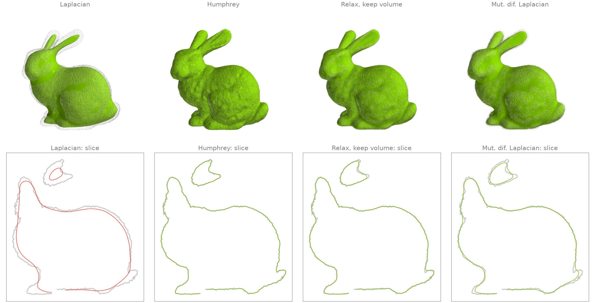
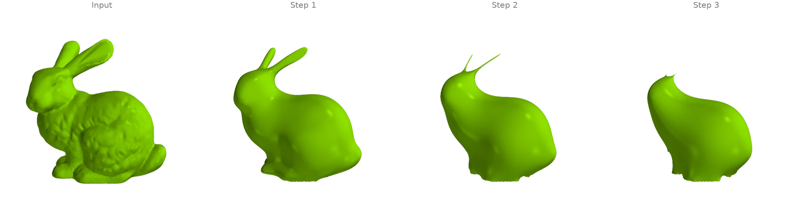
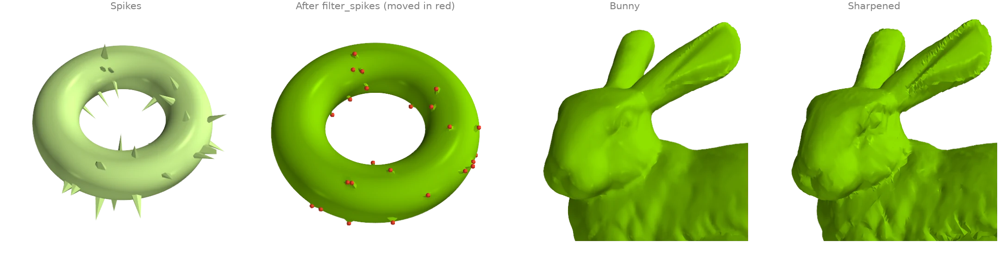
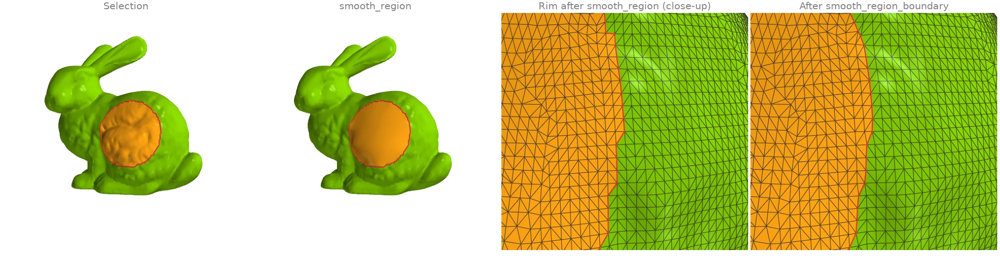
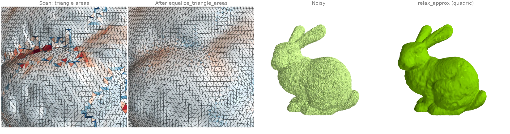

# Smoothing and fairing

Denoising filters, shrink-free smoothing, curvature flow, and local fairing of a selected
region.

## Denoising a scan: four smoothing filters {#s1}

The bunny with Gaussian noise along its normals, cleaned four ways:

- [`filter_laplacian`][ordito.smoothing.filter_laplacian] moves every vertex towards the
  mean of its neighbours (here rescaled after each pass to keep the volume); a few passes
  remove noise, more start to erase detail;
- [`filter_taubin`][ordito.smoothing.filter_taubin] alternates a shrinking and an inflating
  step, which removes noise with far less shrinkage;
- [`filter_implicit_fairing`][ordito.smoothing.filter_implicit_fairing] takes one implicit
  step of cotangent curvature flow;
- [`filter_two_step`][ordito.smoothing.filter_two_step] first smooths the face normals with
  [`filter_normals`][ordito.smoothing.filter_normals] and then moves the vertices to fit
  them, which keeps sharp features.

The printed number is the mean distance of each result's vertices from the clean scan.

```python
import numpy as np

import ordito as od
from examples import data

vertices, faces = data.load("noisy_bunny", device)
smoothed = {
    "Laplacian": od.smoothing.filter_laplacian(vertices, faces, iterations=5),
    "Taubin": od.smoothing.filter_taubin(vertices, faces, iterations=20),
    "Implicit fairing": od.smoothing.filter_implicit_fairing(
        vertices, faces, lamb=1e-6, iterations=1
    ),
    "Two-step (normals)": od.smoothing.filter_two_step(vertices, faces),
}

clean = data.load("bunny", device)[0].numpy()
print(f"{'noisy':>18}: {np.linalg.norm(vertices.numpy() - clean, axis=1).mean():.2e}")
for name, result in smoothed.items():
    print(f"{name:>18}: {np.linalg.norm(result.numpy() - clean, axis=1).mean():.2e}")
```

```text title="Output"
             noisy: 3.50e-04
         Laplacian: 3.03e-04
            Taubin: 2.24e-04
  Implicit fairing: 2.08e-04
Two-step (normals): 2.40e-04
```



Modelled on: [Open3D: mesh filtering](https://www.open3d.org/docs/release/tutorial/geometry/mesh.html) · [PyVista: smoothing](https://docs.pyvista.org/examples/01-filter/surface_smoothing) · [MeshLib: denoise](https://meshlib.io/documentation/ExampleNoiseDenoise.html) · [PyMeshLab: smoothing](https://pymeshlab.readthedocs.io/en/latest/filter_list.html) · [pytorch3d: taubin_smoothing](https://pytorch3d.org/tutorials)
{: .ordito-credits }

## Smoothing without shrinking {#s2}

Many passes of plain Laplacian smoothing pull every vertex towards its neighbours' centroid,
and the whole surface shrinks: thin parts such as the ears go first. Three filters smooth
as hard without losing volume:

- [`filter_humphrey`][ordito.smoothing.filter_humphrey] follows each Laplacian step by
  pushing the vertices part of the way back towards their original positions (HC
  filtering);
- [`relax_keep_volume`][ordito.smoothing.relax_keep_volume] subtracts from each vertex's
  move the average move of its neighbourhood, so a local drift inwards cancels while the
  noise is still removed;
- [`filter_mut_dif_laplacian`][ordito.smoothing.filter_mut_dif_laplacian] adapts the
  diffusion speed per vertex and inflates along the normals to restore the volume.

The lower row shows a slice through the head and body of each result (colour) over the noisy
input (grey). Volumes are from [`volume`][ordito.measures.volume].

```python
import ordito as od
from examples import data

vertices, faces = data.load("noisy_bunny", device)
passes = 200
smoothed = {
    "Laplacian": od.smoothing.filter_laplacian(
        vertices, faces, iterations=passes, volume_constraint=False
    ),
    "Humphrey": od.smoothing.filter_humphrey(vertices, faces, iterations=passes),
    "Relax, keep volume": od.smoothing.relax_keep_volume(vertices, faces, iterations=passes),
    "Mut. dif. Laplacian": od.smoothing.filter_mut_dif_laplacian(
        vertices, faces, iterations=passes
    ),
}
before = od.measures.volume(vertices, faces)
for name, result in smoothed.items():
    print(f"{name:>19}: volume x {od.measures.volume(result, faces) / before:.3f}")
```

```text title="Output"
          Laplacian: volume x 0.904
           Humphrey: volume x 1.003
 Relax, keep volume: volume x 1.005
Mut. dif. Laplacian: volume x 1.000
```



Modelled on: [Open3D: Taubin vs Laplacian](https://www.open3d.org/docs/release/tutorial/geometry/mesh.html) · [PyMeshLab: smoothing](https://pymeshlab.readthedocs.io/en/latest/filter_list.html)
{: .ordito-credits }

## Mean-curvature flow {#s3}

Each step of [`filter_implicit_fairing`][ordito.smoothing.filter_implicit_fairing] moves every
vertex along its mean-curvature normal by solving one implicit (backward Euler) system with
the cotangent Laplacian and the mass matrix, rebuilt from the current shape. Repeating it is
mean-curvature flow: the fur-like bumps vanish in the first step, then the thin ears shrink
fastest and melt into the head while the body rounds off. The rims of the scan's holes in the
base are held fixed, so the base stays where it is. Surface areas come from
[`face_normals_and_areas`][ordito.triangles.face_normals_and_areas].

```python
import ordito as od
from examples import data

vertices, faces = data.load("bunny", device)
frames = [vertices]
for _ in range(3):
    frames.append(
        od.smoothing.filter_implicit_fairing(frames[-1], faces, lamb=1e-4, iterations=1)
    )
for step, positions in enumerate(frames):
    _, areas = od.triangles.face_normals_and_areas(positions, faces)
    print(f"step {step}: surface area {areas.numpy().sum():.4f}")
```

```text title="Output"
step 0: surface area 0.0571
step 1: surface area 0.0425
step 2: surface area 0.0347
step 3: surface area 0.0295
```



The flow is continued only until the ears are about to vanish. Beyond that point their
triangles collapse to zero area, the cotangent system rebuilt from them is badly conditioned,
and further steps become slow and can throw single vertices far off the surface. Pinching
off thin parts is a known property of mean-curvature flow; the conformalized variant (which
keeps the Laplacian of the input) avoids it but is not what this filter computes.

Modelled on: [libigl 205](https://libigl.github.io/tutorial/#laplacian)
{: .ordito-credits }

## Removing spikes and sharpening detail {#s4}

Two targeted filters. [`filter_spikes`][ordito.smoothing.filter_spikes] finds vertices whose
corner angles add up to much less than a full turn (needles, a common scan artifact), moves
only those onto the average of their neighbours, and repeats until none is left: everything
else stays exactly where it was. [`filter_sharpen`][ordito.smoothing.filter_sharpen] is
unsharp masking for meshes: it adds back a multiple of the difference between the surface
and a smoothed copy of it, which exaggerates the bunny's fur-like detail.

```python
import math

import numpy as np

import ordito as od
from examples import data

vertices, faces = data.load("spiky_torus", device)
despiked, moves = od.smoothing.filter_spikes(
    vertices, faces, min_angle_sum=math.pi, return_count=True
)
moved = np.linalg.norm(despiked.numpy() - vertices.numpy(), axis=1) > 0
print(f"spike filter: {moves} moves, {moved.sum()} of {moved.size} vertices changed")

bunny, bunny_faces = data.load("bunny", device)
sharpened = od.smoothing.filter_sharpen(bunny, bunny_faces, weight=1.0, iterations=5)
```

```text title="Output"
spike filter: 40 moves, 40 of 6144 vertices changed
```



Modelled on: [MeshLib: remove spikes](https://meshlib.io/documentation/Examples.html) · [PyMeshLab: unsharp mask](https://pymeshlab.readthedocs.io/en/latest/filter_list.html)
{: .ordito-credits }

## Fairing a region and smoothing its rim {#s5}

A patch of the bunny's flank is selected (the vertices near a point, grown by two rings with
[`expand_vertex_mask`][ordito.selection.expand_vertex_mask]).
[`smooth_region`][ordito.smoothing.smooth_region] then repositions only the selected vertices
so that the surface is as smooth as possible *including across the rim*: the bumps vanish and
the patch blends tangentially into the fixed surface around it.
The rim of a selection follows triangle edges and zigzags;
[`smooth_region_boundary`][ordito.smoothing.smooth_region_boundary] slides the vertices on it
along the surface onto a smooth curve without changing the selection. The rim is drawn from
[`region_boundary_edges`][ordito.selection.region_boundary_edges].

```python
import numpy as np
import warp as wp

import ordito as od
from examples import data

vertices, faces = data.load("bunny", device)
points = vertices.numpy()
near = np.linalg.norm(points - points[5088], axis=1) < 0.03  # a point on the flank
selected = od.selection.expand_vertex_mask(faces, wp.array(near, device=device), hops=2)
faired = od.smoothing.smooth_region(vertices, faces, selected)

# The face region the selection covers, and its rim before and after smoothing it.
region = wp.array(np.all(selected.numpy()[faces.numpy().reshape(-1, 3)], axis=1), device=device)
smooth_rim = od.smoothing.smooth_region_boundary(faired, faces, region, iterations=8)
rim = od.selection.region_boundary_edges(faces, region)
moved = np.linalg.norm(faired.numpy() - points, axis=1)
print(f"{selected.numpy().sum()} free vertices, largest move {moved.max():.4f}")
print(f"{rim.shape[0]} rim edges")
```

```text title="Output"
2261 free vertices, largest move 0.0053
160 rim edges
```



Modelled on: [libigl 401: surface fairing](https://libigl.github.io/tutorial/#biharmonic-deformation) · [MeshLib: smoothRegionBoundary](https://meshlib.io/documentation/Examples.html)
{: .ordito-credits }

## Relaxation: even triangle areas and a local surface fit {#s6}

Two filters that move vertices for reasons other than diffusion.
[`equalize_triangle_areas`][ordito.smoothing.equalize_triangle_areas] moves each vertex to
the point that minimizes the summed squared areas of its triangles, which evens out the
scan's triangle sizes without changing its connectivity (colour: each triangle's area over
the mean on a log scale from 1/3 to 3, blue smaller and red larger, from
[`face_normals_and_areas`][ordito.triangles.face_normals_and_areas]).
[`relax_approx`][ordito.smoothing.relax_approx] fits a quadric to every vertex's geodesic
neighbourhood and moves the vertex onto it, so noise smaller than the neighbourhood is
removed in a few passes while the curvature of the shape is kept; its radius here is two
mean edge lengths from [`edges_unique_length`][ordito.edges.edges_unique_length].

```python
import numpy as np

import ordito as od
from examples import data

vertices, faces = data.load("bunny", device)
even = od.smoothing.equalize_triangle_areas(vertices, faces, iterations=5)
for name, positions in (("scan", vertices), ("equalized", even)):
    _, areas = od.triangles.face_normals_and_areas(positions, faces)
    spread = areas.numpy().std() / areas.numpy().mean()
    print(f"{name:>9}: triangle area spread (std / mean) {spread:.3f}")

noisy, _ = data.load("noisy_bunny", device)
edge = od.edges.edges_unique_length(vertices, faces).numpy().mean()
relaxed = od.smoothing.relax_approx(noisy, faces, 2 * edge, iterations=3, fit="quadric")
clean = vertices.numpy()
for name, positions in (("noisy", noisy), ("relaxed", relaxed)):
    error = np.linalg.norm(positions.numpy() - clean, axis=1).mean()
    print(f"{name:>9}: mean distance from the clean scan {error:.2e}")
```

```text title="Output"
     scan: triangle area spread (std / mean) 0.249
equalized: triangle area spread (std / mean) 0.161
    noisy: mean distance from the clean scan 3.50e-04
  relaxed: mean distance from the clean scan 1.82e-04
```



Modelled on: [MeshLib: relax](https://meshlib.io/documentation/Examples.html) · [PyMeshLab: smoothing](https://pymeshlab.readthedocs.io/en/latest/filter_list.html)
{: .ordito-credits }
