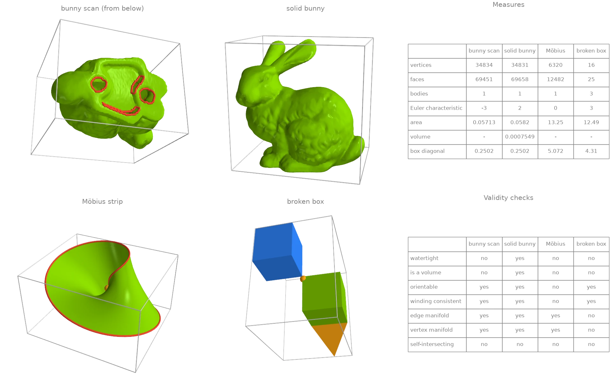
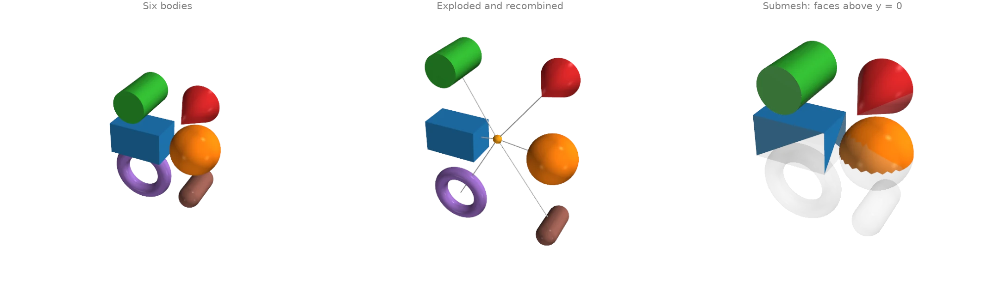
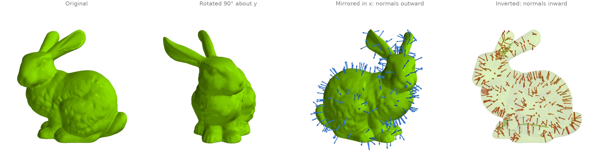
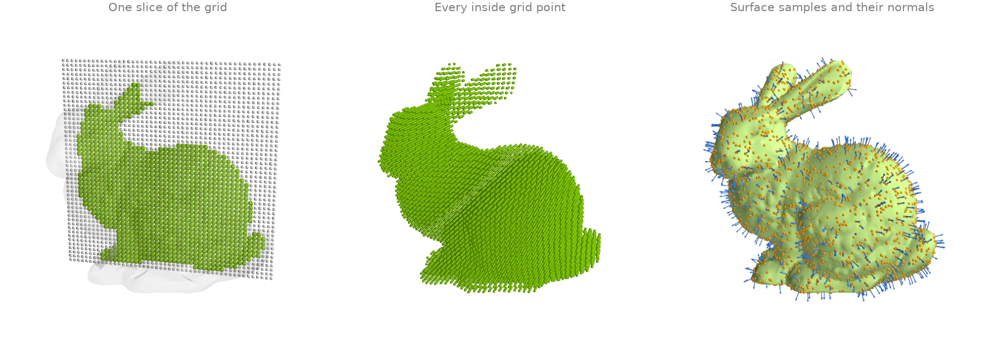
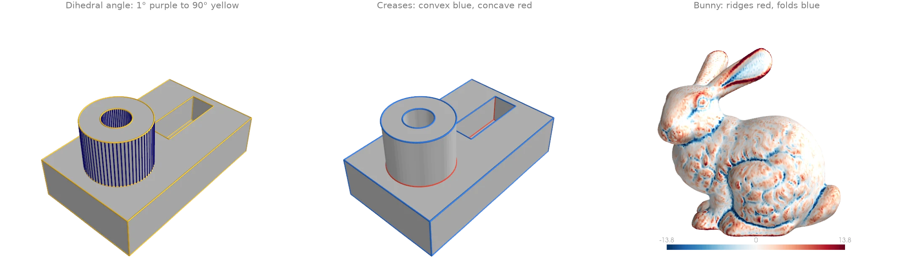
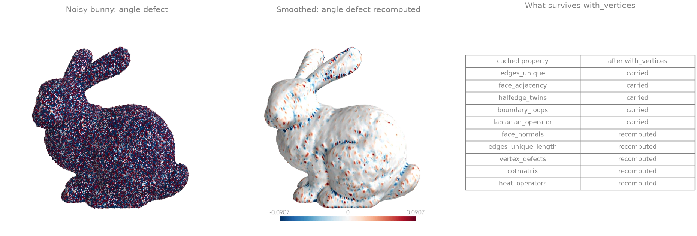
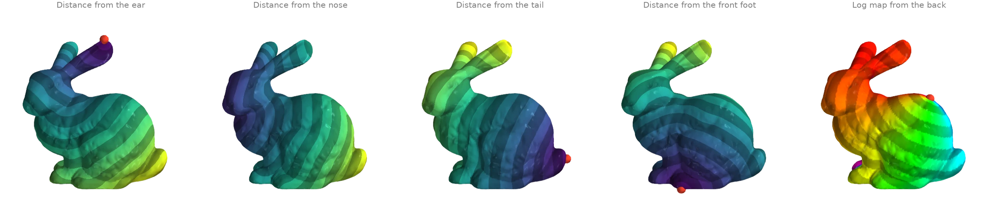

# The Trimesh object

[`ordito.Trimesh`][ordito.mesh.Trimesh] bundles a mesh's vertex and face buffers with lazily
computed, cached properties, in the style of `trimesh.Trimesh`. Every property runs on the
mesh's device, and each is computed once and reused until the mesh changes.

## Quick start: build a mesh and read its properties {#t1}

A [`Trimesh`][ordito.mesh.Trimesh] wraps a vertex buffer and a face buffer (or an existing
`warp.Mesh`, through [`from_warp_mesh`][ordito.mesh.Trimesh.from_warp_mesh]). Every property
is computed on the mesh's device the first time it is read and cached after that. Four inputs
with different defects are compared here: the bunny as scanned, with five holes in its base;
the same bunny closed by [`make_solid`][ordito.repair.make_solid]; a Möbius strip; and two
cubes that touch at one corner, with a fin glued to one edge. The validity checks tell them
apart. Note that [`is_watertight`][ordito.mesh.Trimesh.is_watertight] follows Open3D's
definition, so it also requires a manifold surface with no self-intersections.

```python
import ordito as od
from examples import data

scan = od.Trimesh(*data.load("bunny", device))
meshes = {
    "bunny scan": scan,
    "solid bunny": od.Trimesh(*od.repair.make_solid(scan.vertices, scan.faces)),
    "Möbius strip": od.Trimesh(*data.load("mobius", device)),
    "broken box": od.Trimesh(*data.load("broken_box", device)),
}
for name, mesh in meshes.items():
    print(
        f"{name:>12}: {mesh.n_faces:6d} faces, {mesh.body_count} bodies, "
        f"Euler {mesh.euler_characteristic:2d}, {len(mesh.boundary_loops)} boundary loops, "
        f"watertight {mesh.is_watertight}"
    )
```

```text title="Output"
  bunny scan:  69451 faces, 1 bodies, Euler -3, 5 boundary loops, watertight False
 solid bunny:  69658 faces, 1 bodies, Euler  2, 0 boundary loops, watertight True
Möbius strip:  12482 faces, 1 bodies, Euler  0, 1 boundary loops, watertight False
  broken box:     25 faces, 3 bodies, Euler  3, 0 boundary loops, watertight False
```



Volume is left blank for the three meshes that do not enclose a volume
([`is_volume`][ordito.mesh.Trimesh.is_volume] is false): its integral is only meaningful on a
closed, consistently wound surface. For the same reason the orange dot is the centre of mass
of the solid bunny and the area-weighted surface centroid elsewhere. Bodies are counted across
edges shared by exactly two faces, so the broken box's fin is a body of its own.

Modelled on: [trimesh: quick start](https://trimesh.org/quick_start.html) · [Open3D: mesh properties](https://www.open3d.org/docs/release/tutorial/geometry/mesh.html) · [libigl 701](https://libigl.github.io/tutorial/#mesh-statistics) · [PyMeshLab: measures](https://pymeshlab.readthedocs.io/en/latest/filter_list.html)
{: .ordito-credits }

## Bodies: split, explode and recombine {#t2}

Six primitives packed into one buffer form six bodies.
[`face_connected_component_labels`][ordito.mesh.Trimesh.face_connected_component_labels] names
each face's body and [`body_count`][ordito.mesh.Trimesh.body_count] counts them.
[`split`][ordito.mesh.Trimesh.split] turns them into one `Trimesh` each. Every body is then
moved away from the assembly's centre of mass with
[`transform`][ordito.mesh.Trimesh.transform], and `+` concatenates the moved bodies back into
one mesh: an exploded view. [`submesh`][ordito.mesh.Trimesh.submesh] cuts out a selection of
faces as a mesh of its own.

```python
import functools
import operator

import numpy as np
import warp as wp

import ordito as od
from examples import data

mesh = od.Trimesh(*data.load("parts", device))
labels = mesh.face_connected_component_labels
print(f"{mesh.body_count} bodies, volume {mesh.volume:.3f}")

center = np.array(mesh.center_mass)
exploded = [
    body.transform(
        od.transform.translation_matrix((0.8 * (np.array(body.center_mass) - center)).tolist())
    )
    for body in mesh.split()
]
recombined = functools.reduce(operator.add, exploded)
print(f"recombined: {recombined.n_faces} faces in {recombined.body_count} bodies")

upper_half = mesh.submesh(
    wp.array(mesh.triangles_center.numpy()[:, 1] > 0.0, dtype=wp.bool, device=device)
)
print(f"upper half: {upper_half.n_faces} faces in {upper_half.body_count} bodies")
```

```text title="Output"
6 bodies, volume 1.350
recombined: 5036 faces in 6 bodies
upper half: 918 faces in 4 bodies
```



Modelled on: [trimesh: quick start](https://trimesh.org/quick_start.html) · [libigl 809](https://libigl.github.io/tutorial/#exploded-view) · [Open3D: connected components](https://www.open3d.org/docs/release/tutorial/geometry/mesh.html)
{: .ordito-credits }

## Rigid and mirror transforms {#t3}

[`transform`][ordito.mesh.Trimesh.transform] returns a new mesh under a `4 x 4` matrix built
by [`rotation_matrix`][ordito.transform.rotation_matrix] or
[`reflection_matrix`][ordito.transform.reflection_matrix]. It classifies the matrix first and
carries every cached value the transform preserves: after a rotation the cotangent Laplacian
[`cotmatrix`][ordito.mesh.Trimesh.cotmatrix] is the same object, not a new assembly. A mirror
also reverses the winding of every face, so the mirrored bunny keeps outward normals and a
positive volume. [`invert`][ordito.mesh.Trimesh.invert] reverses the winding without moving
anything, which turns the solid inside out.

```python
import math

import ordito as od
from examples import data

mesh = od.Trimesh(*od.repair.make_solid(*data.load("bunny", device)))
laplacian = mesh.cotmatrix  # assembled once here

spun = mesh.transform(od.transform.rotation_matrix((0.0, 1.0, 0.0), math.pi / 2, mesh.centroid))
mirrored = mesh.transform(od.transform.reflection_matrix((1.0, 0.0, 0.0), mesh.centroid))
inverted = mesh.invert()

print(f"cotmatrix carried through the rotation: {spun.cotmatrix is laplacian}")
for name, m in [("original", mesh), ("rotated", spun), ("mirrored", mirrored)]:
    print(f"{name:>9}: volume {m.volume:.3e}")
print(f" inverted: volume {inverted.volume:.3e}")
```

```text title="Output"
cotmatrix carried through the rotation: True
 original: volume 7.549e-04
  rotated: volume 7.549e-04
 mirrored: volume 7.549e-04
 inverted: volume -7.549e-04
```



Modelled on: [trimesh: quick start](https://trimesh.org/quick_start.html) · [Open3D: transformation](https://www.open3d.org/docs/release/tutorial/geometry/transformation.html)
{: .ordito-credits }

## Inside tests and surface samples {#t4}

[`contains`][ordito.mesh.Trimesh.contains] classifies query points as inside or outside by ray
parity against the mesh's cached BVH, so it needs a closed surface: the bunny is first closed
by [`make_solid`][ordito.repair.make_solid]. [`sample`][ordito.mesh.Trimesh.sample] draws
area-uniform points on the surface and returns the face each point landed on, which indexes
[`face_normals`][ordito.mesh.Trimesh.face_normals].

```python
import numpy as np
import warp as wp

import ordito as od
from examples import data

mesh = od.Trimesh(*od.repair.make_solid(*data.load("bunny", device)))
lower, upper = mesh.bounds
axes = [np.linspace(low, high, 48) for low, high in zip(lower, upper, strict=True)]
grid = np.stack(np.meshgrid(*axes, indexing="ij"), axis=-1).reshape(-1, 3)
inside = mesh.contains(wp.array(grid, dtype=wp.vec3, device=device)).numpy()
print(f"{inside.sum()} of {grid.shape[0]} grid points are inside")

points, face_index = mesh.sample(3000, seed=0)
normals = mesh.face_normals.numpy()[face_index.numpy()]
print(f"{points.shape[0]} samples on a surface of area {mesh.area:.4f}")
```

```text title="Output"
27005 of 110592 grid points are inside
3000 samples on a surface of area 0.0582
```



Modelled on: [trimesh: quick start](https://trimesh.org/quick_start.html) · [Open3D: mesh sampling](https://www.open3d.org/docs/release/tutorial/geometry/mesh.html)
{: .ordito-credits }

## Edge structure: dihedral angles, convexity and boundaries {#t5}

Every pair of faces sharing an edge is a row of
[`face_adjacency`][ordito.mesh.Trimesh.face_adjacency], with the shared vertex pair in
[`face_adjacency_edges`][ordito.mesh.Trimesh.face_adjacency_edges]. The angle between the two
face normals is [`face_adjacency_angles`][ordito.mesh.Trimesh.face_adjacency_angles], and
[`face_adjacency_convex`][ordito.mesh.Trimesh.face_adjacency_convex] says whether the edge
folds outward (a ridge) or inward (a valley). Thresholding the angle picks out the creases of
a machined part. On the scanned bunny, the signed angle averaged around each vertex separates
ridges from folds. [`boundary_edges`][ordito.mesh.Trimesh.boundary_edges] counts the edges on
the rims of the holes in the bunny's base.

```python
import numpy as np

import ordito as od
from examples import data

out = {}
for name, threshold in [("cad_part", 30.0), ("bunny", 40.0)]:
    mesh = od.Trimesh(*data.load(name, device))
    angles = np.degrees(mesh.face_adjacency_angles.numpy())
    convex = mesh.face_adjacency_convex.numpy()
    sharp = angles > threshold
    print(
        f"{name}: {mesh.edges_unique.shape[0]} edges, {sharp.sum()} sharper than "
        f"{threshold:.0f}° ({(sharp & convex).sum()} convex, "
        f"{(sharp & ~convex).sum()} concave), {mesh.boundary_edges.shape[0]} on the boundary"
    )
    out[name] = (mesh.face_adjacency_edges.numpy(), angles, convex, sharp)
```

```text title="Output"
cad_part: 720 edges, 248 sharper than 30° (176 convex, 72 concave), 0 on the boundary
bunny: 104288 edges, 550 sharper than 40° (331 convex, 219 concave), 223 on the boundary
```



Modelled on: [trimesh: quick start](https://trimesh.org/quick_start.html) · [trimesh: examples](https://trimesh.org/examples.html)
{: .ordito-credits }

## Caching and functional updates {#t6}

A [`Trimesh`][ordito.mesh.Trimesh] is frozen: an update returns a new mesh and decides which
cached values are still valid. [`with_vertices`][ordito.mesh.Trimesh.with_vertices] keeps the
faces, so it carries forward every cache that is computed from the faces alone. These are the
edge tables, face adjacency, half-edges, boundaries, manifold and orientation checks, body
count and the uniform [`laplacian_operator`][ordito.mesh.Trimesh.laplacian_operator]. Anything
that reads positions is recomputed on first access: normals, areas, angles, edge lengths,
[`vertex_defects`][ordito.mesh.Trimesh.vertex_defects], the BVH, the cotangent operators and
the heat bundles. Here the noisy bunny is smoothed with
[`filter_taubin`][ordito.smoothing.filter_taubin], reusing the cached uniform Laplacian, and the
angle defect (discrete Gaussian curvature) is read again on the smoothed mesh.

```python
import ordito as od
from examples import data

mesh = od.Trimesh(*data.load("noisy_bunny", device))
names = [
    "edges_unique",
    "face_adjacency",
    "halfedge_twins",
    "boundary_loops",
    "laplacian_operator",
    "face_normals",
    "edges_unique_length",
    "vertex_defects",
    "cotmatrix",
    "heat_operators",
]
before = {name: getattr(mesh, name) for name in names}  # compute and cache

smoothed_vertices = od.smoothing.filter_taubin(
    mesh.vertices, mesh.faces, iterations=20, laplacian_operator=mesh.laplacian_operator
)
smoothed = mesh.with_vertices(smoothed_vertices)
kept = [name for name in names if getattr(smoothed, name) is before[name]]
print("carried forward:", ", ".join(kept))
print("recomputed:     ", ", ".join(name for name in names if name not in kept))
print(f"mean edge length {mesh.mean_edge_length:.6f} -> {smoothed.mean_edge_length:.6f}")
```

```text title="Output"
carried forward: edges_unique, face_adjacency, halfedge_twins, boundary_loops, laplacian_operator
recomputed:      face_normals, edges_unique_length, vertex_defects, cotmatrix, heat_operators
mean edge length 0.001593 -> 0.001443
```



[`with_faces`][ordito.mesh.Trimesh.with_faces] carries nothing, since every cached value
depends on the faces. [`copy`][ordito.mesh.Trimesh.copy] makes independent buffers, and
[`invalidate`][ordito.mesh.Trimesh.invalidate] clears the cache after a buffer has been
edited in place by a kernel.

Modelled on: [trimesh: caching](https://trimesh.org/trimesh.caching.html)
{: .ordito-credits }

## Reusing cached operators {#t7}

The discrete operators of a mesh depend on the mesh alone, so a
[`Trimesh`][ordito.mesh.Trimesh] assembles each of them once and hands the same object to
every solve. Here [`heat_operators`][ordito.mesh.Trimesh.heat_operators] serves four
[`heat_geodesic`][ordito.heat.heat_geodesic] calls from four different sources, and the
mesh's [`heat_solver`][ordito.mesh.Trimesh.heat_solver] keeps the factorizations built on the
second, so the last two run no iteration.
[`vector_heat_operators`][ordito.mesh.Trimesh.vector_heat_operators] holds that same scalar
bundle and the [`vertex_tangent_frames`][ordito.mesh.Trimesh.vertex_tangent_frames], and feeds
[`log_map`][ordito.heat.log_map]: every vertex's position in the tangent plane of a source
vertex, drawn with hue for its direction and stripes for its distance. The cotangent matrix
[`cotmatrix`][ordito.mesh.Trimesh.cotmatrix] and lumped mass
[`mass_matrix_entries`][ordito.mesh.Trimesh.mass_matrix_entries] are cached the same way, for
callers that assemble their own systems.

```python
import warp as wp

import ordito as od
from examples import data

mesh = od.Trimesh(*data.load("bunny", device))
operators = mesh.heat_operators  # assembled here, once

distances = {}
for name, vertex in {"ear": 22820, "nose": 11842, "tail": 12217, "front foot": 34264}.items():
    source = wp.array([vertex], dtype=wp.int32, device=device)
    distances[name] = od.heat.heat_geodesic(mesh, source).numpy()
    print(f"from the {name:<10}: farthest point at {distances[name].max():.4f}")

vector_operators = mesh.vector_heat_operators
print("vector bundle reuses the scalar one:", vector_operators[1] is operators)
log = od.heat.log_map(mesh, 16308)
```

```text title="Output"
from the ear       : farthest point at 0.2396
from the nose      : farthest point at 0.2115
from the tail      : farthest point at 0.2409
from the front foot: farthest point at 0.2201
vector bundle reuses the scalar one: True
```



Modelled on: [potpourri3d](https://github.com/nmwsharp/potpourri3d#mesh-distance) · [libigl 716](https://libigl.github.io/tutorial/#heat-method)
{: .ordito-credits }
