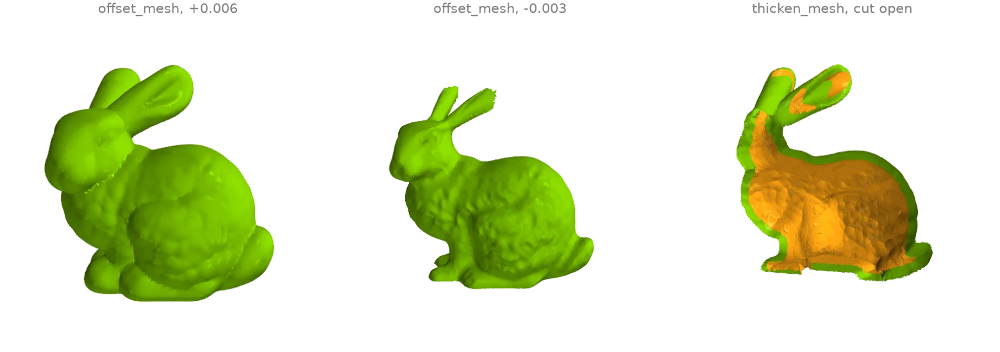
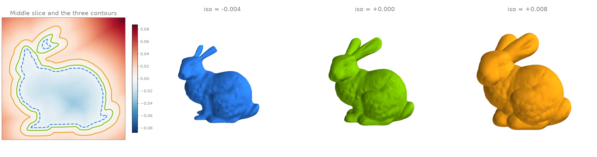
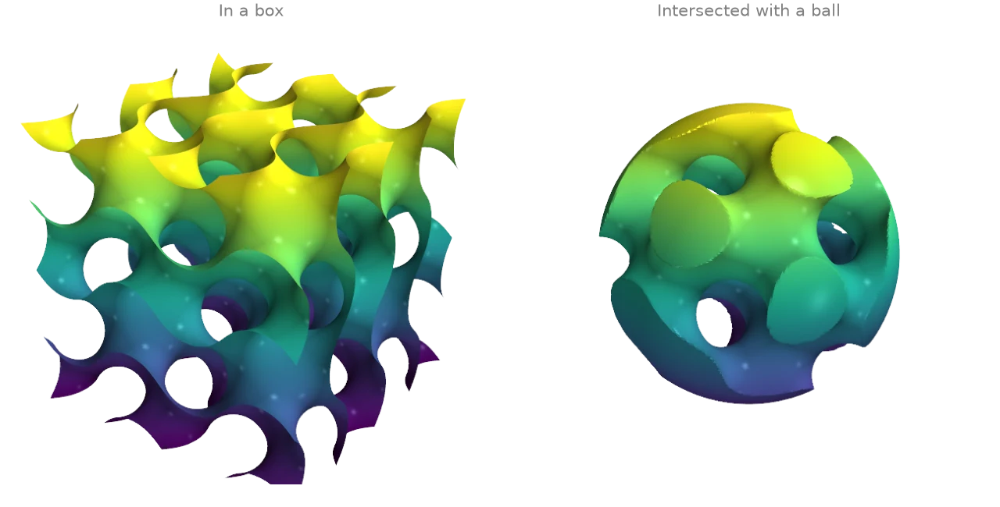
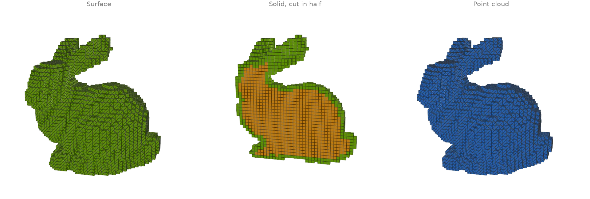
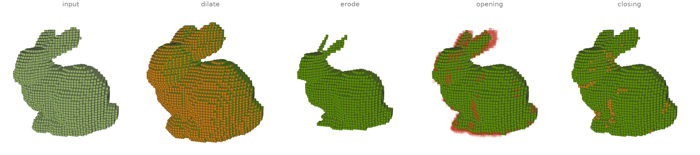
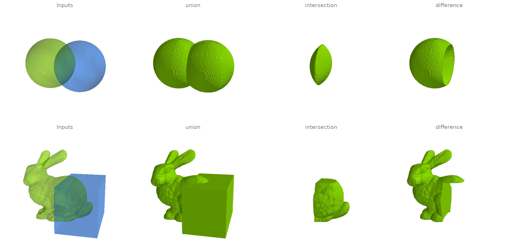
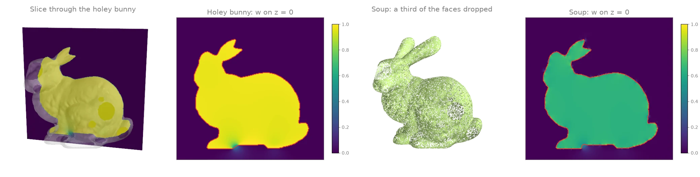

# Offsets, voxels and implicit surfaces

Signed distance fields, offsets, marching cubes, voxelization and the winding number.

## Offset, thicken and shell {#v1}

[`offset_mesh`][ordito.levelset.offset_mesh] moves the surface by a signed distance through
the level set of its distance field, so concave regions and thin parts are handled exactly:
growing rounds over the creases, shrinking thins the ears down to their last voxels.
[`thicken_mesh`][ordito.levelset.thicken_mesh] instead keeps the input's own triangulation:
it displaces a copy of every vertex inward along its normal, reverses it and joins the two
layers along the open rims, giving a shell (shown cut open, inner layer orange).

```python
import ordito as od
from examples import data

vertices, faces = data.load("bunny", device)
grown = od.levelset.offset_mesh(vertices, faces, 0.006)
shrunk = od.levelset.offset_mesh(vertices, faces, -0.003)
shell = od.levelset.thicken_mesh(vertices, faces, 0.006)
for name, (v, f) in {"grown": grown, "shrunk": shrunk, "shell": shell}.items():
    print(f"{name}: {f.shape[0] // 3} faces, volume {od.measures.volume(v, f):.3e}")
```

```text title="Output"
grown: 53856 faces, volume 1.150e-03
shrunk: 141636 faces, volume 5.941e-04
shell: 139348 faces, volume 2.917e-04
```



Modelled on: [MeshLib: offset](https://meshlib.io/documentation/ExampleMeshOffset.html)
{: .ordito-credits }

## Signed distance field and its level sets {#v2}

[`signed_distance_grid`][ordito.proximity.signed_distance_grid] samples the signed distance
to the bunny on a regular lattice (negative inside; the winding-number sign copes with the
open base). One slice of the field is shown on the left with its zero contour, and
[`marching_cubes`][ordito.levelset.marching_cubes] extracts three of its level sets: inside,
on and outside the surface.

```python
import ordito as od
from examples import data

vertices, faces = data.load("bunny", device)
field, bounds = od.proximity.signed_distance_grid(
    vertices, faces, voxel_size=0.0015, pad=8, sign_mode="winding"
)
distances = field.numpy()
print(f"lattice {distances.shape}, from {distances.min():.4f} to {distances.max():.4f}")

levels = {}
for iso in (-0.004, 0.0, 0.008):
    levels[iso] = od.levelset.marching_cubes(field, iso, bounds=bounds)
    print(f"iso {iso:+.3f}: {levels[iso][1].shape[0] // 3} faces")
```

```text title="Output"
lattice (120, 119, 97), from -0.0402 to 0.0994
iso -0.004: 58500 faces
iso +0.000: 74428 faces
iso +0.008: 102496 faces
```



Modelled on: [libigl 704](https://libigl.github.io/tutorial/#signed-distances) · [Open3D: distance queries](https://www.open3d.org/docs/release/tutorial/geometry/distance_queries.html) · [MeshLib: signed distance](https://meshlib.io/documentation/ExampleSignedDistance.html)
{: .ordito-credits }

## Meshing an implicit surface: the gyroid {#v3}

Any scalar field sampled on a lattice can be meshed by
[`marching_cubes`][ordito.levelset.marching_cubes]. The gyroid
`sin x cos y + sin y cos z + sin z cos x = 0` is a triply periodic minimal surface; on the
left it fills a box, on the right the field is combined with a sphere's signed distance
(their maximum is the intersection of the two solids) to cut a closed gyroid solid out of a
ball.

```python
import numpy as np
import warp as wp

import ordito as od

n, extent = 160, 2.0 * np.pi
x, y, z = np.meshgrid(*[np.linspace(-extent, extent, n)] * 3, indexing="ij")
gyroid = np.sin(x) * np.cos(y) + np.sin(y) * np.cos(z) + np.sin(z) * np.cos(x)
in_ball = np.maximum(gyroid, np.sqrt(x**2 + y**2 + z**2) - 0.95 * extent)

bounds = (wp.vec3(-extent, -extent, -extent), wp.vec3(extent, extent, extent))
surfaces = {}
for name, field in {"box": gyroid, "ball": in_ball}.items():
    lattice = od.typing.as_array3d(
        wp.array(field.astype(np.float32), dtype=wp.float32, device=device), wp.float32
    )
    surfaces[name] = od.levelset.marching_cubes(lattice, 0.0, bounds=bounds)
    v, f = surfaces[name]
    print(f"{name}: {f.shape[0] // 3} faces, watertight {od.validation.is_watertight(v, f)}")
```

```text title="Output"
box: 489940 faces, watertight False
ball: 328380 faces, watertight True
```



Modelled on: [PyVista: gyroid](https://docs.pyvista.org/examples/99-advanced/gyroid) · [libigl 715](https://libigl.github.io/tutorial/#marching-cubes)
{: .ordito-credits }

## Voxelizing meshes and point clouds {#v4}

[`voxelize_mesh`][ordito.voxels.voxelize_mesh] marks every cell a triangle actually touches
(an exact triangle-box test), which seals a closed surface (the scan's open base is closed
first with [`fill_min_weight`][ordito.holes.fill_min_weight]);
[`fill_cavities`][ordito.voxels.fill_cavities] then fills every empty cell that cannot reach
the outside, turning the shell into a solid (`mode="solid"` does both; the filled interior
is orange). [`voxelize_points`][ordito.voxels.voxelize_points] marks the cells that contain
a sample of a point cloud. [`to_boxes`][ordito.voxels.to_boxes] meshes a voxel
set as cubes for display; the solid is shown cut in half through
[`cell_centers`][ordito.voxels.cell_centers].

```python
import ordito as od
from examples import data

vertices, faces = data.load("bunny", device)
faces = od.holes.fill_min_weight(vertices, faces)  # seal the scan's open base first
shell = od.voxels.voxelize_mesh(vertices, faces, voxel_size=0.004)
solid = od.voxels.fill_cavities(shell)
cloud = od.voxels.voxelize_points(data.load_points("bunny_cloud", device), voxel_size=0.004)
for name, grid in {"surface": shell, "solid": solid, "point cloud": cloud}.items():
    print(f"{name}: {grid.get_active_stats().voxel_count} voxels")

shell_boxes = od.voxels.to_boxes(shell)
cloud_boxes = od.voxels.to_boxes(cloud)
solid_centers = od.voxels.cell_centers(solid)
```

```text title="Output"
surface: 5286 voxels
solid: 14656 voxels
point cloud: 4470 voxels
```



Modelled on: [Open3D: voxelization](https://www.open3d.org/docs/release/tutorial/geometry/voxelization.html) · [trimesh: voxel](https://trimesh.org/trimesh.voxel.html) · [PyVista: voxelize](https://docs.pyvista.org/examples/01-filter/voxelize) · [PyTorch3D: cubify](https://pytorch3d.org/tutorials)
{: .ordito-credits }

## Voxel morphology {#v5}

Binary morphology on the solid voxelized bunny of the previous example, two steps each with
the 6-neighbourhood: [`dilate`][ordito.voxels.dilate] grows the set by a shell of cells,
[`erode`][ordito.voxels.erode] peels one off (the thin ears go first),
[`opening`][ordito.voxels.opening] (erode then dilate) removes features thinner than the
structuring element while keeping the bulk, and [`closing`][ordito.voxels.closing] (dilate
then erode) fills narrow gaps and dents. Added cells are orange; the cells opening removes
are faint red.

```python
import ordito as od
from examples import data

vertices, faces = data.load("bunny", device)
faces = od.holes.fill_min_weight(vertices, faces)
solid = od.voxels.voxelize_mesh(vertices, faces, voxel_size=0.004, mode="solid")

results = {"input": solid}
for operation in (od.voxels.dilate, od.voxels.erode, od.voxels.opening, od.voxels.closing):
    results[operation.__name__] = operation(solid, iterations=2)
for name, grid in results.items():
    print(f"{name}: {grid.get_active_stats().voxel_count} voxels")
```

```text title="Output"
input: 14656 voxels
dilate: 22283 voxels
erode: 8616 voxels
opening: 13974 voxels
closing: 14855 voxels
```



Modelled on: [trimesh: voxel morphology](https://trimesh.org/trimesh.voxel.morphology.html)
{: .ordito-credits }

## Voxel CSG (approximate booleans) {#v6}

ordito has no exact mesh booleans. What it has is set algebra on voxels: both solids are
voxelized on one lattice with [`voxelize_mesh`][ordito.voxels.voxelize_mesh], combined
cell by cell with [`union`][ordito.voxels.union],
[`intersection`][ordito.voxels.intersection] and [`difference`][ordito.voxels.difference],
and meshed back through [`to_field`][ordito.voxels.to_field] and
[`marching_cubes`][ordito.levelset.marching_cubes]. The result is only as accurate as the
voxel size: sharp edges are rounded off at that scale and the output is resampled
everywhere, not just near the intersection curve.

```python
import warp as wp

import ordito as od
from examples import data

def csg(
    a: tuple[wp.array[wp.vec3], wp.array[wp.int32]],
    b: tuple[wp.array[wp.vec3], wp.array[wp.int32]],
    voxel_size: float,
    origin: wp.vec3,
):
    solid_a = od.voxels.voxelize_mesh(*a, voxel_size, origin=origin, mode="solid")
    solid_b = od.voxels.voxelize_mesh(*b, voxel_size, origin=origin, mode="solid")
    results = {}
    for operation in (od.voxels.union, od.voxels.intersection, od.voxels.difference):
        field, bounds = od.voxels.to_field(operation(solid_a, solid_b))
        results[operation.__name__] = od.levelset.marching_cubes(field, 0.5, bounds=bounds)
    return results

# Two overlapping spheres, split into their two components.
sphere_a, sphere_b = od.combine.split(*data.load("two_spheres", device))
spheres = csg(sphere_a, sphere_b, 0.02, origin=wp.vec3(-1.1, -1.1, -1.1))

# The bunny (its open base sealed first) and a box over its back.
bunny_vertices, bunny_faces = data.load("bunny", device)
bunny = (bunny_vertices, od.holes.fill_min_weight(bunny_vertices, bunny_faces))
box = od.creation.box(bounds=[[-0.01, 0.02, -0.08], [0.08, 0.12, 0.08]], device=device)
# The origin is half a cell off round numbers so that no box face lies on a cell boundary.
carved = csg(bunny, box, 0.0012, origin=wp.vec3(-0.1006, -0.0006, -0.0906))
for name, (_, f) in carved.items():
    print(f"bunny {name} box: {f.shape[0] // 3} faces")
```

```text title="Output"
bunny union box: 183112 faces
bunny intersection box: 49336 faces
bunny difference box: 95672 faces
```



Modelled on: [PyVista: boolean operations](https://docs.pyvista.org/examples/01-filter/boolean_operations) · [libigl 609 (CSG)](https://libigl.github.io/tutorial/#boolean-operations-on-meshes) · [MeshLib: boolean](https://meshlib.io/documentation/ExampleMeshBoolean.html)
{: .ordito-credits }

## Generalized winding number {#v7}

[`winding_number`][ordito.proximity.winding_number] sums the signed solid angles that every
triangle subtends at a query point: 1 inside a closed surface, 0 outside, and a smooth,
still nearly binary field when the surface has holes. That makes inside/outside meaningful
for broken input. On a slice through the holey bunny the field stays near 1 inside and only
blurs where the slice passes near a hole. With a third of the triangles thrown away at
random (a soup with gaps everywhere) the interior reads about 2/3 instead of 1, but it is
still flat and well separated from the outside, so a threshold at 0.5 (red contour) still
recovers it.

```python
import numpy as np
import warp as wp

import ordito as od
from examples import data

vertices, faces = data.load("holey_bunny", device)
rng = np.random.default_rng(0)
triangles = faces.numpy().reshape(-1, 3)
soup = wp.array(
    triangles[rng.random(len(triangles)) > 1 / 3].ravel(), dtype=wp.int32, device=device
)

# Query points on the plane z = 0, a little wider than the bunny.
xs, ys = np.linspace(-0.11, 0.075, 280), np.linspace(0.02, 0.2, 270)
x, y = np.meshgrid(xs, ys)
queries = np.stack([x.ravel(), y.ravel(), np.zeros(x.size)], axis=1)
points = wp.array(queries, dtype=wp.vec3, device=device)

holey = od.proximity.winding_number(vertices, faces, points).numpy().reshape(x.shape)
sparse = od.proximity.winding_number(vertices, soup, points).numpy().reshape(x.shape)
for name, w in (("holey bunny", holey), ("soup", sparse)):
    print(f"{name}: {(w > 0.5).mean():.1%} of the slice inside, max w {w.max():.2f}")
```

```text title="Output"
holey bunny: 36.3% of the slice inside, max w 1.04
soup: 36.1% of the slice inside, max w 0.85
```



Modelled on: [libigl 702](https://libigl.github.io/tutorial/#generalized-winding-number)
{: .ordito-credits }
